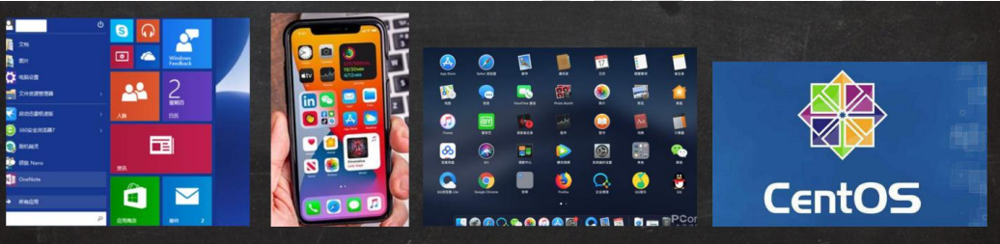

# 介绍

本人的[学习源头](https://www.bilibili.com/video/BV1Sv411r7vd?from=search&seid=2242825036427323134&spm_id_from=333.337.0.0)

1. Linux的诞生

   Linux 内核最初只是由芬兰人林纳斯·托瓦兹（Linus Torvalds）在赫尔辛基大学上学时出于个人爱好而编写的，同时，也是Git 的创造者。

2. linux是一个开源、免费的操作系统,其稳定性、安全性、处理多并发已经得到业界的认可,目前很多企业级的项目(c/c++/php/python/java/go)都会部署到Linux/unix系统上。

3. 常见的操作系统(windows、 IOS、 Android、 MacOS, Linux, Unix)。

   

4. Linux主要的发行版：

   Ubuntu(乌班图)、RedHat(红帽)、CentoS、Debain[蝶变]、Fedora、SuSE、 OpenSUSE [示意图]

5. Linux的应用领域

   1. 服务器领域

      linux在**服务器领域**的应用是最强的。
      linux**免费、稳定、高效**等特点在这里得到了很好的体现,尤其在一些高端领域尤为广泛(c/c++/php/java/python/go)。

   2. 嵌入式领域

      linux运行稳定、对网络的良好支持性、低成本,且可以根据需要进行**软件裁剪**，内核最小可以达到几百KB等特点，使其近些年来在**嵌入式领域**的应用得到非常大的提高。

      主要应用:机顶盒、数字电视、网络电话、程控交换机、手机、PDA、智能家居、智能硬件等都是其应用领域。以后在**物联网中应用会更加广泛**。

