# Java基础

## 一、Java简介

### 1、Java是什么

Java 是由 Sun Microsystems 公司于 1995 年 5 月推出的 Java 面向对象程序设计语言和 Java 平台的总 称。由 James Gosling 和同事们共同研发，并在 1995 年正式推出。

Java 分为三个体系：

- JavaSE（J2SE）（Java2 Platform Standard Edition，java 平台标准版）。
- JavaEE(J2EE) (Java 2 Platform Enterprise Edition，java 平台企业版) 。
- JavaME(J2ME) (Java 2 Platform Micro Edition，java 平台微型版)


詹姆斯 · 高斯林 （James Gosling，1955 年 5 月 19 日－，出生于加拿大），软件专家，Java 编程语言 的共同创始人之一，一般公认他为 “Java 之父”。

### 2、Java的发展史

- 1995 年 5 月 23 日，Java 语言诞生 
- 1996 年 1 月，第一个 JDK1.0 诞生 
- 1997 年 2 月 18 日，JDK1.1 发布 
- 1998 年 12 月 8 日，JAVA2 企业平台 J2EE 发布 
- 1999 年 6 月，SUN 公司发布 Java 的三个版本：标准版（J2SE）、企业版（J2EE）和微型版 （J2ME） 
- 2000 年 5 月 8 日，JDK1.3 发布 
- 2000 年 5 月 29 日，JDK1.4 发布 
- 2001 年 9 月 24 日，J2EE1.3 发布 
- 2002 年 2 月 26 日，J2SE1.4 发布，自此 Java 的计算能力有了大幅提升
- 2004 年 9 月 30 日 18:00PM，J2SE1.5 发布，成为 Java 语言发展史上的又一里程碑。为了表示该 版本的重要性，J2SE1.5 更名为 Java SE 5.0 
- 2005 年 6 月，JavaOne 大会召开，SUN 公司公开 Java SE 6。此时，Java 的各种版本已经更名， 以取消其中的数字 "2"：J2EE 更名为 Java EE，J2SE 更名为 Java SE，J2ME 更名为 Java ME 
- 2006 年 12 月，SUN 公司发布 JRE6.0 
- 2009 年 04 月 20 日，甲骨文 74 亿美元收购 Sun。取得 java 的版权。 
- 2011 年 7 月 28 日，甲骨文发布 java7.0 的正式版。 
- 2014 年 3 月 18 日，Oracle 公司发布 Java SE8，这次版本升级为 Java 带来了全新的 Lambda 表 达 式、流式编程等大量新特性，这些新特性使得 Java 变得更加强大。 
- 2017 年 9 月 22 日，Oracle 公司发布 JavaSE9，这次版本升级强化了 Java 的模块化系统，让 Java 语言更轻量化，且采用了更高效、更智能的 GI 垃圾回收器，并在核心类库上进行大量更新，可进 一 步简化编程。 
- 2018 年 3 月 21 日，JavaSE10 发布，Java10 版本带来了很多新特性，其中最备受广大开发者 关注 的莫过于局部变量类型推断。此外，还包垃圾收集器改善、GC 改进、性能提升、线程管控等新 特 性。 
- 2018 年 9 月 26 日，JavaSE11 发布。这是 Java 大版本周期变化后的第一个长期支持版本（LTS 版 本持续支持到2026 年9月）。 Java11 带来了 ZGC、 HttpClient 等重要特性，一共包含 17 个 JEP （JDK Enhancement Proposals，JDK 增强提案）。 
- 2019 年 3 月 20 日， JavaSE12 发布。 Java12是短期支持版本，可在下一个版本发布之前获得 Oracle 的商业支持。 
- 2019 年 9 月 23 日，Java SE 13 发布，此版本中添加了“文本块”，文本块是一个多行字符串文字， 避免对大多数转义序列的需要，以可预测的方式自动格式化字符串，并在需要时让开发人员控制格 式。 
- 2020 年 3 月，Java SE 14发布。在13基础上继续添加新特性：record 关键字、空指针异常精准提 示、switch 的增强正式使用、ZGC 支持 MacOS 和 Window，同时移除了 CMS 垃圾收集器等 
- 2020年9月15日，Java SE 15发布， 一次发布了 14 个新特性。JDK 15 并不是一个长期支持的版 本，只支持 6 个月到 2021 年 3 月，上一个长期支持版本还是 JDK 11

### 3、Java语言的主要特点

1. 跨平台性:所谓的跨平台性，是指软件可以不受计算机硬件和操作系统的约束而在任意计算机环境下 正常运行。这是软件发展的趋势和编程人员追求的目标。之所以这样说，是因为计算机硬件的种类 繁多，操作系统也各不相同，不同的用户和公司有自己不同的计算机环境偏好，而软件为了能在这 些不同的环境里正常运行，就需要独立于这些平台。而在Java语言中， Java自带的虚拟机很好地实 现了跨平台性。 Java源程序代码经过编译后生成二进制的字节码是与平台无关的，但是可被Java虚 拟机识别的一种机器码指令。 Java虚拟机提供了一个字节码到底层硬件平台及操作系统的屏障，使 得Java语言具备跨平台性。 
2. 面向对象:面向对象是指以对象为基本粒度，其下包含属性和方法。对象的说明用属性表达，而通过 使用方法来操作这个对象。面向对象技术使得应用程序的开发变得简单易用，节省代码。Java是一 种面向对象的语言，也继承了面向对象的诸多好处，如代码扩展、代码复用等。 
3. 安全性:安全性可以分为四个层面，即语言级安全性、编译时安全性、运行时安全性、可执行代码安 全性。语言级安全性指Java的数据结构是完整的对象，这些封装过的数据类型具有安全性。编译时 要进行Java语言和语义的检查，保证每个变量对应一个相应的值，编译后生成Java类。运行时Java 类需要类加载器载入，并经由字节码校验器校验之后才可以运行。 Java类在网络上使用时，对它的 权限进行了设置，保证了被访问用户的安全性。 
4. 多线程:多线程在操作系统中已得到了最成功的应用。多线程是指允许一个应用程序同时存在两个或 两个以上的线程，用于支持事务并发和多任务处理。 Java除了内置的多线程技术之外，还定义了一 些类、方法等来建立和管理用户定义的多线程。 
5. 简单易用:Java源代码的书写不拘泥于特定的环境，可以用记事本、文本编辑器等编辑软件来实现， 然后将源文件进行编译，编译通过后可直接运行，通过调试则可得到想要的结果。

### 4、Java语言的特性

1. 封装：封装是把过程和数据包围起来，对数据的访问只能通过已定义的接口。面向对象计算始于这 个基本概念，即现实世界可以被描绘成一系列完全自治、封装的对象，这些对象通过一个受保护的 接口访问其他对象。封装是一种信息隐藏技术，在java中通过关键字private，protected和public 实现封装。什么是封装？封装把对象的所有组成部分组合在一起，封装定义程序如何引用对象的数 据，封装实际上使用方法将类的数据隐藏起来，控制用户对类的修改和访问数据的程度。 适当的封 装可以让程式码更容易理解和维护，也加强了程式码的安全性。 
2. 继承：继承是面向对象最显著的一个特性。继承是从已有的类中派生出新的类，新的类能吸收已有 类的数据属性和行为，并能扩展新的能力。 Java继承是使用已存在的类的定义作为基础建立新类 的技术，新类的定义可以增加新的数据或新的功能，也可以用父类的功能，但不能选择性地继承父 类。这种技术使得复用以前的代码非常容易，能够大大缩短开发周期，降低开发费用 
3. 多态： 按字面的意思就是“多种状态”。在面向对象语言中，接口的多种不同的实现方式即为多态。 多态性是允许你将父对象设置成为一个或更多的他的子对象相等的技术，赋值之后，父对象就可以 根据当前赋值给它的子对象的特性以不同的方式运作 多态的话，我觉得是更好的利用了继承这一特 性，然后为什么能实现多态，因为可以重写父类的方法。说重写可能不清楚，具体来说就是子类父 类可以存在分别存在名字相同的属性或者方法，然后可视声明的类去调用相应的方法等。 
4. 抽象： 抽象是通过分析与综合的途径，运用概念在人脑中再现对象的质和本质的方法，我觉得理解 成一种方法比较好。就是我们通过对事物的认知，将某一或者一类事物的属性变化成JAVA语言能识 别的类。

### 5、Java 核心机制

1. Java 虚拟机（Java Virtual Machine）简称：JVM；

   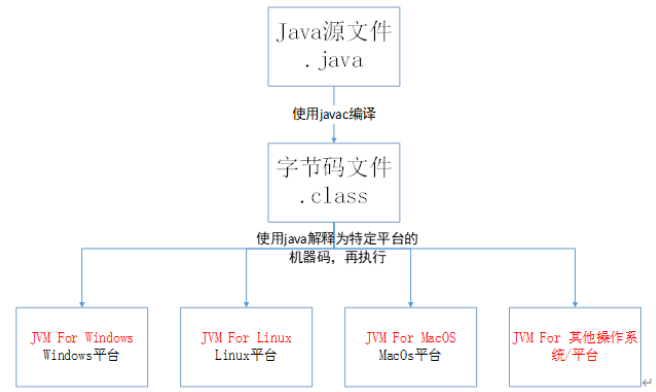

2. 垃圾收集机制（Garbage collection）简称：GC；

   垃圾收集的目的在移除不再使用的对象，当对象建立的时候垃圾收集期，就开始监控对象的动态情 况，垃圾收集主要是对内存的释放。创建对象的时候申请一个空间

   - 再使用的内存空间应回收 - 垃圾收集； 

   - Java 消除了程序员回收无用内存空间的职责；提供一种系统级线程跟踪存储空间的分配情 况。在 JVM 的空闲时，检查并释放可被释放的存储器空间；

### 6、JRE、JDK、JVM 之间的区别与联系

JDK ：英文名称（Java Development Kit），Java 开发工具包。jdk 是整个 Java 开发的核心，它集成了 jre 和开发工具包。 

JRE ：英文名称（Java Runtime Environment），我们叫它：Java 运行时环境。它主要包含两个部分， jvm 的标准实现和 Java 的一些基本类库。它相对于 jvm 来说，多出来的是一部分的 Java 类库。 

JVM ：英文名称（Java Virtual Machine），就是我们耳熟能详的 Java 虚拟机。它只认识 xxx.class 这种 类型的文件，它能够将 class 文件中的字节码指令进行识别并调用操作系统向上的 API 完成动作。jvm 是 Java 能够跨平台的核心。 

这三者的关系是：一层层的嵌套关系，JDK 包含 JRE，JRE 包含 JVM；

## 二、Java环境搭建

### 1、JDK 安装

在这里统一使用 [jdk-8u191-windows-x64.exe](https://mirrors.huaweicloud.com/java/jdk/8u191-b12/jdk-8u191-windows-x64.exe)。额外的【[jdk-8u191-linux-x64.tar.gz](https://mirrors.huaweicloud.com/java/jdk/8u191-b12/jdk-8u191-linux-x64.tar.gz)、[jdk-8u191-macosx-x64.dmg](https://mirrors.huaweicloud.com/java/jdk/8u191-b12/jdk-8u191-macosx-x64.dmg)】

1. 运行 jdk-8u191-windows-x64.exe，进入下图所示安装界面，点击“下一步（N）”：

   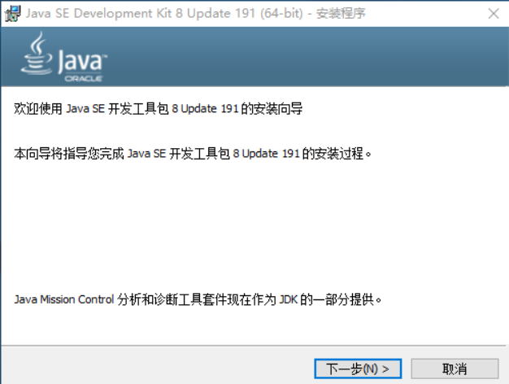

2. 选择要安装的组件，安装路径(**建议直接默认**),选择后点击“下一步（N）”：

   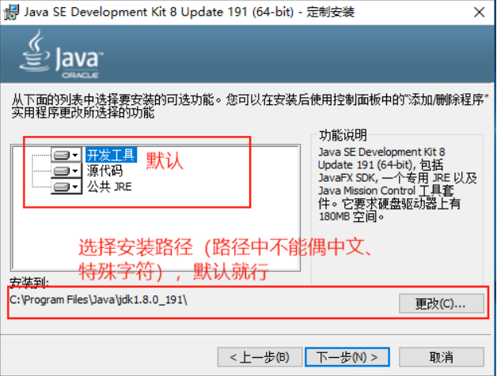

3. 等待安装过程：

   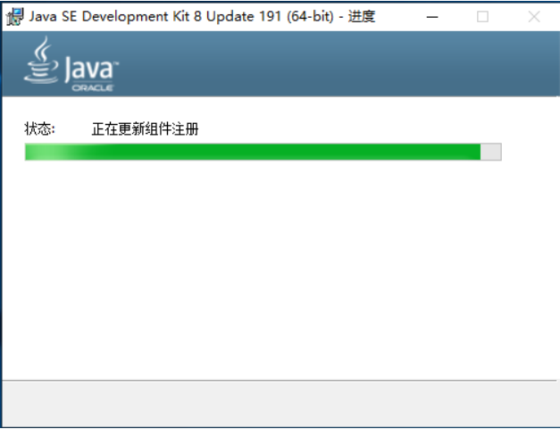

4. 安装过程中会弹出许可条款变更，直接点击“确定(O)”按钮：

   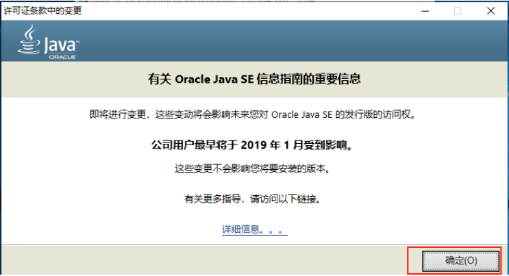

5. 安装公共JRE的界面，默认就行，选择后点击“下一步（N）”：

   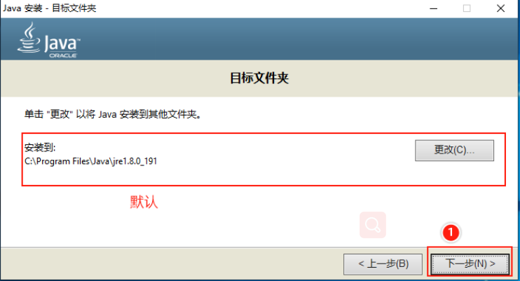

6. 等待公共JRE安装结束，结束后弹出安装完成提示，直接点击“关闭（C）”:

   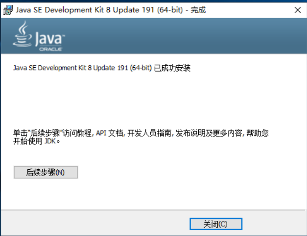

### 2、配置JDK环境变量

安装JDK后还不能直接使用，需要配置JDK的环境变量后才能正常开发。接下来将交大家配置JDK的环境 变量：

1. 右击"此电脑（win10）"，点击"属性"，打开“系统”面板。点击“**高级系统设置**”

   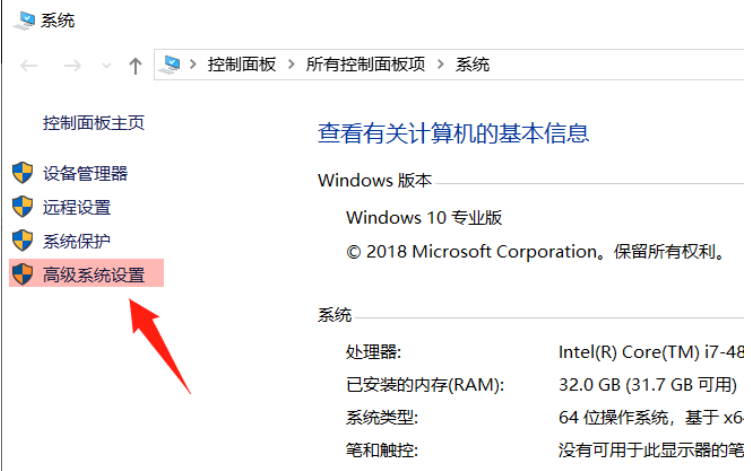

2. 选择"**高级**"选项卡，点击"**环境变量**"：

   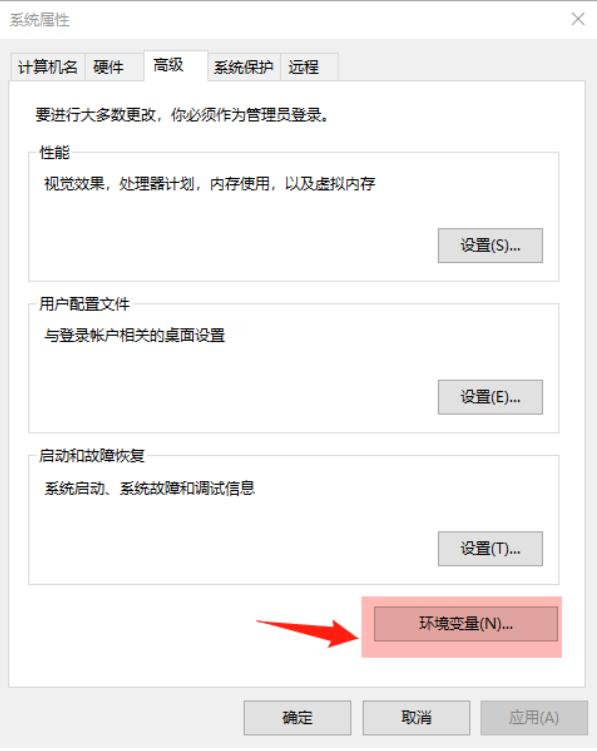

3. 出现“环境变量”界面，如下图：

   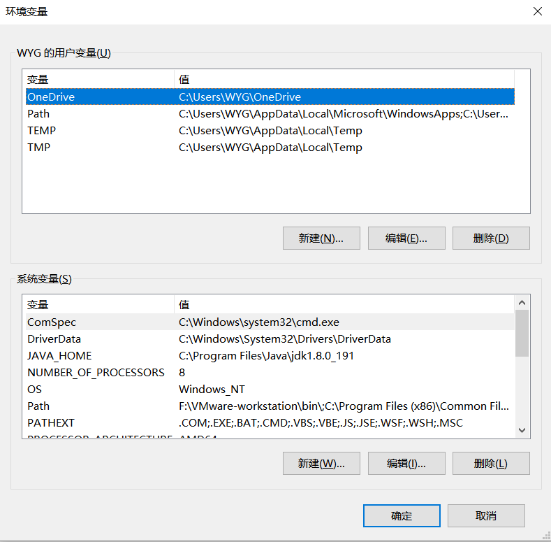

4. 配置 JAVA_HOME 变量：

   - 在系统变量中点击新建

     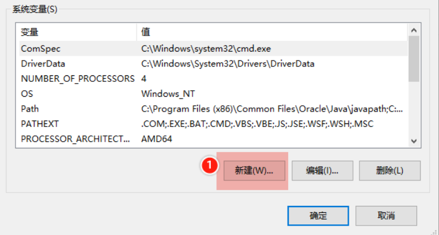

   - 在弹出的新增系统环境变量中填写值，填写后确定

     变量名： JAVA_HOME 

     变量值：填写JDK的安装目录，JDK1-7u80默认为 C:\Program Files\Java\jdk1.8.0_191

     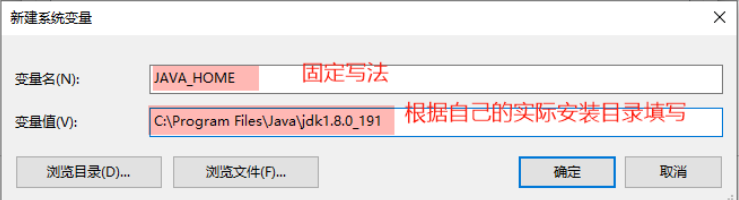

   - 确认

     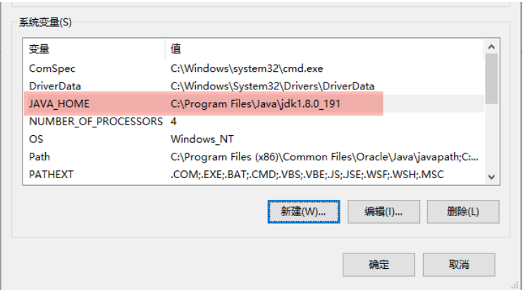

5. 配置 Path 变量

   1. 在系统变量中找到变量名称为Path的变量，选中，点击编辑

      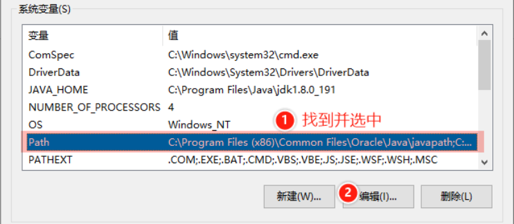

   2. 点击新建，在新建项中填入 %JAVA_HOME%\bin

      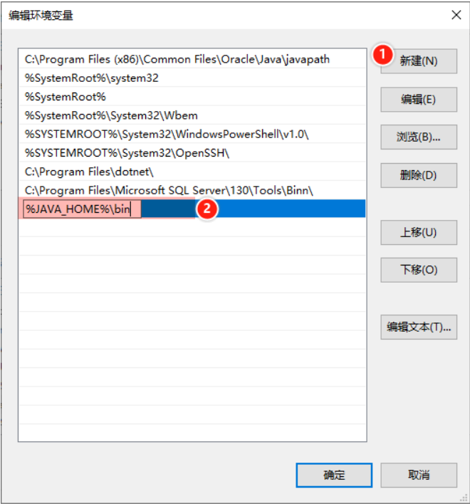

   3. 再次点击新建，在新建项中填入 %JAVA_HOME%\jre\bin

      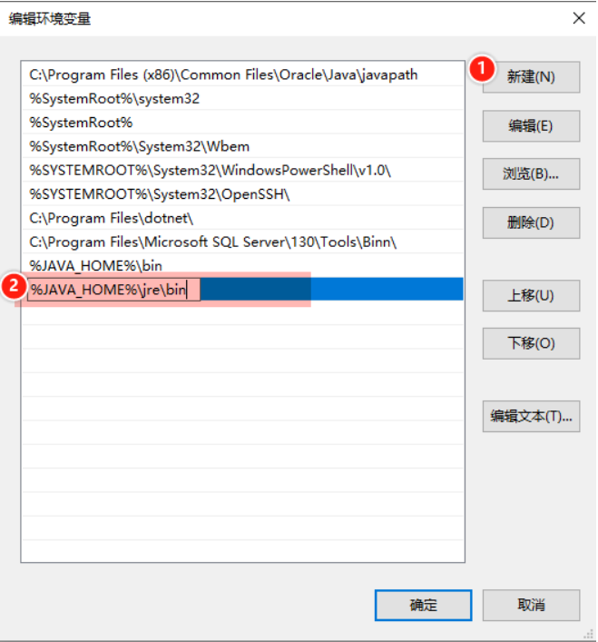

   4. 建议将 ==%JAVA_HOME%\bin== 和 ==%JAVA_HOME%\jre\bin== 通过上移按钮移动到顶部的第二和第 三，把 ==%SystemRoot%\system32== 移动到顶部：

      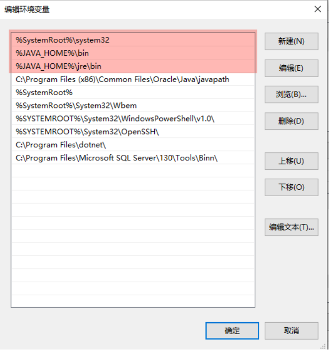

   5. 点击“确定”，保存修改

   6. 点击“环境变量”界面的“确定”按钮，保存修改

   7. 点击“系统属性”界面的“确定”按钮，保存修改

   8. 验证环境变量是否配置成功

      在CMD命令窗口中分别输入 ==java -version==、==java==、==javac==

      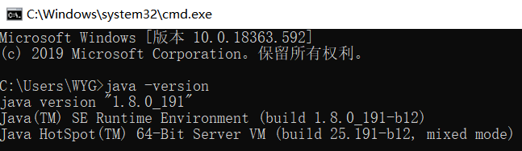

      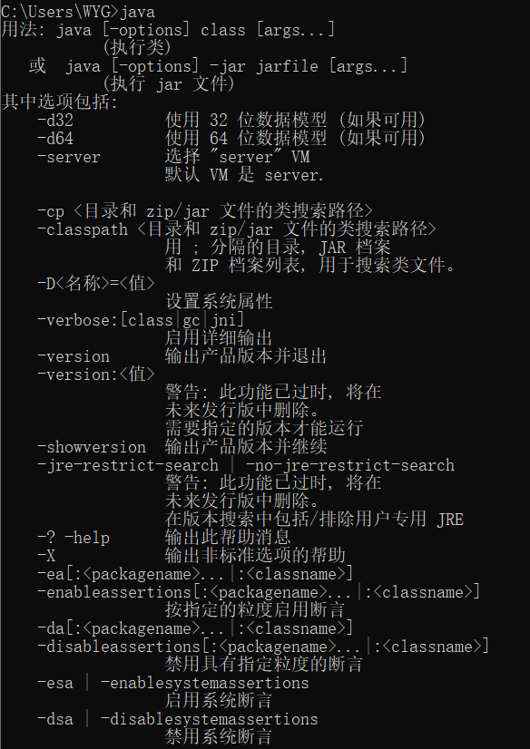

      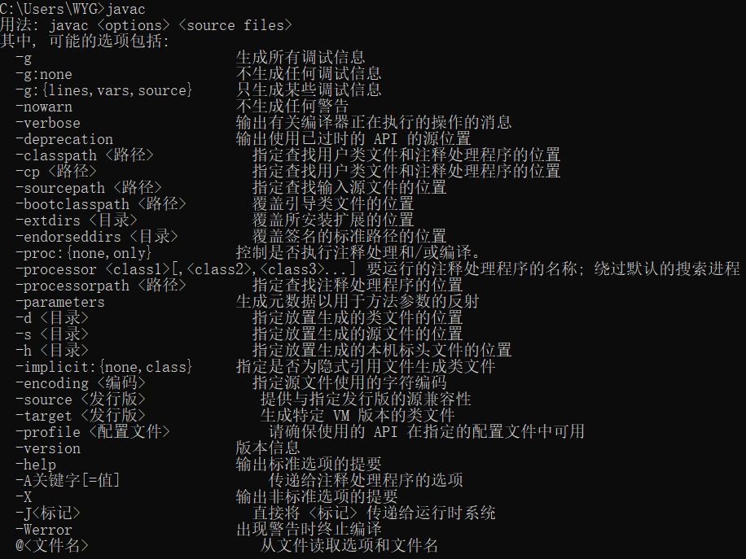

## 三、 Java 基础语法

### 1、第一个Java程序

将通过这个案例告诉大家Java程序运行的基本过程

不使用Eclipse（IDE）

代码如下：

```java
public class HelloWorld {
    /* 第一个Java程序
    * 它将打印字符串 Hello World
    */
    public static void main(String []args) {
    	System.out.println("Hello World"); // 打印 Hello World
    }
}
```

下面将逐步介绍如何保存、编译以及运行这个程序： 

1. 在D盘根目录新建一个文本文档，文件名为：HelloWorld.java； 

2. 使用文本编辑器打开HelloWorld.java，把上面的代码粘贴进去；

3.  打开 cmd 命令窗口，进入目标文件所在的位置 D:\ 

4. 在命令行窗口输入 javac HelloWorld.java 按下回车键编译代码。如果代码没有错误，cmd 命令提 示符会进入下一行。 

5. 再键输入 java HelloWorld 按下回车键就可以运行程序了

   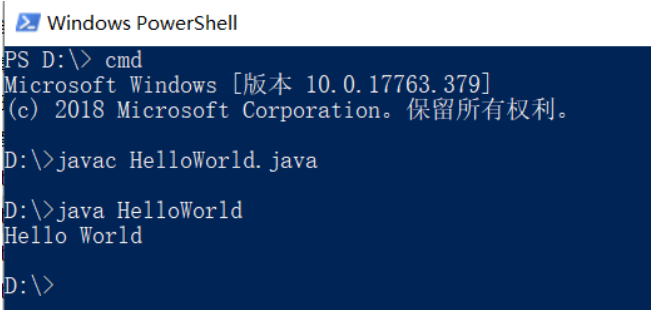

### 2、基本语法

编写 Java 程序时，应注意以下几点：

1. **大小写敏感**：Java 是大小写敏感的，这就意味着标识符 Hello 与 hello 是不同的。 
2. **类名**：大驼峰命名法：对于所有的类来说，类名的首字母应该大写。如果类名由若干单词组成，那 么每个单词的首字母应该大写，例如 MyFirstJavaClass。 
3. **方法名**：小驼峰命名法：所有的方法名都应该以小写字母开头。如果方法名含有若干单词，则后面 的每个单词首字母大写。 
4. **源文件名**：源文件名必须和类名相同。当保存文件的时候，你应该使用public类的类名作为文件名 保存（切记 Java 是大小写敏感的），文件名的后缀为 .java。（如果文件名和类名不相同则会导致编译错误）。
5. **主方法入口**：所有的 Java 程序由 public static void main(String []args) 方法开始执行。

### 3、Java 标识符

Java 所有的组成部分都需要名字。类名、变量名以及方法名都被称为标识符

关于 Java 标识符，有以下几点需要注意：

- 所有的标识符都应该以字母（A-Z 或者 a-z）,美元符（$）、或者下划线（_）开始
- 首字符之后可以是字母（A-Z 或者 a-z）,美元符（$）、下划线（\_）或数字的任何字符组合 
- 关键字不能用作标识符 
- 标识符是大小写敏感的 
- 合法标识符举例：age、$age、_value、__age_value 
- 非法标识符举例：123abc、-age

### 4、Java关键字

关键字：被Java语言赋予了特殊含义，用作专门用途的字符串（单词），这些关键字不能用于常量、变 量、和任何标识符的名称。

| 类别                          | 关键字       | 说明                                                         |
| ----------------------------- | ------------ | ------------------------------------------------------------ |
| 访问控制(3个)                 | private      | 访问控制修饰符，在同一内可见                                 |
|                               | protected    | 访问控制修饰符，对民一包内的类和所有子可见                   |
|                               | public       | 访问控制修饰符，对所有类可见                                 |
| 类、方法和变量修饰符 （14个） | abstract     | 表明类或成员方法具有抽象性                                   |
|                               | class        | 声明一个类                                                   |
|                               | enum         | 枚举（在 J2SE 5.0 中添加）                                   |
|                               | extends      | 表明一个类型是另一个类型的子类型                             |
|                               | final        | 用来说明最终性                                               |
|                               | implements   | 表明一个实现接口                                             |
|                               | interface    | 接口                                                         |
|                               | native       | 原生方法（非ava实现）                                        |
|                               | new          | 用来创建新实例对象                                           |
|                               | static       | 表明具有静态属性                                             |
|                               | strictfp     | 用于跟制浮点计算的精度和舍入（在 J2SE 1.2中 添加）           |
|                               | synchronized | 表明一段代码需同步执行                                       |
|                               | volatile     | 表明两个或者多个变量必须同步地发生变化                       |
| 程序控制语句（11个）          | break        | 用于结束当前循环体中的执行。                                 |
|                               | case         | 用在swtch语句之中，表示其中的一个分支                        |
|                               | continue     | 用于在当前语环体结束时恢复程序执行。                         |
|                               | default      | 1、用在 switch语句中，表明一个默认的分支 <br />==2、用于指定接口中的方法提供方法的默认实现 （Java 8添加）== |
|                               | do           | 用在 do...while环构中                                        |
|                               | else         | 用在条件语句中，表明当条件不成立时的分支                     |
|                               | if           | 条件语句的引导词                                             |
|                               | instanceof   | 用来试一个对象是否是推定型的实例象                           |
|                               | return       | 用于完成方法的执行,返回给调用者方法的返回                    |
|                               | switch       | 分支语句结构的引导词                                         |
|                               | while        | 用于创建一个while循环                                        |
| 错误处理(6个)                 | assert       | 断言，用来进行程序调试（在 J2SE 1.4中添加）                  |
|                               | catch        | 用在异常处理中，用来捕捉异常                                 |
|                               | finally      | 用于处理异常情况，用来声明一个基本肯定会被 执行到的语句块    |
|                               | throw        | 抛出一个异常                                                 |
|                               | throws       | 声明在当前定义的成员方法中所有需要抛出的异 常                |
|                               | try          | 定义具有异常处理的代码块                                     |
| 包相关(2个)                   | import       | 引入要访问指定的类或包                                       |
|                               | package      | 定义所在的包                                                 |
| 基本数据类型(8个)             | boolean      | 基本数据类型之一，布尔类型                                   |
|                               | byte         | 基本数据类型之一，字节类型                                   |
|                               | char         | 基本数据类型之一，字符类型                                   |
|                               | double       | 基本数据类型之一，双精度浮点数类型                           |
|                               | float        | 基本数据类型之一，单精度浮点数类型                           |
|                               | int          | 基本数据类型之一，整数类型                                   |
|                               | long         | 基本数据类型之一，长整数类型                                 |
|                               | short        | 基本数据类型之一, 短整数类型b,m                              |
| 变量引用(3个)                 | supper       | 表明当前对象的父类型的引用或者父类型的构造 方法              |
|                               | this         | 指向当前实例对象的引用                                       |
|                               | void         | 声明当前成员方法没有返回值                                   |
| 保留关键字(2个)               | goto         | 保留关键字，没有具体含义                                     |
|                               | const        | 保留关键字，没有具体含义                                     |

**注意事项**：true，false和，null看起来像关键字，但它们实际上是文字; 也不能在程序中将它们用作标识符。

### 5、java的三种注释

三种注释方法：

1. 单行注释 //注释的内容 
2. 多行注释 /*......*/ 
3. /**......*/ ，这种方式和第二种方式相似。这种格式是为了便于javadoc程序自动生成文档。

JavaDoc标记说明：

| JavaDoc标记 | 解释                                                         |
| ----------- | ------------------------------------------------------------ |
| @author     | 指定作者                                                     |
| @param      | 描述方法的参数                                               |
| @return     | 描述方法的返回值                                             |
| @version    | 指定版本信息                                                 |
| @deprecated | 用来注明被注释的类、变量或方法已经不提倡使用，在将来的版本中有可能被废弃 |
| @throws     | 描述方法抛出的异常，指明抛出异常的条件                       |
| @since      | 指定最早出现在哪个版本                                       |
| @see        | 生成参考其他的JavaDoc文档的连接                              |
| @link       | 生成参考其他的JavaDoc文档，它和@see标记的区别在于，@link标记能够嵌入 到注释语句中，为注释语句中的特殊词汇生成连接。 eg.{@···· Hello} |

**注意**： 

（1）javadoc针对public类生成注释文档 

（2）javadoc只能在public、protected修饰的方法或者属性之上 

（3）javadoc注释的格式化：前导*号和HTML标签 

（4）javadoc注释要仅写在类、属性、方法之前

## 四、Java 基本数据类型

### 1、基本数据类型

Java的两大数据类型：基本数据类型、引用类型

Java语言提供了八种基本数据类型。六种数字类型（四个整数型，两个浮点型），一种字符类型，还有 一种布尔型。

**byte：**

-  byte 数据类型是8位(bit)、有符号的，以二进制补码表示的整数； 
- 最小值是 -128（-2^7）； 
- 最大值是 127（2^7-1）； 
- 默认值是 0； 
- 例子：byte a = 100，byte b = -50。

**short：** 

- short 数据类型是 16 位、有符号的以二进制补码表示的整数 最小值是 -32768（-2^15）；
- 最大值是 32767（2^15 - 1）； 
- Short 数据类型可以节省空间。一个short变量是int型变量所占空间的二分之一； 
- 默认值是 0； 
- 例子：short s = 100，short r = -200。

**int：**

- int 数据类型是32位、有符号的以二进制补码表示的整数； 
- 最小值是 -2,147,483,648（-2^31）； 
- 最大值是 2,147,483,647（2^31 - 1）； 
- 一般地整型变量默认为 int 类型； 
- 默认值是 0 ； 
- 例子：int a = 1000, int b = -2000。

**long：** 

- long 数据类型是 64 位、有符号的以二进制补码表示的整数； 
- 最小值是 -9,223,372,036,854,775,808（-2^63）； 
- 最大值是 9,223,372,036,854,775,807（2^63 -1）； 
- 这种类型主要使用在需要比较大整数的系统上； 
- 默认值是 0L； 
- 例子： long a = 100000L，Long b = -200000L。 
  注意:"L"理论上不分大小写，但是若写成"l"容易与数字"1"混淆，不容易分辩。所以最好大写。 

**float：**

- float 数据类型是单精度、32位、符合IEEE 754标准的浮点数； 
- float 在储存大型浮点数组的时候可节省内存空间； 
- 默认值是 0.0f； 
- 浮点数不能用来表示精确的值，如货币； 
- 例子：float f1 = 234.5f。 

**double：** 

- double 数据类型是双精度、64 位、符合IEEE 754标准的浮点数； 
- 浮点数的默认类型为double类型； 
- double类型同样不能表示精确的值，如货币； 
- 默认值是 0.0d； 
- 例子：double d1 = 123.4。 

**boolean：** 

- boolean数据类型表示一位的信息； 
- 只有两个取值：true 和 false； 
- 这种类型只作为一种标志来记录 true/false 情况； 
- 默认值是 false； 
- 例子：boolean one = true。 

**char：** 

- char类型是一个单一的 16 位 Unicode 字符； 
- 最小值是 \u0000（即为0）； 
- 最大值是 \uffff（即为65,535）； 
- char 数据类型可以储存任何字符； 
- 例子：char letter = 'A';。

| 分类     | 数据类型 | 内存大小(字节) | 内存位数 | 默认值 | 最小值            | 最大值                 | 描述                                 |
| -------- | -------- | -------------- | -------- | ------ | ----------------- | ---------------------- | ------------------------------------ |
| 数字类型 | byte     | 1              | 8        | 0      | -2^7              | 2^7-1                  | 有符号 的以二 进制补 码表示 的整数   |
|          | short    | 2              | 16       | 0      | -2^15             | 2^15 - 1               | 有符号 的以二 进制补 码表示 的整数   |
|          | int      | 4              | 32       | 0      | -2^31             | 2^31 - 1               | 有符号 的以二 进制补 码表示 的整数   |
|          | long     | 8              | 64       | 0      | -2^63             | 2^63 - 1               | 有符号 的以二 进制补 码表示 的整数   |
|          | float    | 4              | 32       | 0.0f   |                   |                        | 单精 度，符 合IEEE 754标准 的浮点 数 |
|          | double   | 8              | 64       | 0.0d   |                   |                        | 双精 度，符 合IEEE 754标准 的浮点 数 |
| 布尔型   | boolean  |                |          | false  |                   |                        |                                      |
| 字符类型 | char     | 2              | 16       | u0000  | \u0000（即 为 0） | \uffff（65535（2^16）) | Unicode 字符                         |

- float类型(32位)：1bit（符号位） 8bits（指数位） 23bits（尾数位） 
- double类型(64位)：1bit（符号位） 11bits（指数位） 52bits（尾数位）

Java语言支持一些特殊的转义字符序列。

| 转义字符 | 意义                                | ASCII码值（十进制） |
| -------- | ----------------------------------- | ------------------- |
| \b       | 退格(BS) ，将当前位置移到前一列     | 008                 |
| \f       | 换页(FF)，将当前位置移到下页开头    | 012                 |
| \n       | 换行(LF) ，将当前位置移到下一行开头 | 010                 |
| \r       | 回车(CR) ，将当前位置移到本行开头   | 013                 |
| \t       | 水平制表(HT) （跳到下一个TAB位置）  | 009                 |
| \v       | 垂直制表(VT)                        | 011                 |
| \\\      | 代表一个反斜线字符'''               | 092                 |
| \\'      | 代表一个单引号（撇号）字符          | 039                 |
| \\"      | 代表一个双引号字符                  | 034                 |
| \0       | 空字符(NULL)                        | 000                 |
| \ddd     | 3位八进制数所代表的任意字符         | 三位八进制          |
| \uhhhh   | 4位十六进制所代表的任意字符         | 四位十六进制        |

### 2、基本数据类型的包装类

Java每个基本类型在java.lang包中都有一个相应的包装类

**包装类有何作用**

1. 提供了一系列实用的方法 

2. 集合不允许存放基本数据类型数据，存放时，要用包装类型

   | 基本数据类型 | 包装类    |
   | ------------ | --------- |
   | byte         | Byte      |
   | short        | Short     |
   | int          | Integer   |
   | long         | Long      |
   | float        | Float     |
   | double       | Double    |
   | char         | Character |
   | boolean      | Boolean   |

   这八种包装类所继承的父类不全都相同。

   - Integer ,Byte,Float,Double,Short,Long都属于Number类的子类，Number类本身提供了一系列的 返回以上六种基本数据类型的操作。
   - Character属于Object子类
   - Boolean属于Object子类。

   装箱及拆箱

   - 将基本数据类型变成包装类称为装箱。
   - 将包装类的类型变为基本数据类型称为拆箱
   - 在JDK1.5之后，提供了自动装箱和自动拆箱功能。

### 3、类型转换

1、自动类型转换(隐式类型转换)

**整型、字符型数据可以混合运算。运算中，不同类型的数据先转化为同一类型，然后进行运算。** 

转换从低级到高级。

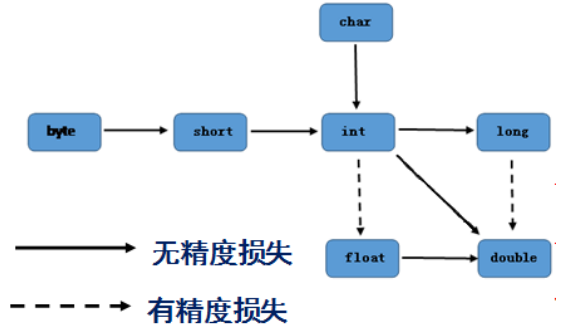

自动转换有以下规律：

- 小的类型自动转化为大的类型 
- 整数类型可以自动转化为浮点类型，可能会产生舍入误差 
- 字符可以自动提升为整数

2、强制类型转换(显式类型转换)

**格式：** (type)value 

type是要强制类型转换后的数据类型 

**注意：** 

- 强制类型转换可能导致溢出或损失精度 
- 在把容量大的类型转换为容量小的类型时必须使用强制类型转换 
- 浮点数到整数的转换是通过舍弃小数得到，而不是四舍五入

## 五、运算符

Java运算符分成以下几种：

- 算术运算符
- 关系（比较）运算符 
- 逻辑运算符 
- 赋值运算符 
- 其他运算符 
- 位运算符（了解）

### 1、算术运算符

| 操作符 | 描述                              |
| ------ | --------------------------------- |
| +      | 加法 - 相加运算符两侧的值         |
| -      | 减法 - 左操作数减去右操作数       |
| *      | 乘法 - 相乘操作符两侧的值         |
| /      | 除法 - 左操作数除以右操作数       |
| %      | 取余 - 左操作数除以右操作数的余数 |
| ++     | 自增: 操作数的值增加1             |
| --     | 自减: 操作数的值减少1             |

注意：**自增（自减）在前面和在后面的区别：** 

- ++y(--y):先将 y 的值自增（自减）1，然后再在当前表达式中使用 y 的值。 
- y++(y--):先在当前表达式中使用 y 的值，然后再将 y 的值自增（自减）1。

### 2、关系（比较）运算符

| 运算符 | 描述                                                         |
| ------ | ------------------------------------------------------------ |
| >      | 检查左操作数的值是否大于右操作数的值，如果是那么条件为真。   |
| \>=    | 检查左操作数的值是否大于或等于右操作数的值，如果是那么条件为真。 |
| <      | 检查左操作数的值是否小于右操作数的值，如果是那么条件为真。   |
| <=     | 检查左操作数的值是否小于或等于右操作数的值，如果是那么条件为真。 |
| ==     | 检查如果两个操作数的值是否相等，如果相等则条件为真。         |
| !=     | 检查如果两个操作数的值是否相等，如果值不相等则条件为真。     |

**注意：Java中 == 和 equals()方法的区别** 

- == 在基本数据类型的时候就是比较值是否相同，在引用类型时是比较地址 
- equals 用于判断引用类型的值

### 3、 逻辑运算符

| 操作符 | 描述                                                         |
| ------ | ------------------------------------------------------------ |
| &&     | 与，前后两个操作数必须都是true才返回true，否则返回false      |
| &      | 不短路与，作用与&&相同，但不会短路。                         |
| \|\|   | 称为逻辑或操作符。如果任何两个操作数任何一个为真，条件为真。 |
| \|     | 不短路或，作用与                                             |
| !      | 称为逻辑非运算符。用来反转操作数的逻辑状态。如果条件为true，则逻辑非运算符将 得到false。 |
| ^      | 异或，当两个操作数不同时才返回true,如果两个操作数相同则返回false。 |

### 4、赋值运算符

| 操作符 | 描述                                                         |
| ------ | ------------------------------------------------------------ |
| =      | 简单的赋值运算符，将右操作数的值赋给左侧操作数               |
| +=     | 加和赋值操作符，它把左操作数和右操作数相加赋值给左操作数     |
| -=     | 减和赋值操作符，它把左操作数和右操作数相减赋值给左操作数     |
| *=     | 乘和赋值操作符，它把左操作数和右操作数相乘赋值给左操作数     |
| /=     | 除和赋值操作符，它把左操作数和右操作数相除赋值给左操作数     |
| %=     | 取余和赋值操作符，它把左操作数和右操作数取余后赋值给左操作数 |

### 5、其他运算符

1. 三目运算符（?:）

   三目运算符也被称为三元运算符。该运算符有3个操作数，并且需要判断布尔表达式的值。该运算符的主 要是决定哪个值应该赋值给变量。

   **格式：**

   ```
   variable x = (expression) ? value if true : value if false
   ```

2. instanceof 运算符

   该运算符用于操作对象实例，检查该对象是否是一个特定类型（类类型或接口类型）。

   **格式：**

   ```
   (Object reference variable) instanceof (class/interface type)
   ```

### 6、位运算符（了解）

| 操作符 | 描述                                                         |
| ------ | ------------------------------------------------------------ |
| ＆     | 如果相对应位都是1，则结果为1，否则为0                        |
| \|     | 如果相对应位都是 0，则结果为 0，否则为 1                     |
| ^      | 如果相对应位值相同，则结果为0，否则为1                       |
| 〜     | 按位取反运算符翻转操作数的每一位，即0变成1，1变成0。         |
| <<     | 按位左移运算符。左操作数按位左移右操作数指定的位数。         |
| \>>    | 按位右移运算符。左操作数按位右移右操作数指定的位数。         |
| \>>>   | 按位右移补零操作符。左操作数的值按右操作数指定的位数右移，移动得到的空位以零 填充。 |

### 7、Java 语言中运算符的优先级

共分为 14 级，其中 1 级最高，14 级最低

| 优先级 |                            运算符                            |                            简介                             | 结合性   |
| ------ | :----------------------------------------------------------: | :---------------------------------------------------------: | -------- |
| 1      |                         [ ]、. 、( )                         |                     方法调用，属性获取                      | 从左向右 |
| 2      |                        !、~、 ++、 --                        |                         一元运算符                          | 从右向左 |
| 3      |                          \* 、/ 、%                          |                    乘、除、取模（余数）                     | 从左向右 |
| 4      |                           \+ 、 -                            |                           加减法                            | 从左向右 |
| 5      |                        <<、 >>、 >>>                         |                 左位移、右位移、无符号右移                  | 从左向右 |
| 6      |                 < 、<= 、>、 >=、 instanceof                 | 小于、小于等于、大于、大于等于， 对象类型判断是否属于同类型 | 从左向右 |
| 7      |                           == 、!=                            |               2个值是否相等，2个值是否不等于                | 从左向右 |
| 8      |                              &                               |                           按位与                            | 从左向右 |
| 9      |                              ^                               |                          按位异或                           | 从左向右 |
| 10     |                              \|                              |                           按位或                            | 从左向右 |
| 11     |                              &&                              |                           短路与                            | 从左向右 |
| 12     |                             \|\|                             |                           短路或                            | 从左向右 |
| 13     |                              ?:                              |                         三目运算符                          | 从右向左 |
| 14     | =、 += 、-= 、*= 、/=、 %=、 &=、 \|=、 ^=、 <、<= 、>、>= 、>>= |                       混合赋值运算符                        | 从右向左 |

## 六、流程控制语句

### 1、 if...else语句

if...else 语句可以看作有4种形式：

- if 语句

  ```java
  if(布尔表达式)
  {
  	//如果布尔表达式为true将执行的语句
  }
  ```

- if...else 语句

  ```java
  if(布尔表达式){
  	//如果布尔表达式的值为true
  } else {
  	//如果布尔表达式的值为false
  }
  ```

- if...else if...else语句

  ```java
  if(布尔表达式 1){
  	//如果布尔表达式 1的值为true执行代码
  } else if(布尔表达式 2){
  	//如果布尔表达式 2的值为true执行代码
  } else if(布尔表达式 3){
  	//如果布尔表达式 3的值为true执行代码
  } else {
  	//如果以上布尔表达式都不为true执行代码
  }
  
  ```

- 嵌套的 if…else 语句

  ```java
  if(布尔表达式 1){
      //如果布尔表达式 1的值为true执行代码
      if(布尔表达式 2){
      	//如果布尔表达式 2的值为true执行代码
      }
  }
  ```

### 2、switch语句

switch case 语句有如下规则：

- switch 语句中的变量类型可以是： byte、short、int或者 char、enum。从 Java SE 7 开始， switch 支持字符串 String 类型了，同时 case 标签必须为字符串常量或字面量。 
- switch 语句可以拥有多个 case 语句。每个 case 后面跟一个要比较的值和冒号。 
- case 语句中的值的数据类型必须与变量的数据类型相同，而且只能是常量或者字面常量。 
- 当变量的值与 case 语句的值相等时，那么 case 语句之后的语句开始执行，直到 break 语句出现 才会跳出 switch 语句。 
- 当遇到 break 语句时，switch 语句终止。程序跳转到 switch 语句后面的语句执行。case 语句不必 须要包含 break 语句。如果没有 break 语句出现，程序会继续执行下一条 case 语句，直到出现 break 语句。 
- switch 语句可以包含一个 default 分支，该分支一般是 switch 语句的最后一个分支（可以在任何 位置，但一般在最后一个）。default 在没有 case 语句的值和变量值相等的时候执行。default 分 支不需要 break 语句。

**格式：**

```Java
switch(表达式)
{
    case 表达式值 1:
    	语句块 1;
    break;
    ....
    case 表达式 N：
    	语句块 N;
    	break;
    default：
    	语句块;
}
```

### 3、 循环语句

Java中有三种主要的循环结构：

- for 循环 
- while 循环 
- do…while 循环 
- Java 增强 for 循环

1. for循环

   **格式：**

   ```Java
   for(初始化; 布尔表达式; 更新) {
   	//代码语句
   }
   ```

2. while 循环

   while是最基本的循环，它的结构为：

   格式：

   ```Java
   while( 布尔表达式 ) {
   	//循环内容
   }
   ```

3. do...while循环

   do…while 循环和 while 循环相似，不同的是，do…while 循环至少会执行一次。

   格式：

   ```java
   do {
   	//代码语句
   } while(布尔表达式);
   ```

4. Java增强型for循环

   Java5 引入了一种主要用于数组的增强型for循环。但需要注意一点：Java增强型for循环**只能取值，不能赋值**

   **格式:**

   ```java
   for(声明语句 : 表达式)
   {
   	//代码句子
   }
   ```

5. break、continue、return

   - break : 结束循环 
   - continue : 结束本次循环,进入下一次循环 
   - return : 结束一个方法，方法的结束了，循环自然被结束

   注意：在while和do...while中使用continue时要注意 更新语句的位置。

## 七、数组

数组对于所有编程语言来说都是重要的数据结构之一，Java 语言中提供的数组是用来存储固定大小的同 类型元素。

### 1、声明数组变量

必须声明数组变量，才能在程序中使用数组。下面是声明数组变量的语法格式：

**格式：**

```java
dataType[] arrayRefVar; // 推荐使用
//或
dataType arrayRefVar[]; // 效果相同，但基本不使用这种方式
```

**示例代码：**

```java
byte[] arrayByteA;
int[] arrayIntA;
long[] arrayLongA;
String[] arrayStringA;
```

### 2、数组初始化

数组的初始化主要有两种方式：

- 静态初始化 
- 动态初始化

1. 数组静态初始化

   格式：

   ```java
   arrayRefVar = {value0, value1, ..., valuek};
   //或者 数组变量的声明和初始化用一条语句完成
   dataType[] arrayRefVar = {value0, value1, ..., valuek};
   ```

   **示例代码：**

   ```java
   //1、静态初始化
   int[] arrayIntA = new int[]{1,2,3,4,5};
   ```

2. 数组动态初始化

   格式：

   ```java
   arrayRefVar = new dataType[arraySize];
   //或者 数组变量的声明和初始化用一条语句完成
   dataType[] arrayRefVar = new dataType[arraySize];
   ```

   示例代码：

   ```java
   //2、动态初始化
   String[] arrayStringA = new String[5];
   ```

### 3、数组引用

Java中通过下标来引用数组元素： arrayName[index]; 

Java会对数组元素要进行越界检查以保证安全性。每个数组都有一个length属性来指明它的长度，例如 arrayIntA.length 指明数组 arrayIntA 的长度。

示例代码：

```java
//赋值
arrayIntA[2]=9;
//取值
System.out.println("arrayIntA的第三个元素是:"+arrayIntA[2]);
```

### 4、数组的遍历

1. for循环遍历数组

   在实际开发中，经常需要遍历数组以获取数组中的每一个元素。最容易想到的方法是for循环。

   示例代码：

   ```java
   //遍历数组赋值
   for (int i = 0; i < arrayStringA.length; i++) {
   	arrayStringA[i]=String.valueOf(i);
   }
   //遍历数组取值
   for (int i = 0; i < arrayStringA.length; i++) {
   	System.out.println(arrayStringA[i]);
   }
   ```

2. 增强型for循环

   格式:

   ```java
   for(声明语句 : 表达式)
   {
   	//代码句子
   }
   ```

### 5、二维数组

二维数组的声明、初始化和引用与一维数组相似：

示例代码：

```java
int[][] arrayA = new int[][]{{1,2},{3,4},{5,6}};
int[][] arrayB = new int[2][2];
arrayB[0][0] = 0;
arrayB[0][1] = 1;
arrayB[1][0] = 2;
arrayB[1][1] = 3;
int[][] arrayC = new int[][]{{1},{2,3},{4,5,6},{7,8,9,10}};
int[][] arrayD = new int[3][];
arrayD[0] = new int[]{1};
arrayD[1] = new int[]{2,3};
arrayD[2] = new int[]{4,5,6};
```

注意：Java语言中，把二维数组看作是**数组的数组**，数组空间不是连续分配的。所以不要求二维数组每 一维的大小相同。

## 八、Java 面向对象

对象和类的概念

- 类：类是一个模板，它描述一类对象的行为和状态。 
- 对象：对象是类的一个实例，有状态和行为。例如，一条狗是一个对象，它的状态有：颜色、名 字、品种；行为有：摇尾巴、叫、吃等。

借用网上的图简单理解一下类和对象，下图中男孩女孩为类，而具体的每个人为该类的对象：

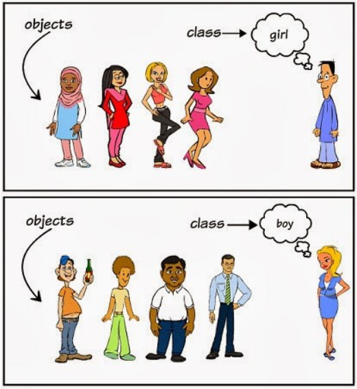

### 1、Java中的类

定义类的基本格式：

```java
[修饰符] class 类名
{
    //零到多个构造器...
    //零到多个成员变量...
    //零到多个方法...
    //零到多个初始化块...
}
```

修饰符 可以为 public final abstract 或者 不写 

类名：大驼峰命名

1. 构造器

   **构造器**也叫**构造方法**或者**构造函数**，构造器与类名相同，没有返回值，连void都不能写; 

   构造器定义格式：

   ```java
   [修饰符] 类名 (形参列表)
   {
   	//构造器方法体代码
   }
   ```

   - 名称与类名相同，没有返回值，不能写void 
   - 如果类中没有手动添加构造器，编译器会默认再添加一个无参构造器 
   - 如果手动添加了构造器（无论什么形式），默认构造器就会消失 
   - 构造器可以重载

2. 成员变量

   **成员变量：**成员变量是定义在类中，方法体之外的变量。这种变量在创建对象的时候实例化。成员变量 可以被类中方法、构造方法和特定类的语句块访问。

   ```java
   [修饰符] type 成员变量名称 [= 默认值];
   ```

   - 修饰符 (public protected private)三选一、 static、final

3. 方法

   Java方法是语句的集合，它们在一起执行一个功能。

   - 方法是解决一类问题的步骤的有序组合 

   - 方法包含于类或对象中 

   - 方法在程序中被创建，在其他地方被引用

     ```java
     [修饰符] 方法的返回值类型 方法名称 (形参列表)
     {
     	//方法体代码
     	[return 返回值;]
     }
     ```

   - 修饰符 (public protected private)三选一、 static、final、synchronize、native

4. 初始化代码块

   在后面

### 2、Java中的对象

1. 创建对象

   对象是根据类创建的。在Java中，使用关键字new来创建一个新的对象。创建对象需要以下三步：

   - 声明：声明一个对象，包括对象名称和对象类型。 

   - 实例化：使用关键字new来创建一个对象，只是为对象在内存中开辟空间。

   - 初始化：使用new创建对象时，会调用构造方法初始化对象，对象中的值赋初始值。

     格式：

     ```java
     classTpye 对象名称 = new classTpye();
     ```

2. 访问实例变量和方法

   格式：

   ```java
   /* 访问类中的变量 */
   objName.variableName;
   /* 访问类中的方法 */
   objName.methodName();
   ```

### 3、成员变量和局部变量

PS:Java中变量的分类

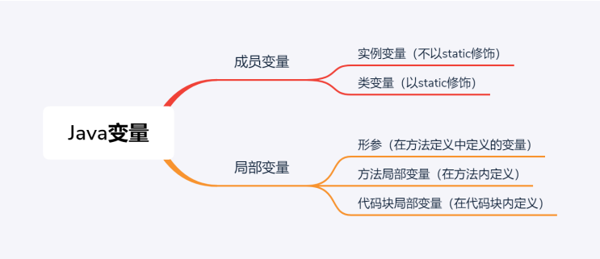

### 4、构造器的重载

- 每个构造器必须有一个独一无二的参数类型列表。

### 5、方法的重载(Overload)

重载(overloading) 是在一个类里面，**方法名字相同，而参数不同**。返回类型可以相同也可以不同。 

每个重载的方法（或者构造函数）都必须有一个独一无二的参数类型列表。

重载规则:

- 方法名字相同 
- 被重载的方法必须形参列表不一样(参数个数或类型不一样)； 
- 被重载的方法可以改变返回类型； 
- 被重载的方法可以改变访问修饰符； 
- 返回值类型不能作为重载函数的区分标准。
- 被重载的方法可以声明新的或更广的检查异常； 
- 方法能够在同一个类中或者在一个子类中被重载

### 6、Java 封装

在面向对象程式设计方法中，封装（英语：Encapsulation）是指一种将抽象性函式接口的实现细节部份 包装、隐藏起来的方法。 

封装可以被认为是一个保护屏障，防止该类的代码和数据被外部类定义的代码随机访问。 

要访问该类的代码和数据，必须通过严格的接口控制。 

适当的封装可以让程式码更容易理解与维护，也加强了程式码的安全性。

**目的**

1. 封装可以隐藏实现的细节 
2. 让使用者只能通过实现写好的访问方法来访问这些字段，这样一来我们只需要在这些方法中增加逻 辑控制，限制对数据的不合理访问
3. 方便数据检查，有利于于保护对象信息的完整性 
4. 便于修改，提高代码的可维护性

**实现Java封装的步骤：**

1. 修改属性的可见性来限制对属性的访问（一般限制为private） 
2. 对每个值属性提供对外的公共方法访问，也就是创建getter 和 setter方法（将实例变量的首字母大 写，在前面添加get或者set， 变成getter 和 setter方法名）

### 7、Java 继承

1. 继承的概念

   继承是java面向对象编程技术的一块基石，因为它允许创建分等级层次的类。 

   继承就是子类继承父类的特征和行为，使得子类对象（实例）具有父类的实例域和方法，或子类从父类 

   继承方法，使得子类具有父类相同的行为。

2. 类的继承格式

   ```java
   class 父类 {
   }
   class 子类 extends 父类 {
   }
   ```

3. 继承类型

   需要注意的是 **Java 不支持多继承**，但支持多重继承

   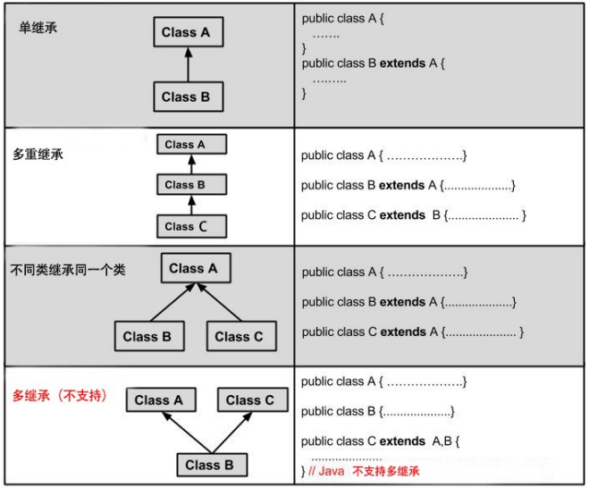

### 8、方法的重写(Override)

重写是子类对父类的允许访问的方法的实现过程进行重新编写, 返回值和形参都不能改变。 

重写的好处在于子类可以根据需要，定义特定于自己的行为。 也就是说子类能够根据需要实现父类的方 法。 

重写方法不能抛出新的检查异常或者比被重写方法申明更加宽泛的异常。例如： 父类的一个方法申明了 一个检查异常 IOException，但是在重写这个方法的时候不能抛出 Exception 异常，因为 Exception 是 IOException 的父类，只能抛出 IOException 的子类异常。

**方法的重写规则：**

1. 参数列表必须完全与被重写方法的相同； 
2. 返回类型必须完全与被重写方法的返回类型相同； 
3. 访问权限不能比父类中被重写的方法的访问权限更低。例如：如果父类的一个方法被声明为 public，那么在子类中重写该方法就不能声明为protected。
4. 父类的成员方法只能被它的子类重写。 
5. 声明为final的方法不能被重写。
6. 声明为static的方法不能被重写，但是能够被再次声明。
7. 子类和父类在同一个包中，那么子类可以重写父类所有除了声明为private和final的方法。
8. 子类和父类不在同一个包中，那么子类只能够重写父类的声明为public和protected的非final方 法。
9. 重写的方法能够抛出任何非强制异常，无论被重写的方法是否抛出异常。但是，重写的方法不能抛 出新的强制性异常，或者比被重写方法声明的更广泛的强制性异常，反之则可以。
10. 构造方法不能被重写。
11. 如果不能继承一个方法，则不能重写这个方法。

### 9、super 与 this 关键字

**super关键字**：我们可以通过super关键字来实现对父类成员的访问，用来引用当前对象的父类。 

**this关键字**：指向自己的引用。

### 10、重写与重载之间的区别

| 区别点   | 重载方法 | 重写方法                                       |
| -------- | -------- | ---------------------------------------------- |
| 参数列表 | 必须修改 | 一定不能修改                                   |
| 返回类型 | 可以修改 | 一定不能修改                                   |
| 异常     | 可以修改 | 可以减少或删除，一定不能抛出新的或者更广的异常 |
| 访问     | 可以修改 | 一定不能做更严格的限制（可以降低限制）         |

- 方法重载是一个类中定义了多个方法名相同,而他们的参数的数量不同或数量相同而类型和次序不 同,则称为方法的重载(Overloading)。 
- 方法重写是在子类存在方法与父类的方法的名字相同,而且参数的个数与类型一样,返回值也一样的 方法,就称为重写(Overriding)。 
- 方法重载是一个类的多态性表现,而方法重写是子类与父类的一种多态性表现。

### 11、初始化块

初始化块根据是否使用static修饰分为两类： 

1. 不使用static修饰的是初始化块 
2. 使用static修饰的是静态初始化块

- 初始化块
  - 初始化块相当于是对构造器的补充，用于创建对象时给对象的初始化，在构造器之前执行 
  - 如果一段初始化代码对所有构造器完全相同，且无需接收参数，那就可以将其提取到非静态初 始化代码块中 
  - 实际上，经过编译后，非静态块已经添加到构造器中，且位于所有构造器代码的前面
- 静态初始化块
  - 静态初始化块用static修饰，又叫类初始化块 
  - 静态初始化块负责对类进行初始化，因此类初始化块是在类初始化阶段就执行 
  - 静态块跟静态方法一样，不能访问非静态成员 
  - 因为静态块是在类的初始化阶段完成的，因此在创建某个类的第二个对象时，该类的静态块就不会执行了

单个类中初始化块、静态初始化块、构造器的执行顺序

- 在单个类中，静态初始化块（多个时从上往下执行），初始化块（多个时从上往下执行），构造器

### 12、final修饰符

final主要用法有以下四种：

1. **用来修饰数据**，包括成员变量和局部变量，该变量只能被赋值一次且它的值无法被改变。对于成员 变量来讲，我们必须在声明时、构造方法或者初始化块中对它赋值；
2. **用来修饰局部变量**，表示在变量的生存期中它的值不能被改变
3. **修饰方法**，表示该方法无法被重写；
4. **修饰类**，表示该类无法被继承。

### 13、Java 抽象类

在面向对象的概念中，所有的对象都是通过类来描绘的，但是反过来，并不是所有的类都是用来描绘对 象的，如果一个类中没有包含足够的信息来描绘一个具体的对象，这样的类就是抽象类。 

抽象类除了不能实例化对象之外，类的其它功能依然存在，成员变量、成员方法、初始化块和构造方法 和普通类一样。 

由于抽象类不能实例化对象，所以抽象类必须被继承，才能被使用。

1. 抽象方法

   抽象方法只包含一个方法名，而没有方法体，使用abstract修饰。

   格式：

   ```java
   [修饰符] abstract 返回类型 方法名();
   ```

   - 修饰符 (public protected private)三选一

2. 总结

   - 抽象类必须使用abstract修饰符来修饰， 

     抽象方法也必须使用abstract修饰符来修饰， 

     抽象方法不能有方法体。

   - 抽象类不能被实例化， 

     无法使用new关键字来调用抽象类的构造器创建抽象类的实例。

   - 抽象类可以包含成员变量、 

     方法（普通方法和抽象方法都可以）、 

     构造器、初始化块、 

     内部类（接 口、枚举）5种成分。

   - 抽象类的构造器不能用于创建实例，主要是用于被其子类调用。

   - 抽象类中不一定包含抽象方法，但是有抽象方法的类必定是抽象类

   - abstract static不能同时修饰一个方法

### 14、Java 接口

接口（英文：Interface），在JAVA编程语言中是一个抽象类型，是抽象方法的集合，接口通常以 interface来声明。一个类通过继承接口的方式，从而来继承接口的抽象方法。 

接口并不是类，编写接口的方式和类很相似，但是它们属于不同的概念。类描述对象的属性和方法。接口则包含类要实现的方法。

除非实现接口的类是抽象类，否则该类要定义接口中的所有方法。 

接口无法被实例化，但是可以被实现。一个实现接口的类，必须实现接口内所描述的所有方法，否则就必须声明为抽象类。 

在 Java 中，接口类型可用来声明一个变量，他们可以成为一个空指针，或是被绑定在一个以此接口实现的对象。

1. 接口的定义

   格式：

   ```java
   [public] interface InterfaceOne [extends fatheInterface1,fatheInterface2...]{
       [public] [static] [final] type CONSTANT_NAME=Value;//定义常量
       //编译时自动为接口里定义的成员变量增加public static final修饰符
       int INT_A=11;
       public final static int INT_B=11;
       
       [public] [abstract] returnType methedName(参数列表);//声明方法
       //编译时自动为接口里定义的方法添加public abstract修饰符
       void sleep();
       public abstract void running();
       void test();
   }
   ```

   修饰符 public、abstract 

   接口有以下特性：

   - 接口是隐式抽象的，当声明一个接口的时候，不必使用**abstract关键字**。 
   - 接口中每一个方法也是隐式抽象的，声明时同样不需要**abstract关键字**。 
   - 接口中的方法都是公有的。 
   - 编译时自动为接口里定义的方法添加public abstract修饰符 
   - Java接口里的成员变量只能是public static final共同修饰的，并且必须赋初值，可以不写public static final，编译的时候会自动添加

2. 接口的实现

   当类实现接口的时候，类要实现接口中所有的方法。否则，类必须声明为抽象的类。 

   类使用implements关键字实现接口。在类声明中，Implements关键字放在class声明后面。

   - Java中类可以实现多个接口

     格式：

     ```java
     [修饰符] class 类名 implements 接口1[, 接口2, 接口3..., ...]
     {
     }
     ```

3. 接口的继承

   一个接口能继承另一个接口，和类之间的继承方式比较相似。接口的继承使用extends关键字，子接口 继承父接口的方法。**接口允许多继承**

### 15、抽象类和接口的对比

|                    | 抽象类                                                       | 接口                                                         |
| ------------------ | ------------------------------------------------------------ | ------------------------------------------------------------ |
| 默认的方法实现     | 它可以有默认的方法实现                                       | 接口完全是抽象的。不存在方法的实现                           |
| 实现               | 子类使用extends关键字来继承抽象类。如果子 类不是抽象类的话,它需要提供抽象类中所有声明 的抽象方法的实现。 | 类使用关键字impements来实现 接口。它需要提供接口中所有声 明的方法的实现 |
| 构造器             | 抽象类可以有构造器                                           | 接口不能有构造器                                             |
| 与正常Java类的区别 | 除了不能实例化抽象类之外,它和普通Java类没有任何区别          | 接囗是完全不同的类型                                         |
| 访问修饰符         | 抽象方法可以有pubic、protected和default这些修饰符            | 接口方法默认修饰符是public。你不可以使用其它修饰符。         |
| main方法           | 抽象方法可以有main方法并且我们可以运行它                     | 接口没有main方法,因此我们不能运行它。                        |
| 多继承             | 抽象类可以继承一个类和实现多个接口                           | 接口只可以继承一个或多个其它接口                             |
| 添加新方法         | 如果你往抽象类中添加新的方法,你可以给它提供 默认的实现。因此你不需要改变你现在的代码。 | 如果你往接口中添加方法，那么你必须改变实现该接口的类。       |

- 相同点:
  - 都位于继承的顶端,用于被其他类实现或继承;
  - 都不能直接实例化对象;
  - 都包含抽象方法,其子类都必须覆写这些抽象方法;
- 区别:
  - 抽象类为部分方法提供实现,避免子类重复实现这些方法,提高代码重用性; 接口只能包含抽象 方法;
  - 一个类只能继承一个直接父类(可能是抽象类),却可以实现多个接口;(接口弥补了Java的单继承)
  - 抽象类是这个事物中应该具备的内容, 继承体系是一种 is..a关系 ；接口是这个事物中的额外内 容,继承体系是一种 like..a关系
- 二者的选用:
  - 优先选用接口,尽量少用抽象类;
  - 需要定义子类的行为,又要为子类提供共性功能时才选用抽象类;
  - 要实现的方法不是当前类族的必要,而是扩展，用接口.

### 16、instanceof 关键字

在 Java 中可以使用 instanceof 关键字判断一个对象是否为一个类（或接口、抽象类、父类）的实例。

语法格式如下： `boolean result = obj instanceof Class;`

其中，obj 是一个对象，Class 表示一个类或接口。当obj 是 class 类（或接口）的实例或者子类实例 时，结果 result 返回 true，否则返回 false。

### 17、Java对象类型转换

**对象类型转换，是指存在继承关系的对象，不是任意类型的对象**，分别是向上转型（upcasting）和向下 转型（downcasting）。

- 向上转型：父类引用指向子类对象为向上转型。
  - 语法格式如下： `fatherClass obj = new sonClass();`
    - fatherClass 是父类名称或接口名称，obj 是创建的对象，sonClass 是子类名称。
    - 向上转型就是把子类对象直接赋给父类引用，不用强制转换。
  - 使用向上转型可以调用父类类型中的所有成员，不能调用子类类型中特有成员，最终运行效果看子类的具体实现。
- 向下转型：与向上转型相反，子类对象指向父类引用为向下转型。
  - 语法格式如下：`sonClass obj = (sonClass) fatherClass;`
    - fatherClass 是父类名称，obj 是创建的对象，sonClass 是子类名称。
  - 向下转型可以调用子类类型中所有的成员，
  - 不过需要注意的是如果父类引用对象指向的是子类对象，那么在向下转型的过程中是安全的， 也就是编译是不会出错误。
  - ==但是如果父类引用对象是父类本身，那么在向下转型的过程中是不安全的，编译不会出错，但 是运行时会出现我们开始提到的 Java 强制类型转换异常，一般使用 instanceof 运算符来避免 出此类错误。==

```java
例子1:
Father f1 = new Son(); // 这就叫 upcasting （向上转型) 
// 现在f1引用指向一个Son对象 
Son s1 = (Son)f1; // 这就叫 downcasting (向下转型) 
// 现在f1还是指向Son对象

例子2:
Father f2 = new Father();
Son s2 = (Son)f2; // 出错，子类引用不能指向父类对象
因为f1指向一个子类对象，Father f1 = new Son(); 
子类s1引用当然可以指向子类对象了。 
而f2 被传给了一个Father对象，Father f2 = new Father（）； 
子类s1引用不能指向父类对象。
```

### 18、 内部类

**在类 A 中定义类 B，那么类 B 就是内部类，也称为嵌套类，相对而言，类 A 就是外部类。**

如果有多层嵌套，例如类 A 中有内部类 B，而类 B 中还有内部类 C，那么通常将最外层的类称为顶层类 （或者顶级类）。

内部类也可以分为多种形式，与变量非常类似。

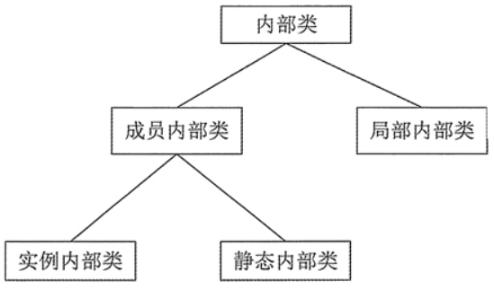

内部类的特点如下：

- 内部类仍然是一个独立的类，在编译之后内部类会被编译成独立的.class文件，但是前面冠以**外部类的类名和$符号**。 
- 内部类不能用普通的方式访问。内部类是外部类的一个成员，因此内部类可以自由地访问外部类的 成员变量，无论是否为 private 的。 
- 内部类声明成静态的，就不能随便访问外部类的成员变量，只能访问外部类的静态成员变量。

有关内部类的说明有如下几点：

- 外部类只有两种访问级别：public 和默认；内部类则有 4 种访问级别：public、protected、 private 和默认。 
- 在外部类中可以直接通过内部类的类名访问内部类。 InnerClass ic = new InnerClass(); // InnerClass为内部类的类名 
- 在外部类以外的其他类中则需要通过内部类的完整类名访问内部类。 Test.InnerClass ti = newTest().new InnerClass(); // Test.innerClass是内部类的完整类名 
- 内部类与外部类不能重名。

**Java实例内部类**

实例内部类是指没有用 static 修饰的内部类，有的地方也称为非静态内部类。 

1. 在外部类的静态方法和外部类以外的其他类中，必须通过外部类的实例创建内部类的实例。 
2. 在实例内部类中，可以访问外部类的所有成员。提示：如果有多层嵌套，则内部类可以访问所有外 部类的成员。 
3. 在外部类中不能直接访问内部类的成员，而必须通过内部类的实例去访问。 
4. 外部类实例与内部类实例是一对多的关系，也就是说一个内部类实例只对应一个外部类实例，而一 个外部类实例则可以对应多个内部类实例。 
5. 在实例内部类中不能定义 static 成员，除非同时使用 final 和 static 修饰。

**Java静态内部类**

静态内部类有如下特点:

1. 在创建静态内部类的实例时，不需要创建外部类的实例。 
2. 静态内部类中可以定义静态成员和实例成员。外部类以外的其他类需要通过完整的类名访问静态内 部类中的静态成员，如果要访问静态内部类中的实例成员，则需要通过静态内部类的实例。
3. 静态内部类可以直接访问外部类的静态成员，如果要访问外部类的实例成员，则需要通过外部类的 实例去访问。
4. 外部类可以通过静态内部类的类名直接访问静态内部类的静态成员,如果要访问静态内部类的实例成 员，则需要通过静态内部类的实例去访问。

**Java局部内部类**

局部内部类是指在一个方法（或代码块）中定义的内部类。 

局部内部类有如下特点：

1. 局部内部类与局部变量一样，不能使用访问控制修饰符（public、private 和 protected）和 static 修饰符修饰。 
2. 局部内部类只在当前方法中有效。 
3. 局部内部类中不能定义 static 成员。 
4. 局部内部类中还可以包含内部类，但是这些内部类也不能使用访问控制修饰符（public、private 和 protected）和 static 修饰符修饰。 
5. 在局部内部类中可以访问外部类的所有成员。 
6. 在局部内部类中只可以访问当前方法中 final 类型的参数与变量。如果方法中的成员与外部类中的 成员同名，则可以使用 OuterClassName.this.MemberName的形式访问外部类中的成员。

**Java匿名内部类**

匿名内部类是指没有类名的内部类，必须在创建时使用 new 语句来声明类。

```java
new <类或接口>() {
	// 类的主体
};
```

匿名内部类有两种实现方式：

- 继承一个类，重写其方法。 
- 实现一个接口（可以是多个），实现其方法。

匿名内部类有如下特点：

1. 匿名类和局部内部类一样，可以访问外部类的所有成员。如果匿名类位于一个方法中，则匿名类只 能访问方法中 final 类型的局部变量和参数。 
2. 匿名类中允许使用非静态代码块进行成员初始化操作。 
3. 匿名类的非静态代码块会在父类的构造方法之后被执行。

### 19、枚举类型

枚举类型相当于特殊的类，经过编译之后同样产生一个class文件。枚举类型中可以定义方法（包括构造 方法）、属性、静态的方法和属性、继承接口、重载覆盖等，类似于class。

**枚举类型的定义:**

```java
public enum ColorSelect {
	RED,BLUE,BLACK YELLOW,GREEN;
}
```

枚举类型使用enum来声明类型，枚举类型的每一个枚举值（枚举属性）都是枚举类型的实例，且都是 public static final类型的实例。

**枚举类型的继承：**

- 所有的枚举类型都隐含的继承自java.lang.Enum类，又因为Java是单继承的，所以一个枚举类型不 能继承任何其他的类。 
- 枚举类型因为继承了java.lang.Enum类，又因为java.lang.Enum实现了java.lang.Comparable和 java.io.Serializable接口，所以枚举类型也默认实现了这两个接口。

**枚举类型的构造方法：**

- 必须是private访问权限，不能使public权限。这样就可以保证在枚举类型定义的外部无法使用new 来创建枚举值。 
- 使用构造方法(当然是带参数的构造方法)赋值，则必须给所有的枚举值赋值；如果写了构造方法， 却没有使用其用于赋值，则会报错。

**继承自父类（java.lang.Enum）的方法：**

1. ordinal()方法: 返回枚举值在枚举类种的顺序。这个顺序根据枚举值声明的顺序而定。

   ```java
   Color.RED.ordinal(); //返回结果：0
   Color.BLUE.ordinal(); //返回结果：1
   ```

2. compareTo()方法: Enum实现了java.lang.Comparable接口，因此可以比较象与指定对象的顺序。 Enum中的compareTo返回的是两个枚举值的顺序之差。当然，前提是两个枚举值必须属于同一个 枚举类，否则会抛出ClassCastException()异常。

   ```java
   Color.RED.compareTo(Color.BLUE); //返回结果 -1
   ```

3. values()方法： 静态方法，返回一个包含全部枚举值的数组。

   ```java
   Color[] colors = Color.values();
   for(Color c:colors){
   	System.out.print(c+",");
   }//返回结果：RED,BLUE,BLACK YELLOW,GREEN,
   ```

4.  toString()方法： 返回枚举常量的名称。

   ```java
   Color c=Color.RED;
   System.out.println(c);//返回结果: RED
   ```

5. . valueOf()方法： 这个方法和toString方法是相对应的，返回带指定名称的指定枚举类型的枚举常量。

   ```java
   Color.valueOf("BLUE"); //返回结果: Color.BLUE
   ```

6.  equals()方法： 比较两个枚举类对象的引用。

   ```java
    equals()方法： 比较两个枚举类对象的引用。
   ```

枚举类型可以用于switch语句。

### 20、 修饰符总结

四个访问控制符：

注意：在不写访问控制符的情况下，就是**friendly(默认)**修饰符

| 访问范围   | private | friendly(默认，不写) | protected | pubic |
| ---------- | ------- | -------------------- | --------- | ----- |
| 同一个类中 | √       | √                    | √         | √     |
| 同一个包中 |         | √                    | √         | √     |
| 子类中     |         |                      | √         | √     |
| 全局范围内 |         |                      |           | √     |

**类修饰符：**

- public（访问控制符），将一个类声明为公共类，他可以被任何对象访问，一个程序的主类必须是 公共类。 
- friendly，默认的修饰符，只有在相同包中的对象才能使用这样的类。 
- abstract，将一个类声明为抽象类，没有实现的方法，需要子类提供方法实现。 
- final，将一个类声明为最终（即非继承类），表示他不能被其他类继承。

**成员变量修饰符：**

- public（公共访问控制符），指定该变量为公共的，他可以被任何对象的方法访问。 
- private（私有访问控制符）指定该变量只允许自己的类的方法访问，其他任何类（包括子类）中的 方法均不能访问。 
- protected（保护访问控制符）指定该变量可以别被自己的类和子类访问。在子类中可以覆盖此变 量。 
- friendly ，在同一个包中的类可以访问，其他包中的类不能访问。 
- final，最终修饰符，指定此变量的值不能变。 
- static（静态修饰符）指定变量被所有对象共享，即所有实例都可以使用该变量。变量属于这个 类。

**方法修饰符:**

- public（公共控制符），指定该方法可以从所有类访问 
- private（私有控制符）指定此方法只能有自己类等方法访问，其他的类不能访问（包括子类） 
- protected（保护访问控制符）指定该方法可以被它的类和子类进行访问。 
- final，指定该方法不能被重载。 
- static，指定不需要实例化就可以激活的一个方法。 
- synchronize，同步修饰符，在多个线程中，该修饰符用于在运行前，对他所属的方法加锁，以防止其他线程的访问，运行结束后解锁。 
- native，本地修饰符。指定此方法的方法体是用其他语言在程序外部编写的。

**初始化块：**

- static(可选)，使用static修饰的初始化块被称为静态代码块

## 九、Java常用类

### 1、System类

System类代表当前Java程序的运行平台，程序不能创建System类的对象， System类提供了一些类变量 和类方法，允许直接通过System类来调用这些类变量和类方法。

**常用方法**

| 修饰符 | 返回值类型 | 方法（形参）                        | 说明                                                         |
| ------ | ---------- | ----------------------------------- | ------------------------------------------------------------ |
| static | long       | currentTimeMillis()                 | 返回以毫秒为单位的当前时间。                                 |
| static | void       | exit(int status)                    | 终止当前正在运行的 Java 虚拟机。                             |
| static | void       | gc()                                | 运行垃圾回收器。                                             |
| static | Map        | getenv()                            | 返回一个不能修改的当前系统环境的字符 串映射视图。            |
| static | String     | getenv(String name)                 | 获取指定的环境变量值。                                       |
| static | Properties | getProperties()                     | 确定当前的系统属性。                                         |
| static | String     | getProperty(String key)             | 获取指定键指示的系统属性。                                   |
| static | String     | getProperty(String key, String def) | 获取用指定键描述的系统属性。                                 |
| static | int        | identityHashCode(Object x)          | 返回给定对象的哈希码，该代码与默认的 方法 hashCode() 返回的代码一样，无论 给定对象的类是否重写 hashCode()。 |
| static | long       | nanoTime()                          | 返回最准确的可用系统计时器的当前值， 以毫微秒为单位。        |

### 2、Runtime类

Runtime类代表Java程序的**运行时环境**，可以访问JVM的相关信息，每个Java程序都有一个与之对应 的Runtime实例，应用程序通过该对象与其运行时环境相连。**应用程序不能创建自己的Runtime实例**， 但可以通过getRuntime()方法获取与之关联的Runtime对象。

**常用方法**

| 修饰符 | 返回值类型 | 方法（形参）          | 说明                                                        |
| ------ | ---------- | --------------------- | ----------------------------------------------------------- |
| static | Runtime    | getRuntime()          | 返回与当前 Java 应用程序相关的运行时对象。                  |
| static | int        | availableProcessors() | 向 Java 虚拟机返回可用处理器的数目。                        |
| static | long       | totalMemory()         | 返回 Java 虚拟机中的内存总量。                              |
| static | long       | freeMemory()          | 返回 Java 虚拟机中的空闲内存量。                            |
| static | long       | maxMemory()           | 返回 Java 虚拟机试图使用的最大内存量。                      |
| static | Process    | exec(String command)  | 在单独的进程中执行指定的字符串命令。                        |
| static | void       | gc()                  | 运行垃圾回收器。                                            |
| static | void       | exit(int status)      | 通过启动虚拟机的关闭序列，终止当前正在运 行的 Java 虚拟机。 |
| static | void       | halt(int status)      | 强行终止目前正在运行的 Java 虚拟机。                        |

### 3、String类

1. String类常用构造器

   | 构造器                                                       | 说明                                                         |
   | ------------------------------------------------------------ | ------------------------------------------------------------ |
   | String()                                                     | 初始化一个新创建的 String 对象，使其表示一个空字符序列。     |
   | **String(byte[] bytes)**                                     | 通过使用平台的默认字符集解码指定的 byte 数组，构造一个新的String。 |
   | **String(byte[] bytes, Charset charset)**                    | 通过使用指定的 charset 解码指定的 byte 数组，构造一个新的String。 |
   | String(byte[] bytes, String charsetName)                     | 通过使用指定的 charset 解码指定的 byte 数组，构造一个新的String。 |
   | **String(byte[] bytes, int offset, int length)**             | 通过使用平台的默认字符集解码指定的 byte 子数组，构造一个新的String。 |
   | String(byte[] bytes, int offset, int length, Charset charset) | 通过使用指定的 charset 解码指定的 byte 子数组，构造一个新的String。 |
   | String(byte[] bytes, int offset, int length, String charsetName) | 通过使用指定的字符集解码指定的 byte 子数组，构造一个新的String。 |
   | **String(char[] value)**                                     | 分配一个新的 String，使其表示字符数组参数中当前包含的字符序列。 |
   | String(char[] value, int offset, int count)                  | 分配一个新的 String，它包含取自字符数组参数一个子数组的字符。 |
   | **String(String original)**                                  | 初始化一个新创建的 String 对象，使其表示一个与参数相同的 字符序列；换句话说，新创建的字符串是该参数字符串的副 本。 |
   | String(StringBuffer buffer)                                  | 分配一个新的字符串，它包含字符串缓冲区参数中当前包含的字符序列。 |
   | String(StringBuilder builder)                                | 分配一个新的字符串，它包含字符串生成器参数中当前包含的字符序列。 |

2. String常用判断方法

   | 返回值类型 | 方法名称                     | 说明                                 |
   | ---------- | ---------------------------- | ------------------------------------ |
   | boolean    | equals(Object obj)           | 比较字符串的内容是否相同,区分大小写  |
   | boolean    | equalsIgnoreCase(String str) | 比较字符串的内容是否相同,忽略大小写  |
   | boolean    | contains(String str)         | 判断大字符串中是否包含小字符串       |
   | boolean    | startsWith(String str)       | 判断字符串是否以某个指定的字符串开头 |
   | boolean    | endsWith(String str)         | 判断字符串是否以某个指定的字符串结尾 |
   | boolean    | isEmpty()                    | 判断字符串是否为空。                 |

3. String类常用的获取方法

   | 返回值类型 | 方法名称                              | 说明                                                         |
   | ---------- | ------------------------------------- | ------------------------------------------------------------ |
   | int        | length()                              | 获取字符串的长度。                                           |
   | char       | charAt(int index)                     | 获取指定索引位置的字符                                       |
   | int        | indexOf(int ch)                       | 返回指定字符在此字符串中第一次出现处的索引。                 |
   | int        | indexOf(int ch,int fromIndex)         | 返回在此字符串中第一次出现指定字符处的索引，从指定的索引开始搜索。 |
   | int        | indexOf(String str)                   | 返回指定子字符串在此字符串中第一次出现处的索引。             |
   | int        | indexOf(String str,int fromIndex)     | 返回指定子字符串在此字符串中第一次出现处的索引，从 指定的索引开始。 |
   | int        | lastIndexOf(int ch)                   | 返回指定字符在此字符串中最后一次出现处的索引。               |
   | int        | lastIndexOf(int ch,int fromIndex)     | 返回指定字符在此字符串中最后一次出现处的索引，从指 定的索引处开始进行反向搜索。 |
   | int        | lastIndexOf(String str)               | 返回指定子字符串在此字符串中最右边出现处的索引。             |
   | int        | lastIndexOf(String str,int fromIndex) | 返回指定子字符串在此字符串中最后一次出现处的索引， 从指定的索引开始反向搜索。 |
   | String     | substring(int start)                  | 从指定位置开始截取字符串,默认到末尾。                        |
   | String     | substring(int start,int end)          | 从指定位置开始到指定位置结束截取字符串。                     |

4. String的常用转换方法

   | 返回值类型 | 方法名称           | 说明                     |
   | ---------- | ------------------ | ------------------------ |
   | byte[]     | getBytes()         | 把字符串转换为字节数组。 |
   | char[]     | toCharArray()      | 把字符串转换为字符数组。 |
   | static     | String valueOf()   | 把传入的变量转成字符串。 |
   | String     | toLowerCase()      | 把字符串转成小写。       |
   | String     | toUpperCase()      | 把字符串转成大写。       |
   | String     | concat(String str) | 把字符串拼接。           |

5. String类其他常用方法

   | 返回值类型 | 方法名称                        | 说明                                                         |
   | ---------- | ------------------------------- | ------------------------------------------------------------ |
   | String     | replace(char old,char new)      | 返回一个新的字符串，它是通过用 newChar 替换此字符串中出现的所有 oldChar 得到的。 |
   | String     | replace(String old,String new)  | 使用指定的字面值替换序列替换此字符串所有匹配字面值目标序列的子字符串。 |
   | String     | trim()                          | 返回字符串的副本，忽略前导空白和尾部空白。                   |
   | int        | compareTo(String str)           | 按字典顺序比较两个字符串。                                   |
   | int        | compareToIgnoreCase(String str) | 按字典顺序比较两个字符串，不考虑大小写。                     |
   | String[]   | split(String regex)             | 根据给定正则表达式的匹配拆分此字符串。                       |
   | String[]   | split(String regex,int limit)   | 根据匹配给定的正则表达式来拆分此字符串。                     |

6. String、StringBuffer和StringBuilder

   | 构造器                         | 说明                                                         |
   | ------------------------------ | ------------------------------------------------------------ |
   | StringBuffer()                 | 构造一个字符串缓冲区，其中没有字符，初始容量为16个字符。     |
   | StringBuffer(CharSequence seq) | 构造一个包含与指定字符相同的字符串缓冲区。                   |
   | StringBuffer(int capacity)     | 构造一个字符串缓冲区，其中没有字符，但是包含指定的初始容 量capacity。 |
   | StringBuffer(String str)       | 构造一个指定字符串内容的字符串缓冲区。                       |

   | 返回类型     | 方法                                                         | 说明                                                         |
   | ------------ | ------------------------------------------------------------ | ------------------------------------------------------------ |
   | StringBuffer | append(boolean b)                                            | 将boolean参数的字符串表示形式追加到 序列中。                 |
   | StringBuffer | append(char c)                                               | 将char参数的字符串表示形式追加到此 序列。                    |
   | StringBuffer | append(char[] str)                                           | 将char数组参数的字符串表示形式追加 到此序列。                |
   | StringBuffer | append(char[] str, int offset, int len)                      | 将char数组参数的子数组的字符串表示 形式追加到此序列。        |
   | StringBuffer | append(CharSequence s)                                       | 将指定的内容附加CharSequence到此序 列。                      |
   | StringBuffer | append(CharSequence s, int start, int end)                   | 将指定的子CharSequence序列追加到此 序列。                    |
   | StringBuffer | append(double d)                                             | 将double 参数的字符串表示形式追加到 此序列。                 |
   | StringBuffer | append(float f)                                              | 将float 参数的字符串表示形式追加到此 序列。                  |
   | StringBuffer | append(int i)                                                | 将int 参数的字符串表示形式追加到此序 列。                    |
   | StringBuffer | append(long lng)                                             | 将long 参数的字符串表示形式追加到此 序列。                   |
   | StringBuffer | append(Object obj)                                           | 附加Object参数的字符串表示形式。                             |
   | StringBuffer | append(String str)                                           | 将指定的字符串追加到此字符序列。                             |
   | StringBuffer | append(StringBuffer sb)                                      | 将指定的内容附加StringBuffer到此序 列。                      |
   | StringBuffer | appendCodePoint(int codePoint)                               | 将codePoint参数的字符串表示形式追加 到此序列。               |
   | int          | capacity()                                                   | 返回当前容量。                                               |
   | char         | charAt(int index)                                            | 返回char指定索引处的此序列中的值。                           |
   | int          | codePointAt(int index)                                       | 返回指定索引处的字符（Unicode代码 点）。                     |
   | int          | codePointBefore(int index)                                   | 返回指定索引之前的字符（Unicode代码 点）。                   |
   | int          | codePointCount(int beginIndex, int endIndex)                 | 返回此序列的指定文本范围内的Unicode 代码点数。               |
   | StringBuffer | delete(int start, int end)                                   | 删除此序列的子字符串中的字符。                               |
   | StringBuffer | deleteCharAt(int index)                                      | char按此顺序删除指定位置。                                   |
   | void         | ensureC                                                      | pacity(int minimumCapacity)                                  |
   | void         | getChars(int srcBegin, int srcEnd, char[] dst, int dstBegin) | 字符从此序列复制到目标字符数组中 dst。                       |
   | int          | indexOf(String str)                                          | 返回指定子字符串第一次出现的字符串中 的索引。                |
   | int          | indexOf(String str, int fromIndex)                           | 从指定的索引处开始，返回指定子字符串 第一次出现的字符串中的索引。 |
   | StringBuffer | insert(int offset, boolean b)                                | 将boolea参数的字符串表示形式插入此 序列中。                  |
   | StringBuffer | insert(int offset, char c)                                   | 将char参数的字符串表示形式插入此序 列中。                    |
   | StringBuffer | insert(int offset, char[] str)                               | 将char数组参数的字符串表示形式插入 此序列中。                |
   | StringBuffer | insert(int index, char[] str, int offset, int len)           | 将str数组参数的子数组的字符串表示形 式插入到此序列中。       |
   | StringBuffer | insert(int dstOffset, CharSequence s)                        | 将指定的内容CharSequence插入此序列 中。                      |
   | StringBuffer | insert(int dstOffset, CharSequence s, int start, int end)    | 将指定的子CharSequence序列插入此序 列中。                    |
   | StringBuffer | insert(int offset, double d)                                 | 将double参数的字符串表示形式插入此 序列中。                  |
   | StringBuffer | insert(int offset, float f)                                  | 将float参数的字符串表示形式插入此序 列中。                   |
   | StringBuffer | insert(int offset, int i)                                    | 将第二个int 参数的字符串表示形式插入 到此序列中。            |
   | StringBuffer | insert(int offset, long l)                                   | 将long参数的字符串表示形式插入此序 列中。                    |
   | StringBuffer | insert(int offset, Object obj)                               | 将Object 参数的字符串表示形式插入此 字符序列。               |
   | StringBuffer | insert(int offset, String str)                               | 将字符串插入此字符序列。                                     |
   | int          | lastIndexOf(String str)                                      | 返回指定子字符串最后一次出现在字符串 中的索引。              |
   | int          | lastIndexOf(String str, int fromIndex)                       | 返回指定子字符串最后一次出现在字符串 中的索引。              |
   | int          | length()                                                     | 返回该字符串的长度（字符数）。                               |
   | int          | offsetByCodePoints(int index, int codePointOffset)           | 返回此序列中与代码点给定index的偏移 量的索引codePointOffset。 |
   | StringBuffer | replace(int start, int end, String str)                      | 用指定的字符替换此序列的子字符串中的 字符String。            |
   | StringBuffer | reverse()                                                    | 返回此字符序列的反向替换。                                   |
   | void         | setCharAt(int index, char ch)                                | 指定索引处的字符设置为ch。                                   |
   | void         | setLength(int newLength)                                     | 设置字符序列的长度。                                         |
   | CharSequence | subSequence(int start, int end)                              | 返回一个新的字符序列，它是该序列的子 序列。                  |
   | String       | substring(int start)                                         | 返回一个新的String，包含此字符序列中 当前包含的字符的子序列。 |
   | String       | substring(int start, int end)                                | 返回一个新的String，包含此序列中当前 包含的字符的子序列。    |
   | String       | toString()                                                   | 返回表示此序列中数据的字符串。                               |

   - String 类对象不可变，一旦修改 String的值就是隐形的重建了一个新的对象，释放了原 String对象 
   - StringBuffer和StringBuilder类是可以通过append()、insert()、reverse()....等方法来修改值。创建 的对象是可变 
   - StringBuffer：线程安全的； 
   - StringBuilder：线程非安全的 
   - 字符串连接 String 的 + 比 StringBuffer(StringBuilder) 的 Append() 性能差了很多 
   - 三者在执行速度方面的比较：StringBuilder > StringBuffer > String

### 4、BigDecimal类

为了能精确表示、计算浮点数，Java提供了BigDecimal类，该类提供了大量的构造器用于创建 BigDecimal对象，包括把所有的基本数值型变量转换成一个BigDecimal对象，也包括利用数字字符串、 数字字符数组来创建BigDecimal对象。

**常用构造器**

| 构造器                 | 说明                                                         |
| ---------------------- | ------------------------------------------------------------ |
| BigDecimal(char[] in)  | 将 BigDecimal 的字符数组表示形式转换为 BigDecimal，接受与 BigDecimal(String) 构造方法相同的字符序列。 |
| BigDecimal(double val) | 将 double 转换为 BigDecimal，后者是 double 的二进制浮点值准确的十 进制表示形式。 |
| BigDecimal(int val)    | 将 int 转换为 BigDecimal。                                   |
| BigDecimal(long val)   | 将 long 转换为 BigDecimal。                                  |
| BigDecimal(String val) | 将 BigDecimal 的字符串表示形式转换为 BigDecimal。            |

**常用方法**

| 修饰符 | 返回值类型 | 方法（形参）                      | 说明                                                         |
| ------ | ---------- | --------------------------------- | ------------------------------------------------------------ |
| static | BigDecimal | valueOf(double val)               | 使用 Double.toString(double) 方法提供 的 double 规范的字符串表示形式将 double 转换为 BigDecimal。 |
| static | BigDecimal | valueOf(long val)                 | 将 long 值转换为具有零标度的 BigDecimal。                    |
|        | BigDecimal | abs()                             | 返回 BigDecimal，其值为此 BigDecimal 的绝对值，其标度为 this.scale()。 |
|        | BigDecimal | add(BigDecimal augend)            | 返回一个 BigDecimal，其值为 (this + augend)                  |
|        | BigDecimal | subtract(BigDecimal subtrahend)   | 返回一个 BigDecimal，其值为 (this - subtrahend)              |
|        | BigDecimal | multiply(BigDecimal multiplicand) | 返回一个 BigDecimal，其值为 (this × multiplicand)            |
|        | BigDecimal | divide(BigDecimal divisor)        | 返回一个 BigDecimal，其值为 (this / divisor)                 |
|        | BigDecimal | pow(int n)                        | 返回其值为 (thisn) 的 BigDecimal                             |
|        | int        | compareTo(BigDecimal val)         | 将此 BigDecimal 与指定的 BigDecimal 比 较。                  |
|        | byte       | byteValue()                       | 将此 BigDecimal 转换为 byte，                                |
|        | byte       | byteValueExact()                  | 将此 BigDecimal 转换为 byte，以检查丢 失的信息。             |
|        | short      | shortValue()                      | 将此 BigDecimal 转换为 short                                 |
|        | short      | shortValueExact()                 | 将此 BigDecimal 转换为 short，以检查丢 失的信息。            |
|        | int        | intValue()                        | 将此 BigDecimal 转换为 int。                                 |
|        | int        | intValueExact()                   | 将此 BigDecimal 转换为 int，以检查丢失 的信息                |
|        | long       | longValue()                       | 将此 BigDecimal 转换为 long。                                |
|        | long       | longValueExact()                  | 将此 BigDecimal 转换为 long，以检查丢 失的信息。             |
|        | float      | floatValue()                      | 将此 BigDecimal 转换为 float。                               |
|        | double     | doubleValue()                     | 将此 BigDecimal 转换为 double。                              |
|        | String     | toString()                        | 返回此 BigDecimal 的字符串表示形式， 如果需要指数，则使用科学记数法。 |

### 5、Date和Calendar类

1. Date类

   Java提供了Date类来处理日期、时间（此处的Date是指java.util包下的Date类，而不是java.sql包下的 Date类），Date对象既包含日期，也包含时间。Date类从JDK1.0起就开始存在了，因为它历史悠久，所 以它的大部分构造器、方法都已经过时，不再推荐使用了。

   **构造器**

   Java.util.Date的构造器还剩下两个构造器，其他都已经**过时**（@Deprecated注解，表示已经不再推荐使 用，使用会有警告，并且可以会导致程序性能或者安全性方面的问题）

   | 构造器          | 说明                                                         |
   | --------------- | ------------------------------------------------------------ |
   | Date()          | 分配 Date 对象并初始化此对象，以表示分配它的时间（精确到毫秒）。 |
   | Date(long date) | 分配 Date 对象并初始化此对象，以表示自从标准基准时间（称为“历元 （epoch）”，即 1970 年 1 月 1 日 00:00:00 GMT）以来的指定毫秒数。 |

   **方法**

   Java.util.Date的方法也剩下几个，其他都过时了

   | 返回值类型 | 方法（形参）                | 说明                                                         |
   | ---------- | --------------------------- | ------------------------------------------------------------ |
   | boolean    | after(Date when)            | 测试此日期是否在指定日期之后。                               |
   | boolean    | before(Date when)           | 测试此日期是否在指定日期之前。                               |
   | Object     | clone()                     | 返回此对象的副本。                                           |
   | int        | compareTo(Date anotherDate) | 比较两个日期的顺序。                                         |
   | boolean    | equals(Object obj)          | 比较两个日期的相等性。                                       |
   | long       | getTime()                   | 返回自 1970 年 1 月 1 日 00:00:00 GMT 以来此 Date 对象 表示的毫秒数。 |
   | void       | setTime(long time)          | 设置此 Date 对象，以表示 1970 年 1 月 1 日 00:00:00 GMT 以后 time 毫秒的时间点。 |

   **使用SimpleDateFormat类可以对 Date 和 String 相互转换**

2. Calendar类

   由于Date类过于古老，许多的构造器和方法都已经过时。Java推荐使用Calendar来完成时间计算等操 作。

   **Calendar类中关于时间的属性**

   | 常量                  | 描述                           |
   | --------------------- | ------------------------------ |
   | Calendar.YEAR         | 年份                           |
   | Calendar.MONTH        | 月份                           |
   | Calendar.DATE         | 日期                           |
   | Calendar.DAY_OF_MONTH | 日期，和上面的字段意义完全相同 |
   | Calendar.HOUR         | 12小时制的小时                 |
   | Calendar.HOUR_OF_DAY  | 24小时制的小时                 |
   | Calendar.MINUTE       | 分钟                           |
   | Calendar.SECOND       | 秒                             |
   | Calendar.DAY_OF_WEEK  | 星期几                         |

   **常用方法**

   | 修饰符 | 返回值类型 | 方法                        | 说明                                                         |
   | ------ | ---------- | --------------------------- | ------------------------------------------------------------ |
   | static | Calendar   | getInstance()               | 使用默认时区和语言环境获得一个日历。                         |
   |        | int        | get(int field)              | 返回给定日历字段的值。                                       |
   |        | void       | set(int field, int value)   | 将给定的日历字段设置为给定值。该方法有多个重载               |
   |        | void       | add(int field, int amount)  | 根据日历的规则，为给定的日历字段添加或减去指定 的时间量。    |
   |        | void       | roll(int field, int amount) | 向指定日历字段添加指定（有符号的）时间量，不更 改更大的字段。 |
   |        | Date       | getTime()                   | 返回一个表示此 Calendar 时间值（从历元至现在的 毫秒偏移量）的 Date 对象。 |
   |        | void       | setTime(Date date)          | 使用给定的 Date 设置此 Calendar 的时间。                     |

   **PS:十二个月的英文**

   | 中文   | 简称  | 全称      |
   | ------ | ----- | --------- |
   | 一月   | Jan.  | January   |
   | 二月   | Feb.  | February  |
   | 三月   | Mar.  | March     |
   | 四月   | Apr.  | April     |
   | 五月   | May.  | May       |
   | 六月   | Jun.  | June      |
   | 七月   | Jul.  | July      |
   | 八月   | Aug.  | August    |
   | 九月   | Sept. | September |
   | 十月   | Oct.  | October   |
   | 十一月 | Nov.  | November  |
   | 十二月 | Dec.  | December  |

   