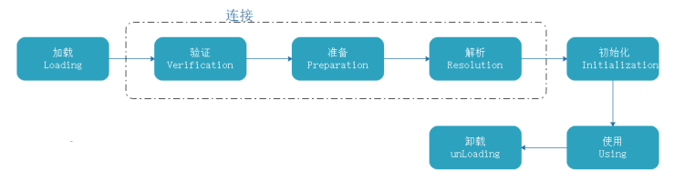

# Java基础

## 一、Java简介

### 1、Java是什么

Java 是由 Sun Microsystems 公司于 1995 年 5 月推出的 Java 面向对象程序设计语言和 Java 平台的总 称。由 James Gosling 和同事们共同研发，并在 1995 年正式推出。

Java 分为三个体系：

- JavaSE（J2SE）（Java2 Platform Standard Edition，java 平台标准版）。
- JavaEE(J2EE) (Java 2 Platform Enterprise Edition，java 平台企业版) 。
- JavaME(J2ME) (Java 2 Platform Micro Edition，java 平台微型版)


詹姆斯 · 高斯林 （James Gosling，1955 年 5 月 19 日－，出生于加拿大），软件专家，Java 编程语言 的共同创始人之一，一般公认他为 “Java 之父”。

### 2、Java的发展史

- 1995 年 5 月 23 日，Java 语言诞生 
- 1996 年 1 月，第一个 JDK1.0 诞生 
- 1997 年 2 月 18 日，JDK1.1 发布 
- 1998 年 12 月 8 日，JAVA2 企业平台 J2EE 发布 
- 1999 年 6 月，SUN 公司发布 Java 的三个版本：标准版（J2SE）、企业版（J2EE）和微型版 （J2ME） 
- 2000 年 5 月 8 日，JDK1.3 发布 
- 2000 年 5 月 29 日，JDK1.4 发布 
- 2001 年 9 月 24 日，J2EE1.3 发布 
- 2002 年 2 月 26 日，J2SE1.4 发布，自此 Java 的计算能力有了大幅提升
- 2004 年 9 月 30 日 18:00PM，J2SE1.5 发布，成为 Java 语言发展史上的又一里程碑。为了表示该 版本的重要性，J2SE1.5 更名为 Java SE 5.0 
- 2005 年 6 月，JavaOne 大会召开，SUN 公司公开 Java SE 6。此时，Java 的各种版本已经更名， 以取消其中的数字 "2"：J2EE 更名为 Java EE，J2SE 更名为 Java SE，J2ME 更名为 Java ME 
- 2006 年 12 月，SUN 公司发布 JRE6.0 
- 2009 年 04 月 20 日，甲骨文 74 亿美元收购 Sun。取得 java 的版权。 
- 2011 年 7 月 28 日，甲骨文发布 java7.0 的正式版。 
- 2014 年 3 月 18 日，Oracle 公司发布 Java SE8，这次版本升级为 Java 带来了全新的 Lambda 表 达 式、流式编程等大量新特性，这些新特性使得 Java 变得更加强大。 
- 2017 年 9 月 22 日，Oracle 公司发布 JavaSE9，这次版本升级强化了 Java 的模块化系统，让 Java 语言更轻量化，且采用了更高效、更智能的 GI 垃圾回收器，并在核心类库上进行大量更新，可进 一 步简化编程。 
- 2018 年 3 月 21 日，JavaSE10 发布，Java10 版本带来了很多新特性，其中最备受广大开发者 关注 的莫过于局部变量类型推断。此外，还包垃圾收集器改善、GC 改进、性能提升、线程管控等新 特 性。 
- 2018 年 9 月 26 日，JavaSE11 发布。这是 Java 大版本周期变化后的第一个长期支持版本（LTS 版 本持续支持到2026 年9月）。 Java11 带来了 ZGC、 HttpClient 等重要特性，一共包含 17 个 JEP （JDK Enhancement Proposals，JDK 增强提案）。 
- 2019 年 3 月 20 日， JavaSE12 发布。 Java12是短期支持版本，可在下一个版本发布之前获得 Oracle 的商业支持。 
- 2019 年 9 月 23 日，Java SE 13 发布，此版本中添加了“文本块”，文本块是一个多行字符串文字， 避免对大多数转义序列的需要，以可预测的方式自动格式化字符串，并在需要时让开发人员控制格 式。 
- 2020 年 3 月，Java SE 14发布。在13基础上继续添加新特性：record 关键字、空指针异常精准提 示、switch 的增强正式使用、ZGC 支持 MacOS 和 Window，同时移除了 CMS 垃圾收集器等 
- 2020年9月15日，Java SE 15发布， 一次发布了 14 个新特性。JDK 15 并不是一个长期支持的版 本，只支持 6 个月到 2021 年 3 月，上一个长期支持版本还是 JDK 11

### 3、Java语言的主要特点

1. 跨平台性:所谓的跨平台性，是指软件可以不受计算机硬件和操作系统的约束而在任意计算机环境下 正常运行。这是软件发展的趋势和编程人员追求的目标。之所以这样说，是因为计算机硬件的种类 繁多，操作系统也各不相同，不同的用户和公司有自己不同的计算机环境偏好，而软件为了能在这 些不同的环境里正常运行，就需要独立于这些平台。而在Java语言中， Java自带的虚拟机很好地实 现了跨平台性。 Java源程序代码经过编译后生成二进制的字节码是与平台无关的，但是可被Java虚 拟机识别的一种机器码指令。 Java虚拟机提供了一个字节码到底层硬件平台及操作系统的屏障，使 得Java语言具备跨平台性。 
2. 面向对象:面向对象是指以对象为基本粒度，其下包含属性和方法。对象的说明用属性表达，而通过 使用方法来操作这个对象。面向对象技术使得应用程序的开发变得简单易用，节省代码。Java是一 种面向对象的语言，也继承了面向对象的诸多好处，如代码扩展、代码复用等。 
3. 安全性:安全性可以分为四个层面，即语言级安全性、编译时安全性、运行时安全性、可执行代码安 全性。语言级安全性指Java的数据结构是完整的对象，这些封装过的数据类型具有安全性。编译时 要进行Java语言和语义的检查，保证每个变量对应一个相应的值，编译后生成Java类。运行时Java 类需要类加载器载入，并经由字节码校验器校验之后才可以运行。 Java类在网络上使用时，对它的 权限进行了设置，保证了被访问用户的安全性。 
4. 多线程:多线程在操作系统中已得到了最成功的应用。多线程是指允许一个应用程序同时存在两个或 两个以上的线程，用于支持事务并发和多任务处理。 Java除了内置的多线程技术之外，还定义了一 些类、方法等来建立和管理用户定义的多线程。 
5. 简单易用:Java源代码的书写不拘泥于特定的环境，可以用记事本、文本编辑器等编辑软件来实现， 然后将源文件进行编译，编译通过后可直接运行，通过调试则可得到想要的结果。

### 4、Java语言的特性

1. 封装：封装是把过程和数据包围起来，对数据的访问只能通过已定义的接口。面向对象计算始于这 个基本概念，即现实世界可以被描绘成一系列完全自治、封装的对象，这些对象通过一个受保护的 接口访问其他对象。封装是一种信息隐藏技术，在java中通过关键字private，protected和public 实现封装。什么是封装？封装把对象的所有组成部分组合在一起，封装定义程序如何引用对象的数 据，封装实际上使用方法将类的数据隐藏起来，控制用户对类的修改和访问数据的程度。 适当的封 装可以让程式码更容易理解和维护，也加强了程式码的安全性。 
2. 继承：继承是面向对象最显著的一个特性。继承是从已有的类中派生出新的类，新的类能吸收已有 类的数据属性和行为，并能扩展新的能力。 Java继承是使用已存在的类的定义作为基础建立新类 的技术，新类的定义可以增加新的数据或新的功能，也可以用父类的功能，但不能选择性地继承父 类。这种技术使得复用以前的代码非常容易，能够大大缩短开发周期，降低开发费用 
3. 多态： 按字面的意思就是“多种状态”。在面向对象语言中，接口的多种不同的实现方式即为多态。 多态性是允许你将父对象设置成为一个或更多的他的子对象相等的技术，赋值之后，父对象就可以 根据当前赋值给它的子对象的特性以不同的方式运作 多态的话，我觉得是更好的利用了继承这一特 性，然后为什么能实现多态，因为可以重写父类的方法。说重写可能不清楚，具体来说就是子类父 类可以存在分别存在名字相同的属性或者方法，然后可视声明的类去调用相应的方法等。 
4. 抽象： 抽象是通过分析与综合的途径，运用概念在人脑中再现对象的质和本质的方法，我觉得理解 成一种方法比较好。就是我们通过对事物的认知，将某一或者一类事物的属性变化成JAVA语言能识 别的类。

### 5、Java 核心机制

1. Java 虚拟机（Java Virtual Machine）简称：JVM；

   

2. 垃圾收集机制（Garbage collection）简称：GC；

   垃圾收集的目的在移除不再使用的对象，当对象建立的时候垃圾收集期，就开始监控对象的动态情 况，垃圾收集主要是对内存的释放。创建对象的时候申请一个空间

   - 再使用的内存空间应回收 - 垃圾收集； 

   - Java 消除了程序员回收无用内存空间的职责；提供一种系统级线程跟踪存储空间的分配情 况。在 JVM 的空闲时，检查并释放可被释放的存储器空间；

### 6、JRE、JDK、JVM 之间的区别与联系

JDK ：英文名称（Java Development Kit），Java 开发工具包。jdk 是整个 Java 开发的核心，它集成了 jre 和开发工具包。 

JRE ：英文名称（Java Runtime Environment），我们叫它：Java 运行时环境。它主要包含两个部分， jvm 的标准实现和 Java 的一些基本类库。它相对于 jvm 来说，多出来的是一部分的 Java 类库。 

JVM ：英文名称（Java Virtual Machine），就是我们耳熟能详的 Java 虚拟机。它只认识 xxx.class 这种 类型的文件，它能够将 class 文件中的字节码指令进行识别并调用操作系统向上的 API 完成动作。jvm 是 Java 能够跨平台的核心。 

这三者的关系是：一层层的嵌套关系，JDK 包含 JRE，JRE 包含 JVM；

## 二、Java环境搭建

### 1、JDK 安装

在这里统一使用 [jdk-8u191-windows-x64.exe](https://mirrors.huaweicloud.com/java/jdk/8u191-b12/jdk-8u191-windows-x64.exe)。额外的【[jdk-8u191-linux-x64.tar.gz](https://mirrors.huaweicloud.com/java/jdk/8u191-b12/jdk-8u191-linux-x64.tar.gz)、[jdk-8u191-macosx-x64.dmg](https://mirrors.huaweicloud.com/java/jdk/8u191-b12/jdk-8u191-macosx-x64.dmg)】

1. 运行 jdk-8u191-windows-x64.exe，进入下图所示安装界面，点击“下一步（N）”：

   

2. 选择要安装的组件，安装路径(**建议直接默认**),选择后点击“下一步（N）”：

   

3. 等待安装过程：

   

4. 安装过程中会弹出许可条款变更，直接点击“确定(O)”按钮：

   

5. 安装公共JRE的界面，默认就行，选择后点击“下一步（N）”：

   

6. 等待公共JRE安装结束，结束后弹出安装完成提示，直接点击“关闭（C）”:

   

### 2、配置JDK环境变量

安装JDK后还不能直接使用，需要配置JDK的环境变量后才能正常开发。接下来将交大家配置JDK的环境 变量：

1. 右击"此电脑（win10）"，点击"属性"，打开“系统”面板。点击“**高级系统设置**”

   

2. 选择"**高级**"选项卡，点击"**环境变量**"：

   

3. 出现“环境变量”界面，如下图：

   

4. 配置 JAVA_HOME 变量：

   - 在系统变量中点击新建

     

   - 在弹出的新增系统环境变量中填写值，填写后确定

     变量名： JAVA_HOME 

     变量值：填写JDK的安装目录，JDK1-7u80默认为 C:\Program Files\Java\jdk1.8.0_191

     

   - 确认

     

5. 配置 Path 变量

   1. 在系统变量中找到变量名称为Path的变量，选中，点击编辑

      

   2. 点击新建，在新建项中填入 %JAVA_HOME%\bin

      

   3. 再次点击新建，在新建项中填入 %JAVA_HOME%\jre\bin

      

   4. 建议将 ==%JAVA_HOME%\bin== 和 ==%JAVA_HOME%\jre\bin== 通过上移按钮移动到顶部的第二和第 三，把 ==%SystemRoot%\system32== 移动到顶部：

      

   5. 点击“确定”，保存修改

   6. 点击“环境变量”界面的“确定”按钮，保存修改

   7. 点击“系统属性”界面的“确定”按钮，保存修改

   8. 验证环境变量是否配置成功

      在CMD命令窗口中分别输入 ==java -version==、==java==、==javac==

      

      

      

## 三、 Java 基础语法

### 1、第一个Java程序

将通过这个案例告诉大家Java程序运行的基本过程

不使用Eclipse（IDE）

代码如下：

```java
public class HelloWorld {
    /* 第一个Java程序
    * 它将打印字符串 Hello World
    */
    public static void main(String []args) {
    	System.out.println("Hello World"); // 打印 Hello World
    }
}
```

下面将逐步介绍如何保存、编译以及运行这个程序： 

1. 在D盘根目录新建一个文本文档，文件名为：HelloWorld.java； 

2. 使用文本编辑器打开HelloWorld.java，把上面的代码粘贴进去；

3.  打开 cmd 命令窗口，进入目标文件所在的位置 D:\ 

4. 在命令行窗口输入 javac HelloWorld.java 按下回车键编译代码。如果代码没有错误，cmd 命令提 示符会进入下一行。 

5. 再键输入 java HelloWorld 按下回车键就可以运行程序了

   

### 2、基本语法

编写 Java 程序时，应注意以下几点：

1. **大小写敏感**：Java 是大小写敏感的，这就意味着标识符 Hello 与 hello 是不同的。 
2. **类名**：大驼峰命名法：对于所有的类来说，类名的首字母应该大写。如果类名由若干单词组成，那 么每个单词的首字母应该大写，例如 MyFirstJavaClass。 
3. **方法名**：小驼峰命名法：所有的方法名都应该以小写字母开头。如果方法名含有若干单词，则后面 的每个单词首字母大写。 
4. **源文件名**：源文件名必须和类名相同。当保存文件的时候，你应该使用public类的类名作为文件名 保存（切记 Java 是大小写敏感的），文件名的后缀为 .java。（如果文件名和类名不相同则会导致编译错误）。
5. **主方法入口**：所有的 Java 程序由 public static void main(String []args) 方法开始执行。

### 3、Java 标识符

Java 所有的组成部分都需要名字。类名、变量名以及方法名都被称为标识符

关于 Java 标识符，有以下几点需要注意：

- 所有的标识符都应该以字母（A-Z 或者 a-z）,美元符（$）、或者下划线（_）开始
- 首字符之后可以是字母（A-Z 或者 a-z）,美元符（$）、下划线（\_）或数字的任何字符组合 
- 关键字不能用作标识符 
- 标识符是大小写敏感的 
- 合法标识符举例：age、$age、_value、__age_value 
- 非法标识符举例：123abc、-age

### 4、Java关键字

关键字：被Java语言赋予了特殊含义，用作专门用途的字符串（单词），这些关键字不能用于常量、变 量、和任何标识符的名称。

| 类别                          | 关键字       | 说明                                                         |
| ----------------------------- | ------------ | ------------------------------------------------------------ |
| 访问控制(3个)                 | private      | 访问控制修饰符，在同一内可见                                 |
|                               | protected    | 访问控制修饰符，对民一包内的类和所有子可见                   |
|                               | public       | 访问控制修饰符，对所有类可见                                 |
| 类、方法和变量修饰符 （14个） | abstract     | 表明类或成员方法具有抽象性                                   |
|                               | class        | 声明一个类                                                   |
|                               | enum         | 枚举（在 J2SE 5.0 中添加）                                   |
|                               | extends      | 表明一个类型是另一个类型的子类型                             |
|                               | final        | 用来说明最终性                                               |
|                               | implements   | 表明一个实现接口                                             |
|                               | interface    | 接口                                                         |
|                               | native       | 原生方法（非ava实现）                                        |
|                               | new          | 用来创建新实例对象                                           |
|                               | static       | 表明具有静态属性                                             |
|                               | strictfp     | 用于跟制浮点计算的精度和舍入（在 J2SE 1.2中 添加）           |
|                               | synchronized | 表明一段代码需同步执行                                       |
|                               | volatile     | 表明两个或者多个变量必须同步地发生变化                       |
| 程序控制语句（11个）          | break        | 用于结束当前循环体中的执行。                                 |
|                               | case         | 用在swtch语句之中，表示其中的一个分支                        |
|                               | continue     | 用于在当前语环体结束时恢复程序执行。                         |
|                               | default      | 1、用在 switch语句中，表明一个默认的分支 <br />==2、用于指定接口中的方法提供方法的默认实现 （Java 8添加）== |
|                               | do           | 用在 do...while环构中                                        |
|                               | else         | 用在条件语句中，表明当条件不成立时的分支                     |
|                               | if           | 条件语句的引导词                                             |
|                               | instanceof   | 用来试一个对象是否是推定型的实例象                           |
|                               | return       | 用于完成方法的执行,返回给调用者方法的返回                    |
|                               | switch       | 分支语句结构的引导词                                         |
|                               | while        | 用于创建一个while循环                                        |
| 错误处理(6个)                 | assert       | 断言，用来进行程序调试（在 J2SE 1.4中添加）                  |
|                               | catch        | 用在异常处理中，用来捕捉异常                                 |
|                               | finally      | 用于处理异常情况，用来声明一个基本肯定会被 执行到的语句块    |
|                               | throw        | 抛出一个异常                                                 |
|                               | throws       | 声明在当前定义的成员方法中所有需要抛出的异 常                |
|                               | try          | 定义具有异常处理的代码块                                     |
| 包相关(2个)                   | import       | 引入要访问指定的类或包                                       |
|                               | package      | 定义所在的包                                                 |
| 基本数据类型(8个)             | boolean      | 基本数据类型之一，布尔类型                                   |
|                               | byte         | 基本数据类型之一，字节类型                                   |
|                               | char         | 基本数据类型之一，字符类型                                   |
|                               | double       | 基本数据类型之一，双精度浮点数类型                           |
|                               | float        | 基本数据类型之一，单精度浮点数类型                           |
|                               | int          | 基本数据类型之一，整数类型                                   |
|                               | long         | 基本数据类型之一，长整数类型                                 |
|                               | short        | 基本数据类型之一, 短整数类型b,m                              |
| 变量引用(3个)                 | supper       | 表明当前对象的父类型的引用或者父类型的构造 方法              |
|                               | this         | 指向当前实例对象的引用                                       |
|                               | void         | 声明当前成员方法没有返回值                                   |
| 保留关键字(2个)               | goto         | 保留关键字，没有具体含义                                     |
|                               | const        | 保留关键字，没有具体含义                                     |

**注意事项**：true，false和，null看起来像关键字，但它们实际上是文字; 也不能在程序中将它们用作标识符。

### 5、java的三种注释

三种注释方法：

1. 单行注释 //注释的内容 
2. 多行注释 /*......*/ 
3. /**......*/ ，这种方式和第二种方式相似。这种格式是为了便于javadoc程序自动生成文档。

JavaDoc标记说明：

| JavaDoc标记 | 解释                                                         |
| ----------- | ------------------------------------------------------------ |
| @author     | 指定作者                                                     |
| @param      | 描述方法的参数                                               |
| @return     | 描述方法的返回值                                             |
| @version    | 指定版本信息                                                 |
| @deprecated | 用来注明被注释的类、变量或方法已经不提倡使用，在将来的版本中有可能被废弃 |
| @throws     | 描述方法抛出的异常，指明抛出异常的条件                       |
| @since      | 指定最早出现在哪个版本                                       |
| @see        | 生成参考其他的JavaDoc文档的连接                              |
| @link       | 生成参考其他的JavaDoc文档，它和@see标记的区别在于，@link标记能够嵌入 到注释语句中，为注释语句中的特殊词汇生成连接。 eg.{@···· Hello} |

**注意**： 

（1）javadoc针对public类生成注释文档 

（2）javadoc只能在public、protected修饰的方法或者属性之上 

（3）javadoc注释的格式化：前导*号和HTML标签 

（4）javadoc注释要仅写在类、属性、方法之前

## 四、Java 基本数据类型

### 1、基本数据类型

Java的两大数据类型：基本数据类型、引用类型

Java语言提供了八种基本数据类型。六种数字类型（四个整数型，两个浮点型），一种字符类型，还有 一种布尔型。

**byte：**

-  byte 数据类型是8位(bit)、有符号的，以二进制补码表示的整数； 
- 最小值是 -128（-2^7）； 
- 最大值是 127（2^7-1）； 
- 默认值是 0； 
- 例子：byte a = 100，byte b = -50。

**short：** 

- short 数据类型是 16 位、有符号的以二进制补码表示的整数 最小值是 -32768（-2^15）；
- 最大值是 32767（2^15 - 1）； 
- Short 数据类型可以节省空间。一个short变量是int型变量所占空间的二分之一； 
- 默认值是 0； 
- 例子：short s = 100，short r = -200。

**int：**

- int 数据类型是32位、有符号的以二进制补码表示的整数； 
- 最小值是 -2,147,483,648（-2^31）； 
- 最大值是 2,147,483,647（2^31 - 1）； 
- 一般地整型变量默认为 int 类型； 
- 默认值是 0 ； 
- 例子：int a = 1000, int b = -2000。

**long：** 

- long 数据类型是 64 位、有符号的以二进制补码表示的整数； 
- 最小值是 -9,223,372,036,854,775,808（-2^63）； 
- 最大值是 9,223,372,036,854,775,807（2^63 -1）； 
- 这种类型主要使用在需要比较大整数的系统上； 
- 默认值是 0L； 
- 例子： long a = 100000L，Long b = -200000L。 
  注意:"L"理论上不分大小写，但是若写成"l"容易与数字"1"混淆，不容易分辩。所以最好大写。 

**float：**

- float 数据类型是单精度、32位、符合IEEE 754标准的浮点数； 
- float 在储存大型浮点数组的时候可节省内存空间； 
- 默认值是 0.0f； 
- 浮点数不能用来表示精确的值，如货币； 
- 例子：float f1 = 234.5f。 

**double：** 

- double 数据类型是双精度、64 位、符合IEEE 754标准的浮点数； 
- 浮点数的默认类型为double类型； 
- double类型同样不能表示精确的值，如货币； 
- 默认值是 0.0d； 
- 例子：double d1 = 123.4。 

**boolean：** 

- boolean数据类型表示一位的信息； 
- 只有两个取值：true 和 false； 
- 这种类型只作为一种标志来记录 true/false 情况； 
- 默认值是 false； 
- 例子：boolean one = true。 

**char：** 

- char类型是一个单一的 16 位 Unicode 字符； 
- 最小值是 \u0000（即为0）； 
- 最大值是 \uffff（即为65,535）； 
- char 数据类型可以储存任何字符； 
- 例子：char letter = 'A';。

| 分类     | 数据类型 | 内存大小(字节) | 内存位数 | 默认值 | 最小值            | 最大值                 | 描述                                 |
| -------- | -------- | -------------- | -------- | ------ | ----------------- | ---------------------- | ------------------------------------ |
| 数字类型 | byte     | 1              | 8        | 0      | -2^7              | 2^7-1                  | 有符号 的以二 进制补 码表示 的整数   |
|          | short    | 2              | 16       | 0      | -2^15             | 2^15 - 1               | 有符号 的以二 进制补 码表示 的整数   |
|          | int      | 4              | 32       | 0      | -2^31             | 2^31 - 1               | 有符号 的以二 进制补 码表示 的整数   |
|          | long     | 8              | 64       | 0      | -2^63             | 2^63 - 1               | 有符号 的以二 进制补 码表示 的整数   |
|          | float    | 4              | 32       | 0.0f   |                   |                        | 单精 度，符 合IEEE 754标准 的浮点 数 |
|          | double   | 8              | 64       | 0.0d   |                   |                        | 双精 度，符 合IEEE 754标准 的浮点 数 |
| 布尔型   | boolean  |                |          | false  |                   |                        |                                      |
| 字符类型 | char     | 2              | 16       | u0000  | \u0000（即 为 0） | \uffff（65535（2^16）) | Unicode 字符                         |

- float类型(32位)：1bit（符号位） 8bits（指数位） 23bits（尾数位） 
- double类型(64位)：1bit（符号位） 11bits（指数位） 52bits（尾数位）

Java语言支持一些特殊的转义字符序列。

| 转义字符 | 意义                                | ASCII码值（十进制） |
| -------- | ----------------------------------- | ------------------- |
| \b       | 退格(BS) ，将当前位置移到前一列     | 008                 |
| \f       | 换页(FF)，将当前位置移到下页开头    | 012                 |
| \n       | 换行(LF) ，将当前位置移到下一行开头 | 010                 |
| \r       | 回车(CR) ，将当前位置移到本行开头   | 013                 |
| \t       | 水平制表(HT) （跳到下一个TAB位置）  | 009                 |
| \v       | 垂直制表(VT)                        | 011                 |
| \\\      | 代表一个反斜线字符'''               | 092                 |
| \\'      | 代表一个单引号（撇号）字符          | 039                 |
| \\"      | 代表一个双引号字符                  | 034                 |
| \0       | 空字符(NULL)                        | 000                 |
| \ddd     | 3位八进制数所代表的任意字符         | 三位八进制          |
| \uhhhh   | 4位十六进制所代表的任意字符         | 四位十六进制        |

### 2、基本数据类型的包装类

Java每个基本类型在java.lang包中都有一个相应的包装类

**包装类有何作用**

1. 提供了一系列实用的方法 

2. 集合不允许存放基本数据类型数据，存放时，要用包装类型

   | 基本数据类型 | 包装类    |
   | ------------ | --------- |
   | byte         | Byte      |
   | short        | Short     |
   | int          | Integer   |
   | long         | Long      |
   | float        | Float     |
   | double       | Double    |
   | char         | Character |
   | boolean      | Boolean   |

   这八种包装类所继承的父类不全都相同。

   - Integer ,Byte,Float,Double,Short,Long都属于Number类的子类，Number类本身提供了一系列的 返回以上六种基本数据类型的操作。
   - Character属于Object子类
   - Boolean属于Object子类。

   装箱及拆箱

   - 将基本数据类型变成包装类称为装箱。
   - 将包装类的类型变为基本数据类型称为拆箱
   - 在JDK1.5之后，提供了自动装箱和自动拆箱功能。

### 3、类型转换

1、自动类型转换(隐式类型转换)

**整型、字符型数据可以混合运算。运算中，不同类型的数据先转化为同一类型，然后进行运算。** 

转换从低级到高级。


自动转换有以下规律：

- 小的类型自动转化为大的类型 
- 整数类型可以自动转化为浮点类型，可能会产生舍入误差 
- 字符可以自动提升为整数

2、强制类型转换(显式类型转换)

**格式：** (type)value 

type是要强制类型转换后的数据类型 

**注意：** 

- 强制类型转换可能导致溢出或损失精度 
- 在把容量大的类型转换为容量小的类型时必须使用强制类型转换 
- 浮点数到整数的转换是通过舍弃小数得到，而不是四舍五入

## 五、运算符

Java运算符分成以下几种：

- 算术运算符
- 关系（比较）运算符 
- 逻辑运算符 
- 赋值运算符 
- 其他运算符 
- 位运算符（了解）

### 1、算术运算符

| 操作符 | 描述                              |
| ------ | --------------------------------- |
| +      | 加法 - 相加运算符两侧的值         |
| -      | 减法 - 左操作数减去右操作数       |
| *      | 乘法 - 相乘操作符两侧的值         |
| /      | 除法 - 左操作数除以右操作数       |
| %      | 取余 - 左操作数除以右操作数的余数 |
| ++     | 自增: 操作数的值增加1             |
| --     | 自减: 操作数的值减少1             |

注意：**自增（自减）在前面和在后面的区别：** 

- ++y(--y):先将 y 的值自增（自减）1，然后再在当前表达式中使用 y 的值。 
- y++(y--):先在当前表达式中使用 y 的值，然后再将 y 的值自增（自减）1。

### 2、关系（比较）运算符

| 运算符 | 描述                                                         |
| ------ | ------------------------------------------------------------ |
| >      | 检查左操作数的值是否大于右操作数的值，如果是那么条件为真。   |
| \>=    | 检查左操作数的值是否大于或等于右操作数的值，如果是那么条件为真。 |
| <      | 检查左操作数的值是否小于右操作数的值，如果是那么条件为真。   |
| <=     | 检查左操作数的值是否小于或等于右操作数的值，如果是那么条件为真。 |
| ==     | 检查如果两个操作数的值是否相等，如果相等则条件为真。         |
| !=     | 检查如果两个操作数的值是否相等，如果值不相等则条件为真。     |

**注意：Java中 == 和 equals()方法的区别** 

- == 在基本数据类型的时候就是比较值是否相同，在引用类型时是比较地址 
- equals 用于判断引用类型的值

### 3、 逻辑运算符

| 操作符 | 描述                                                         |
| ------ | ------------------------------------------------------------ |
| &&     | 与，前后两个操作数必须都是true才返回true，否则返回false      |
| &      | 不短路与，作用与&&相同，但不会短路。                         |
| \|\|   | 称为逻辑或操作符。如果任何两个操作数任何一个为真，条件为真。 |
| \|     | 不短路或，作用与                                             |
| !      | 称为逻辑非运算符。用来反转操作数的逻辑状态。如果条件为true，则逻辑非运算符将 得到false。 |
| ^      | 异或，当两个操作数不同时才返回true,如果两个操作数相同则返回false。 |

### 4、赋值运算符

| 操作符 | 描述                                                         |
| ------ | ------------------------------------------------------------ |
| =      | 简单的赋值运算符，将右操作数的值赋给左侧操作数               |
| +=     | 加和赋值操作符，它把左操作数和右操作数相加赋值给左操作数     |
| -=     | 减和赋值操作符，它把左操作数和右操作数相减赋值给左操作数     |
| *=     | 乘和赋值操作符，它把左操作数和右操作数相乘赋值给左操作数     |
| /=     | 除和赋值操作符，它把左操作数和右操作数相除赋值给左操作数     |
| %=     | 取余和赋值操作符，它把左操作数和右操作数取余后赋值给左操作数 |

### 5、其他运算符

1. 三目运算符（?:）

   三目运算符也被称为三元运算符。该运算符有3个操作数，并且需要判断布尔表达式的值。该运算符的主 要是决定哪个值应该赋值给变量。

   **格式：**

   ```
   variable x = (expression) ? value if true : value if false
   ```

2. instanceof 运算符

   该运算符用于操作对象实例，检查该对象是否是一个特定类型（类类型或接口类型）。

   **格式：**

   ```
   (Object reference variable) instanceof (class/interface type)
   ```

### 6、位运算符（了解）

| 操作符 | 描述                                                         |
| ------ | ------------------------------------------------------------ |
| ＆     | 如果相对应位都是1，则结果为1，否则为0                        |
| \|     | 如果相对应位都是 0，则结果为 0，否则为 1                     |
| ^      | 如果相对应位值相同，则结果为0，否则为1                       |
| 〜     | 按位取反运算符翻转操作数的每一位，即0变成1，1变成0。         |
| <<     | 按位左移运算符。左操作数按位左移右操作数指定的位数。         |
| \>>    | 按位右移运算符。左操作数按位右移右操作数指定的位数。         |
| \>>>   | 按位右移补零操作符。左操作数的值按右操作数指定的位数右移，移动得到的空位以零 填充。 |

### 7、Java 语言中运算符的优先级

共分为 14 级，其中 1 级最高，14 级最低

| 优先级 |                            运算符                            |                            简介                             | 结合性   |
| ------ | :----------------------------------------------------------: | :---------------------------------------------------------: | -------- |
| 1      |                         [ ]、. 、( )                         |                     方法调用，属性获取                      | 从左向右 |
| 2      |                        !、~、 ++、 --                        |                         一元运算符                          | 从右向左 |
| 3      |                          \* 、/ 、%                          |                    乘、除、取模（余数）                     | 从左向右 |
| 4      |                           \+ 、 -                            |                           加减法                            | 从左向右 |
| 5      |                        <<、 >>、 >>>                         |                 左位移、右位移、无符号右移                  | 从左向右 |
| 6      |                 < 、<= 、>、 >=、 instanceof                 | 小于、小于等于、大于、大于等于， 对象类型判断是否属于同类型 | 从左向右 |
| 7      |                           == 、!=                            |               2个值是否相等，2个值是否不等于                | 从左向右 |
| 8      |                              &                               |                           按位与                            | 从左向右 |
| 9      |                              ^                               |                          按位异或                           | 从左向右 |
| 10     |                              \|                              |                           按位或                            | 从左向右 |
| 11     |                              &&                              |                           短路与                            | 从左向右 |
| 12     |                             \|\|                             |                           短路或                            | 从左向右 |
| 13     |                              ?:                              |                         三目运算符                          | 从右向左 |
| 14     | =、 += 、-= 、*= 、/=、 %=、 &=、 \|=、 ^=、 <、<= 、>、>= 、>>= |                       混合赋值运算符                        | 从右向左 |

## 六、流程控制语句

### 1、 if...else语句

if...else 语句可以看作有4种形式：

- if 语句

  ```java
  if(布尔表达式)
  {
  	//如果布尔表达式为true将执行的语句
  }
  ```

- if...else 语句

  ```java
  if(布尔表达式){
  	//如果布尔表达式的值为true
  } else {
  	//如果布尔表达式的值为false
  }
  ```

- if...else if...else语句

  ```java
  if(布尔表达式 1){
  	//如果布尔表达式 1的值为true执行代码
  } else if(布尔表达式 2){
  	//如果布尔表达式 2的值为true执行代码
  } else if(布尔表达式 3){
  	//如果布尔表达式 3的值为true执行代码
  } else {
  	//如果以上布尔表达式都不为true执行代码
  }
  
  ```

- 嵌套的 if…else 语句

  ```java
  if(布尔表达式 1){
      //如果布尔表达式 1的值为true执行代码
      if(布尔表达式 2){
      	//如果布尔表达式 2的值为true执行代码
      }
  }
  ```

### 2、switch语句

switch case 语句有如下规则：

- switch 语句中的变量类型可以是： byte、short、int或者 char、enum。从 Java SE 7 开始， switch 支持字符串 String 类型了，同时 case 标签必须为字符串常量或字面量。 
- switch 语句可以拥有多个 case 语句。每个 case 后面跟一个要比较的值和冒号。 
- case 语句中的值的数据类型必须与变量的数据类型相同，而且只能是常量或者字面常量。 
- 当变量的值与 case 语句的值相等时，那么 case 语句之后的语句开始执行，直到 break 语句出现 才会跳出 switch 语句。 
- 当遇到 break 语句时，switch 语句终止。程序跳转到 switch 语句后面的语句执行。case 语句不必 须要包含 break 语句。如果没有 break 语句出现，程序会继续执行下一条 case 语句，直到出现 break 语句。 
- switch 语句可以包含一个 default 分支，该分支一般是 switch 语句的最后一个分支（可以在任何 位置，但一般在最后一个）。default 在没有 case 语句的值和变量值相等的时候执行。default 分 支不需要 break 语句。

**格式：**

```Java
switch(表达式)
{
    case 表达式值 1:
    	语句块 1;
    break;
    ....
    case 表达式 N：
    	语句块 N;
    	break;
    default：
    	语句块;
}
```

### 3、 循环语句

Java中有三种主要的循环结构：

- for 循环 
- while 循环 
- do…while 循环 
- Java 增强 for 循环

1. for循环

   **格式：**

   ```Java
   for(初始化; 布尔表达式; 更新) {
   	//代码语句
   }
   ```

2. while 循环

   while是最基本的循环，它的结构为：

   格式：

   ```Java
   while( 布尔表达式 ) {
   	//循环内容
   }
   ```

3. do...while循环

   do…while 循环和 while 循环相似，不同的是，do…while 循环至少会执行一次。

   格式：

   ```java
   do {
   	//代码语句
   } while(布尔表达式);
   ```

4. Java增强型for循环

   Java5 引入了一种主要用于数组的增强型for循环。但需要注意一点：Java增强型for循环**只能取值，不能赋值**

   **格式:**

   ```java
   for(声明语句 : 表达式)
   {
   	//代码句子
   }
   ```

5. break、continue、return

   - break : 结束循环 
   - continue : 结束本次循环,进入下一次循环 
   - return : 结束一个方法，方法的结束了，循环自然被结束

   注意：在while和do...while中使用continue时要注意 更新语句的位置。

## 七、数组

数组对于所有编程语言来说都是重要的数据结构之一，Java 语言中提供的数组是用来存储固定大小的同 类型元素。

### 1、声明数组变量

必须声明数组变量，才能在程序中使用数组。下面是声明数组变量的语法格式：

**格式：**

```java
dataType[] arrayRefVar; // 推荐使用
//或
dataType arrayRefVar[]; // 效果相同，但基本不使用这种方式
```

**示例代码：**

```java
byte[] arrayByteA;
int[] arrayIntA;
long[] arrayLongA;
String[] arrayStringA;
```

### 2、数组初始化

数组的初始化主要有两种方式：

- 静态初始化 
- 动态初始化

1. 数组静态初始化

   格式：

   ```java
   arrayRefVar = {value0, value1, ..., valuek};
   //或者 数组变量的声明和初始化用一条语句完成
   dataType[] arrayRefVar = {value0, value1, ..., valuek};
   ```

   **示例代码：**

   ```java
   //1、静态初始化
   int[] arrayIntA = new int[]{1,2,3,4,5};
   ```

2. 数组动态初始化

   格式：

   ```java
   arrayRefVar = new dataType[arraySize];
   //或者 数组变量的声明和初始化用一条语句完成
   dataType[] arrayRefVar = new dataType[arraySize];
   ```

   示例代码：

   ```java
   //2、动态初始化
   String[] arrayStringA = new String[5];
   ```

### 3、数组引用

Java中通过下标来引用数组元素： arrayName[index]; 

Java会对数组元素要进行越界检查以保证安全性。每个数组都有一个length属性来指明它的长度，例如 arrayIntA.length 指明数组 arrayIntA 的长度。

示例代码：

```java
//赋值
arrayIntA[2]=9;
//取值
System.out.println("arrayIntA的第三个元素是:"+arrayIntA[2]);
```

### 4、数组的遍历

1. for循环遍历数组

   在实际开发中，经常需要遍历数组以获取数组中的每一个元素。最容易想到的方法是for循环。

   示例代码：

   ```java
   //遍历数组赋值
   for (int i = 0; i < arrayStringA.length; i++) {
   	arrayStringA[i]=String.valueOf(i);
   }
   //遍历数组取值
   for (int i = 0; i < arrayStringA.length; i++) {
   	System.out.println(arrayStringA[i]);
   }
   ```

2. 增强型for循环

   格式:

   ```java
   for(声明语句 : 表达式)
   {
   	//代码句子
   }
   ```

### 5、二维数组

二维数组的声明、初始化和引用与一维数组相似：

示例代码：

```java
int[][] arrayA = new int[][]{{1,2},{3,4},{5,6}};
int[][] arrayB = new int[2][2];
arrayB[0][0] = 0;
arrayB[0][1] = 1;
arrayB[1][0] = 2;
arrayB[1][1] = 3;
int[][] arrayC = new int[][]{{1},{2,3},{4,5,6},{7,8,9,10}};
int[][] arrayD = new int[3][];
arrayD[0] = new int[]{1};
arrayD[1] = new int[]{2,3};
arrayD[2] = new int[]{4,5,6};
```

注意：Java语言中，把二维数组看作是**数组的数组**，数组空间不是连续分配的。所以不要求二维数组每 一维的大小相同。

## 八、Java 面向对象

对象和类的概念

- 类：类是一个模板，它描述一类对象的行为和状态。 
- 对象：对象是类的一个实例，有状态和行为。例如，一条狗是一个对象，它的状态有：颜色、名 字、品种；行为有：摇尾巴、叫、吃等。

借用网上的图简单理解一下类和对象，下图中男孩女孩为类，而具体的每个人为该类的对象：


### 1、Java中的类

定义类的基本格式：

```java
[修饰符] class 类名
{
    //零到多个构造器...
    //零到多个成员变量...
    //零到多个方法...
    //零到多个初始化块...
}
```

修饰符 可以为 public final abstract 或者 不写 

类名：大驼峰命名

1. 构造器

   **构造器**也叫**构造方法**或者**构造函数**，构造器与类名相同，没有返回值，连void都不能写; 

   构造器定义格式：

   ```java
   [修饰符] 类名 (形参列表)
   {
   	//构造器方法体代码
   }
   ```

   - 名称与类名相同，没有返回值，不能写void 
   - 如果类中没有手动添加构造器，编译器会默认再添加一个无参构造器 
   - 如果手动添加了构造器（无论什么形式），默认构造器就会消失 
   - 构造器可以重载

2. 成员变量

   **成员变量：**成员变量是定义在类中，方法体之外的变量。这种变量在创建对象的时候实例化。成员变量 可以被类中方法、构造方法和特定类的语句块访问。

   ```java
   [修饰符] type 成员变量名称 [= 默认值];
   ```

   - 修饰符 (public protected private)三选一、 static、final

3. 方法

   Java方法是语句的集合，它们在一起执行一个功能。

   - 方法是解决一类问题的步骤的有序组合 

   - 方法包含于类或对象中 

   - 方法在程序中被创建，在其他地方被引用

     ```java
     [修饰符] 方法的返回值类型 方法名称 (形参列表)
     {
     	//方法体代码
     	[return 返回值;]
     }
     ```

   - 修饰符 (public protected private)三选一、 static、final、synchronize、native

4. 初始化代码块

   在后面

### 2、Java中的对象

1. 创建对象

   对象是根据类创建的。在Java中，使用关键字new来创建一个新的对象。创建对象需要以下三步：

   - 声明：声明一个对象，包括对象名称和对象类型。 

   - 实例化：使用关键字new来创建一个对象，只是为对象在内存中开辟空间。

   - 初始化：使用new创建对象时，会调用构造方法初始化对象，对象中的值赋初始值。

     格式：

     ```java
     classTpye 对象名称 = new classTpye();
     ```

2. 访问实例变量和方法

   格式：

   ```java
   /* 访问类中的变量 */
   objName.variableName;
   /* 访问类中的方法 */
   objName.methodName();
   ```

### 3、成员变量和局部变量

PS:Java中变量的分类


### 4、构造器的重载

- 每个构造器必须有一个独一无二的参数类型列表。

### 5、方法的重载(Overload)

重载(overloading) 是在一个类里面，**方法名字相同，而参数不同**。返回类型可以相同也可以不同。 

每个重载的方法（或者构造函数）都必须有一个独一无二的参数类型列表。

重载规则:

- 方法名字相同 
- 被重载的方法必须形参列表不一样(参数个数或类型不一样)； 
- 被重载的方法可以改变返回类型； 
- 被重载的方法可以改变访问修饰符； 
- 返回值类型不能作为重载函数的区分标准。
- 被重载的方法可以声明新的或更广的检查异常； 
- 方法能够在同一个类中或者在一个子类中被重载

### 6、Java 封装

在面向对象程式设计方法中，封装（英语：Encapsulation）是指一种将抽象性函式接口的实现细节部份 包装、隐藏起来的方法。 

封装可以被认为是一个保护屏障，防止该类的代码和数据被外部类定义的代码随机访问。 

要访问该类的代码和数据，必须通过严格的接口控制。 

适当的封装可以让程式码更容易理解与维护，也加强了程式码的安全性。

**目的**

1. 封装可以隐藏实现的细节 
2. 让使用者只能通过实现写好的访问方法来访问这些字段，这样一来我们只需要在这些方法中增加逻 辑控制，限制对数据的不合理访问
3. 方便数据检查，有利于于保护对象信息的完整性 
4. 便于修改，提高代码的可维护性

**实现Java封装的步骤：**

1. 修改属性的可见性来限制对属性的访问（一般限制为private） 
2. 对每个值属性提供对外的公共方法访问，也就是创建getter 和 setter方法（将实例变量的首字母大 写，在前面添加get或者set， 变成getter 和 setter方法名）

### 7、Java 继承

1. 继承的概念

   继承是java面向对象编程技术的一块基石，因为它允许创建分等级层次的类。 

   继承就是子类继承父类的特征和行为，使得子类对象（实例）具有父类的实例域和方法，或子类从父类 

   继承方法，使得子类具有父类相同的行为。

2. 类的继承格式

   ```java
   class 父类 {
   }
   class 子类 extends 父类 {
   }
   ```

3. 继承类型

   需要注意的是 **Java 不支持多继承**，但支持多重继承

   

### 8、方法的重写(Override)

重写是子类对父类的允许访问的方法的实现过程进行重新编写, 返回值和形参都不能改变。 

重写的好处在于子类可以根据需要，定义特定于自己的行为。 也就是说子类能够根据需要实现父类的方 法。 

重写方法不能抛出新的检查异常或者比被重写方法申明更加宽泛的异常。例如： 父类的一个方法申明了 一个检查异常 IOException，但是在重写这个方法的时候不能抛出 Exception 异常，因为 Exception 是 IOException 的父类，只能抛出 IOException 的子类异常。

**方法的重写规则：**

1. 参数列表必须完全与被重写方法的相同； 
2. 返回类型必须完全与被重写方法的返回类型相同； 
3. 访问权限不能比父类中被重写的方法的访问权限更低。例如：如果父类的一个方法被声明为 public，那么在子类中重写该方法就不能声明为protected。
4. 父类的成员方法只能被它的子类重写。 
5. 声明为final的方法不能被重写。
6. 声明为static的方法不能被重写，但是能够被再次声明。
7. 子类和父类在同一个包中，那么子类可以重写父类所有除了声明为private和final的方法。
8. 子类和父类不在同一个包中，那么子类只能够重写父类的声明为public和protected的非final方 法。
9. 重写的方法能够抛出任何非强制异常，无论被重写的方法是否抛出异常。但是，重写的方法不能抛 出新的强制性异常，或者比被重写方法声明的更广泛的强制性异常，反之则可以。
10. 构造方法不能被重写。
11. 如果不能继承一个方法，则不能重写这个方法。

### 9、super 与 this 关键字

**super关键字**：我们可以通过super关键字来实现对父类成员的访问，用来引用当前对象的父类。 

**this关键字**：指向自己的引用。

### 10、重写与重载之间的区别

| 区别点   | 重载方法 | 重写方法                                       |
| -------- | -------- | ---------------------------------------------- |
| 参数列表 | 必须修改 | 一定不能修改                                   |
| 返回类型 | 可以修改 | 一定不能修改                                   |
| 异常     | 可以修改 | 可以减少或删除，一定不能抛出新的或者更广的异常 |
| 访问     | 可以修改 | 一定不能做更严格的限制（可以降低限制）         |

- 方法重载是一个类中定义了多个方法名相同,而他们的参数的数量不同或数量相同而类型和次序不 同,则称为方法的重载(Overloading)。 
- 方法重写是在子类存在方法与父类的方法的名字相同,而且参数的个数与类型一样,返回值也一样的 方法,就称为重写(Overriding)。 
- 方法重载是一个类的多态性表现,而方法重写是子类与父类的一种多态性表现。

### 11、初始化块

初始化块根据是否使用static修饰分为两类： 

1. 不使用static修饰的是初始化块 
2. 使用static修饰的是静态初始化块

- 初始化块
  - 初始化块相当于是对构造器的补充，用于创建对象时给对象的初始化，在构造器之前执行 
  - 如果一段初始化代码对所有构造器完全相同，且无需接收参数，那就可以将其提取到非静态初 始化代码块中 
  - 实际上，经过编译后，非静态块已经添加到构造器中，且位于所有构造器代码的前面
- 静态初始化块
  - 静态初始化块用static修饰，又叫类初始化块 
  - 静态初始化块负责对类进行初始化，因此类初始化块是在类初始化阶段就执行 
  - 静态块跟静态方法一样，不能访问非静态成员 
  - 因为静态块是在类的初始化阶段完成的，因此在创建某个类的第二个对象时，该类的静态块就不会执行了

单个类中初始化块、静态初始化块、构造器的执行顺序

- 在单个类中，静态初始化块（多个时从上往下执行），初始化块（多个时从上往下执行），构造器

### 12、final修饰符

final主要用法有以下四种：

1. **用来修饰数据**，包括成员变量和局部变量，该变量只能被赋值一次且它的值无法被改变。对于成员 变量来讲，我们必须在声明时、构造方法或者初始化块中对它赋值；
2. **用来修饰局部变量**，表示在变量的生存期中它的值不能被改变
3. **修饰方法**，表示该方法无法被重写；
4. **修饰类**，表示该类无法被继承。

### 13、Java 抽象类

在面向对象的概念中，所有的对象都是通过类来描绘的，但是反过来，并不是所有的类都是用来描绘对 象的，如果一个类中没有包含足够的信息来描绘一个具体的对象，这样的类就是抽象类。 

抽象类除了不能实例化对象之外，类的其它功能依然存在，成员变量、成员方法、初始化块和构造方法 和普通类一样。 

由于抽象类不能实例化对象，所以抽象类必须被继承，才能被使用。

1. 抽象方法

   抽象方法只包含一个方法名，而没有方法体，使用abstract修饰。

   格式：

   ```java
   [修饰符] abstract 返回类型 方法名();
   ```

   - 修饰符 (public protected private)三选一

2. 总结

   - 抽象类必须使用abstract修饰符来修饰， 

     抽象方法也必须使用abstract修饰符来修饰， 

     抽象方法不能有方法体。

   - 抽象类不能被实例化， 

     无法使用new关键字来调用抽象类的构造器创建抽象类的实例。

   - 抽象类可以包含成员变量、 

     方法（普通方法和抽象方法都可以）、 

     构造器、初始化块、 

     内部类（接 口、枚举）5种成分。

   - 抽象类的构造器不能用于创建实例，主要是用于被其子类调用。

   - 抽象类中不一定包含抽象方法，但是有抽象方法的类必定是抽象类

   - abstract static不能同时修饰一个方法

### 14、Java 接口

接口（英文：Interface），在JAVA编程语言中是一个抽象类型，是抽象方法的集合，接口通常以 interface来声明。一个类通过继承接口的方式，从而来继承接口的抽象方法。 

接口并不是类，编写接口的方式和类很相似，但是它们属于不同的概念。类描述对象的属性和方法。接口则包含类要实现的方法。

除非实现接口的类是抽象类，否则该类要定义接口中的所有方法。 

接口无法被实例化，但是可以被实现。一个实现接口的类，必须实现接口内所描述的所有方法，否则就必须声明为抽象类。 

在 Java 中，接口类型可用来声明一个变量，他们可以成为一个空指针，或是被绑定在一个以此接口实现的对象。

1. 接口的定义

   格式：

   ```java
   [public] interface InterfaceOne [extends fatheInterface1,fatheInterface2...]{
       [public] [static] [final] type CONSTANT_NAME=Value;//定义常量
       //编译时自动为接口里定义的成员变量增加public static final修饰符
       int INT_A=11;
       public final static int INT_B=11;
       
       [public] [abstract] returnType methedName(参数列表);//声明方法
       //编译时自动为接口里定义的方法添加public abstract修饰符
       void sleep();
       public abstract void running();
       void test();
   }
   ```

   修饰符 public、abstract 

   接口有以下特性：

   - 接口是隐式抽象的，当声明一个接口的时候，不必使用**abstract关键字**。 
   - 接口中每一个方法也是隐式抽象的，声明时同样不需要**abstract关键字**。 
   - 接口中的方法都是公有的。 
   - 编译时自动为接口里定义的方法添加public abstract修饰符 
   - Java接口里的成员变量只能是public static final共同修饰的，并且必须赋初值，可以不写public static final，编译的时候会自动添加

2. 接口的实现

   当类实现接口的时候，类要实现接口中所有的方法。否则，类必须声明为抽象的类。 

   类使用implements关键字实现接口。在类声明中，Implements关键字放在class声明后面。

   - Java中类可以实现多个接口

     格式：

     ```java
     [修饰符] class 类名 implements 接口1[, 接口2, 接口3..., ...]
     {
     }
     ```

3. 接口的继承

   一个接口能继承另一个接口，和类之间的继承方式比较相似。接口的继承使用extends关键字，子接口 继承父接口的方法。**接口允许多继承**

### 15、抽象类和接口的对比

|                    | 抽象类                                                       | 接口                                                         |
| ------------------ | ------------------------------------------------------------ | ------------------------------------------------------------ |
| 默认的方法实现     | 它可以有默认的方法实现                                       | 接口完全是抽象的。不存在方法的实现                           |
| 实现               | 子类使用extends关键字来继承抽象类。如果子 类不是抽象类的话,它需要提供抽象类中所有声明 的抽象方法的实现。 | 类使用关键字impements来实现 接口。它需要提供接口中所有声 明的方法的实现 |
| 构造器             | 抽象类可以有构造器                                           | 接口不能有构造器                                             |
| 与正常Java类的区别 | 除了不能实例化抽象类之外,它和普通Java类没有任何区别          | 接囗是完全不同的类型                                         |
| 访问修饰符         | 抽象方法可以有pubic、protected和default这些修饰符            | 接口方法默认修饰符是public。你不可以使用其它修饰符。         |
| main方法           | 抽象方法可以有main方法并且我们可以运行它                     | 接口没有main方法,因此我们不能运行它。                        |
| 多继承             | 抽象类可以继承一个类和实现多个接口                           | 接口只可以继承一个或多个其它接口                             |
| 添加新方法         | 如果你往抽象类中添加新的方法,你可以给它提供 默认的实现。因此你不需要改变你现在的代码。 | 如果你往接口中添加方法，那么你必须改变实现该接口的类。       |

- 相同点:
  - 都位于继承的顶端,用于被其他类实现或继承;
  - 都不能直接实例化对象;
  - 都包含抽象方法,其子类都必须覆写这些抽象方法;
- 区别:
  - 抽象类为部分方法提供实现,避免子类重复实现这些方法,提高代码重用性; 接口只能包含抽象 方法;
  - 一个类只能继承一个直接父类(可能是抽象类),却可以实现多个接口;(接口弥补了Java的单继承)
  - 抽象类是这个事物中应该具备的内容, 继承体系是一种 is..a关系 ；接口是这个事物中的额外内 容,继承体系是一种 like..a关系
- 二者的选用:
  - 优先选用接口,尽量少用抽象类;
  - 需要定义子类的行为,又要为子类提供共性功能时才选用抽象类;
  - 要实现的方法不是当前类族的必要,而是扩展，用接口.

### 16、instanceof 关键字

在 Java 中可以使用 instanceof 关键字判断一个对象是否为一个类（或接口、抽象类、父类）的实例。

语法格式如下： `boolean result = obj instanceof Class;`

其中，obj 是一个对象，Class 表示一个类或接口。当obj 是 class 类（或接口）的实例或者子类实例 时，结果 result 返回 true，否则返回 false。

### 17、Java对象类型转换

**对象类型转换，是指存在继承关系的对象，不是任意类型的对象**，分别是向上转型（upcasting）和向下 转型（downcasting）。

- 向上转型：父类引用指向子类对象为向上转型。
  - 语法格式如下： `fatherClass obj = new sonClass();`
    - fatherClass 是父类名称或接口名称，obj 是创建的对象，sonClass 是子类名称。
    - 向上转型就是把子类对象直接赋给父类引用，不用强制转换。
  - 使用向上转型可以调用父类类型中的所有成员，不能调用子类类型中特有成员，最终运行效果看子类的具体实现。
- 向下转型：与向上转型相反，子类对象指向父类引用为向下转型。
  - 语法格式如下：`sonClass obj = (sonClass) fatherClass;`
    - fatherClass 是父类名称，obj 是创建的对象，sonClass 是子类名称。
  - 向下转型可以调用子类类型中所有的成员，
  - 不过需要注意的是如果父类引用对象指向的是子类对象，那么在向下转型的过程中是安全的， 也就是编译是不会出错误。
  - ==但是如果父类引用对象是父类本身，那么在向下转型的过程中是不安全的，编译不会出错，但 是运行时会出现我们开始提到的 Java 强制类型转换异常，一般使用 instanceof 运算符来避免 出此类错误。==

```java
例子1:
Father f1 = new Son(); // 这就叫 upcasting （向上转型) 
// 现在f1引用指向一个Son对象 
Son s1 = (Son)f1; // 这就叫 downcasting (向下转型) 
// 现在f1还是指向Son对象

例子2:
Father f2 = new Father();
Son s2 = (Son)f2; // 出错，子类引用不能指向父类对象
因为f1指向一个子类对象，Father f1 = new Son(); 
子类s1引用当然可以指向子类对象了。 
而f2 被传给了一个Father对象，Father f2 = new Father（）； 
子类s1引用不能指向父类对象。
```

### 18、 内部类

**在类 A 中定义类 B，那么类 B 就是内部类，也称为嵌套类，相对而言，类 A 就是外部类。**

如果有多层嵌套，例如类 A 中有内部类 B，而类 B 中还有内部类 C，那么通常将最外层的类称为顶层类 （或者顶级类）。

内部类也可以分为多种形式，与变量非常类似。


内部类的特点如下：

- 内部类仍然是一个独立的类，在编译之后内部类会被编译成独立的.class文件，但是前面冠以**外部类的类名和$符号**。 
- 内部类不能用普通的方式访问。内部类是外部类的一个成员，因此内部类可以自由地访问外部类的 成员变量，无论是否为 private 的。 
- 内部类声明成静态的，就不能随便访问外部类的成员变量，只能访问外部类的静态成员变量。

有关内部类的说明有如下几点：

- 外部类只有两种访问级别：public 和默认；内部类则有 4 种访问级别：public、protected、 private 和默认。 
- 在外部类中可以直接通过内部类的类名访问内部类。 InnerClass ic = new InnerClass(); // InnerClass为内部类的类名 
- 在外部类以外的其他类中则需要通过内部类的完整类名访问内部类。 Test.InnerClass ti = newTest().new InnerClass(); // Test.innerClass是内部类的完整类名 
- 内部类与外部类不能重名。

**Java实例内部类**

实例内部类是指没有用 static 修饰的内部类，有的地方也称为非静态内部类。 

1. 在外部类的静态方法和外部类以外的其他类中，必须通过外部类的实例创建内部类的实例。 
2. 在实例内部类中，可以访问外部类的所有成员。提示：如果有多层嵌套，则内部类可以访问所有外 部类的成员。 
3. 在外部类中不能直接访问内部类的成员，而必须通过内部类的实例去访问。 
4. 外部类实例与内部类实例是一对多的关系，也就是说一个内部类实例只对应一个外部类实例，而一 个外部类实例则可以对应多个内部类实例。 
5. 在实例内部类中不能定义 static 成员，除非同时使用 final 和 static 修饰。

**Java静态内部类**

静态内部类有如下特点:

1. 在创建静态内部类的实例时，不需要创建外部类的实例。 
2. 静态内部类中可以定义静态成员和实例成员。外部类以外的其他类需要通过完整的类名访问静态内 部类中的静态成员，如果要访问静态内部类中的实例成员，则需要通过静态内部类的实例。
3. 静态内部类可以直接访问外部类的静态成员，如果要访问外部类的实例成员，则需要通过外部类的 实例去访问。
4. 外部类可以通过静态内部类的类名直接访问静态内部类的静态成员,如果要访问静态内部类的实例成 员，则需要通过静态内部类的实例去访问。

**Java局部内部类**

局部内部类是指在一个方法（或代码块）中定义的内部类。 

局部内部类有如下特点：

1. 局部内部类与局部变量一样，不能使用访问控制修饰符（public、private 和 protected）和 static 修饰符修饰。 
2. 局部内部类只在当前方法中有效。 
3. 局部内部类中不能定义 static 成员。 
4. 局部内部类中还可以包含内部类，但是这些内部类也不能使用访问控制修饰符（public、private 和 protected）和 static 修饰符修饰。 
5. 在局部内部类中可以访问外部类的所有成员。 
6. 在局部内部类中只可以访问当前方法中 final 类型的参数与变量。如果方法中的成员与外部类中的 成员同名，则可以使用 OuterClassName.this.MemberName的形式访问外部类中的成员。

**Java匿名内部类**

匿名内部类是指没有类名的内部类，必须在创建时使用 new 语句来声明类。

```java
new <类或接口>() {
	// 类的主体
};
```

匿名内部类有两种实现方式：

- 继承一个类，重写其方法。 
- 实现一个接口（可以是多个），实现其方法。

匿名内部类有如下特点：

1. 匿名类和局部内部类一样，可以访问外部类的所有成员。如果匿名类位于一个方法中，则匿名类只 能访问方法中 final 类型的局部变量和参数。 
2. 匿名类中允许使用非静态代码块进行成员初始化操作。 
3. 匿名类的非静态代码块会在父类的构造方法之后被执行。

### 19、枚举类型

枚举类型相当于特殊的类，经过编译之后同样产生一个class文件。枚举类型中可以定义方法（包括构造 方法）、属性、静态的方法和属性、继承接口、重载覆盖等，类似于class。

**枚举类型的定义:**

```java
public enum ColorSelect {
	RED,BLUE,BLACK YELLOW,GREEN;
}
```

枚举类型使用enum来声明类型，枚举类型的每一个枚举值（枚举属性）都是枚举类型的实例，且都是 public static final类型的实例。

**枚举类型的继承：**

- 所有的枚举类型都隐含的继承自java.lang.Enum类，又因为Java是单继承的，所以一个枚举类型不 能继承任何其他的类。 
- 枚举类型因为继承了java.lang.Enum类，又因为java.lang.Enum实现了java.lang.Comparable和 java.io.Serializable接口，所以枚举类型也默认实现了这两个接口。

**枚举类型的构造方法：**

- 必须是private访问权限，不能使public权限。这样就可以保证在枚举类型定义的外部无法使用new 来创建枚举值。 
- 使用构造方法(当然是带参数的构造方法)赋值，则必须给所有的枚举值赋值；如果写了构造方法， 却没有使用其用于赋值，则会报错。

**继承自父类（java.lang.Enum）的方法：**

1. ordinal()方法: 返回枚举值在枚举类种的顺序。这个顺序根据枚举值声明的顺序而定。

   ```java
   Color.RED.ordinal(); //返回结果：0
   Color.BLUE.ordinal(); //返回结果：1
   ```

2. compareTo()方法: Enum实现了java.lang.Comparable接口，因此可以比较象与指定对象的顺序。 Enum中的compareTo返回的是两个枚举值的顺序之差。当然，前提是两个枚举值必须属于同一个 枚举类，否则会抛出ClassCastException()异常。

   ```java
   Color.RED.compareTo(Color.BLUE); //返回结果 -1
   ```

3. values()方法： 静态方法，返回一个包含全部枚举值的数组。

   ```java
   Color[] colors = Color.values();
   for(Color c:colors){
   	System.out.print(c+",");
   }//返回结果：RED,BLUE,BLACK YELLOW,GREEN,
   ```

4.  toString()方法： 返回枚举常量的名称。

   ```java
   Color c=Color.RED;
   System.out.println(c);//返回结果: RED
   ```

5. . valueOf()方法： 这个方法和toString方法是相对应的，返回带指定名称的指定枚举类型的枚举常量。

   ```java
   Color.valueOf("BLUE"); //返回结果: Color.BLUE
   ```

6.  equals()方法： 比较两个枚举类对象的引用。

   ```java
    equals()方法： 比较两个枚举类对象的引用。
   ```

枚举类型可以用于switch语句。

### 20、 修饰符总结

四个访问控制符：

注意：在不写访问控制符的情况下，就是**friendly(默认)**修饰符

| 访问范围   | private | friendly(默认，不写) | protected | pubic |
| ---------- | ------- | -------------------- | --------- | ----- |
| 同一个类中 | √       | √                    | √         | √     |
| 同一个包中 |         | √                    | √         | √     |
| 子类中     |         |                      | √         | √     |
| 全局范围内 |         |                      |           | √     |

**类修饰符：**

- public（访问控制符），将一个类声明为公共类，他可以被任何对象访问，一个程序的主类必须是 公共类。 
- friendly，默认的修饰符，只有在相同包中的对象才能使用这样的类。 
- abstract，将一个类声明为抽象类，没有实现的方法，需要子类提供方法实现。 
- final，将一个类声明为最终（即非继承类），表示他不能被其他类继承。

**成员变量修饰符：**

- public（公共访问控制符），指定该变量为公共的，他可以被任何对象的方法访问。 
- private（私有访问控制符）指定该变量只允许自己的类的方法访问，其他任何类（包括子类）中的 方法均不能访问。 
- protected（保护访问控制符）指定该变量可以别被自己的类和子类访问。在子类中可以覆盖此变 量。 
- friendly ，在同一个包中的类可以访问，其他包中的类不能访问。 
- final，最终修饰符，指定此变量的值不能变。 
- static（静态修饰符）指定变量被所有对象共享，即所有实例都可以使用该变量。变量属于这个 类。

**方法修饰符:**

- public（公共控制符），指定该方法可以从所有类访问 
- private（私有控制符）指定此方法只能有自己类等方法访问，其他的类不能访问（包括子类） 
- protected（保护访问控制符）指定该方法可以被它的类和子类进行访问。 
- final，指定该方法不能被重载。 
- static，指定不需要实例化就可以激活的一个方法。 
- synchronize，同步修饰符，在多个线程中，该修饰符用于在运行前，对他所属的方法加锁，以防止其他线程的访问，运行结束后解锁。 
- native，本地修饰符。指定此方法的方法体是用其他语言在程序外部编写的。

**初始化块：**

- static(可选)，使用static修饰的初始化块被称为静态代码块

## 九、Java常用类

### 1、System类

System类代表当前Java程序的运行平台，程序不能创建System类的对象， System类提供了一些类变量 和类方法，允许直接通过System类来调用这些类变量和类方法。

**常用方法**

| 修饰符 | 返回值类型 | 方法（形参）                        | 说明                                                         |
| ------ | ---------- | ----------------------------------- | ------------------------------------------------------------ |
| static | long       | currentTimeMillis()                 | 返回以毫秒为单位的当前时间。                                 |
| static | void       | exit(int status)                    | 终止当前正在运行的 Java 虚拟机。                             |
| static | void       | gc()                                | 运行垃圾回收器。                                             |
| static | Map        | getenv()                            | 返回一个不能修改的当前系统环境的字符 串映射视图。            |
| static | String     | getenv(String name)                 | 获取指定的环境变量值。                                       |
| static | Properties | getProperties()                     | 确定当前的系统属性。                                         |
| static | String     | getProperty(String key)             | 获取指定键指示的系统属性。                                   |
| static | String     | getProperty(String key, String def) | 获取用指定键描述的系统属性。                                 |
| static | int        | identityHashCode(Object x)          | 返回给定对象的哈希码，该代码与默认的 方法 hashCode() 返回的代码一样，无论 给定对象的类是否重写 hashCode()。 |
| static | long       | nanoTime()                          | 返回最准确的可用系统计时器的当前值， 以毫微秒为单位。        |

### 2、Runtime类

Runtime类代表Java程序的**运行时环境**，可以访问JVM的相关信息，每个Java程序都有一个与之对应 的Runtime实例，应用程序通过该对象与其运行时环境相连。**应用程序不能创建自己的Runtime实例**， 但可以通过getRuntime()方法获取与之关联的Runtime对象。

**常用方法**

| 修饰符 | 返回值类型 | 方法（形参）          | 说明                                                        |
| ------ | ---------- | --------------------- | ----------------------------------------------------------- |
| static | Runtime    | getRuntime()          | 返回与当前 Java 应用程序相关的运行时对象。                  |
| static | int        | availableProcessors() | 向 Java 虚拟机返回可用处理器的数目。                        |
| static | long       | totalMemory()         | 返回 Java 虚拟机中的内存总量。                              |
| static | long       | freeMemory()          | 返回 Java 虚拟机中的空闲内存量。                            |
| static | long       | maxMemory()           | 返回 Java 虚拟机试图使用的最大内存量。                      |
| static | Process    | exec(String command)  | 在单独的进程中执行指定的字符串命令。                        |
| static | void       | gc()                  | 运行垃圾回收器。                                            |
| static | void       | exit(int status)      | 通过启动虚拟机的关闭序列，终止当前正在运 行的 Java 虚拟机。 |
| static | void       | halt(int status)      | 强行终止目前正在运行的 Java 虚拟机。                        |

### 3、String类

1. String类常用构造器

   | 构造器                                                       | 说明                                                         |
   | ------------------------------------------------------------ | ------------------------------------------------------------ |
   | String()                                                     | 初始化一个新创建的 String 对象，使其表示一个空字符序列。     |
   | **String(byte[] bytes)**                                     | 通过使用平台的默认字符集解码指定的 byte 数组，构造一个新的String。 |
   | **String(byte[] bytes, Charset charset)**                    | 通过使用指定的 charset 解码指定的 byte 数组，构造一个新的String。 |
   | String(byte[] bytes, String charsetName)                     | 通过使用指定的 charset 解码指定的 byte 数组，构造一个新的String。 |
   | **String(byte[] bytes, int offset, int length)**             | 通过使用平台的默认字符集解码指定的 byte 子数组，构造一个新的String。 |
   | String(byte[] bytes, int offset, int length, Charset charset) | 通过使用指定的 charset 解码指定的 byte 子数组，构造一个新的String。 |
   | String(byte[] bytes, int offset, int length, String charsetName) | 通过使用指定的字符集解码指定的 byte 子数组，构造一个新的String。 |
   | **String(char[] value)**                                     | 分配一个新的 String，使其表示字符数组参数中当前包含的字符序列。 |
   | String(char[] value, int offset, int count)                  | 分配一个新的 String，它包含取自字符数组参数一个子数组的字符。 |
   | **String(String original)**                                  | 初始化一个新创建的 String 对象，使其表示一个与参数相同的 字符序列；换句话说，新创建的字符串是该参数字符串的副 本。 |
   | String(StringBuffer buffer)                                  | 分配一个新的字符串，它包含字符串缓冲区参数中当前包含的字符序列。 |
   | String(StringBuilder builder)                                | 分配一个新的字符串，它包含字符串生成器参数中当前包含的字符序列。 |

2. String常用判断方法

   | 返回值类型 | 方法名称                     | 说明                                 |
   | ---------- | ---------------------------- | ------------------------------------ |
   | boolean    | equals(Object obj)           | 比较字符串的内容是否相同,区分大小写  |
   | boolean    | equalsIgnoreCase(String str) | 比较字符串的内容是否相同,忽略大小写  |
   | boolean    | contains(String str)         | 判断大字符串中是否包含小字符串       |
   | boolean    | startsWith(String str)       | 判断字符串是否以某个指定的字符串开头 |
   | boolean    | endsWith(String str)         | 判断字符串是否以某个指定的字符串结尾 |
   | boolean    | isEmpty()                    | 判断字符串是否为空。                 |

3. String类常用的获取方法

   | 返回值类型 | 方法名称                              | 说明                                                         |
   | ---------- | ------------------------------------- | ------------------------------------------------------------ |
   | int        | length()                              | 获取字符串的长度。                                           |
   | char       | charAt(int index)                     | 获取指定索引位置的字符                                       |
   | int        | indexOf(int ch)                       | 返回指定字符在此字符串中第一次出现处的索引。                 |
   | int        | indexOf(int ch,int fromIndex)         | 返回在此字符串中第一次出现指定字符处的索引，从指定的索引开始搜索。 |
   | int        | indexOf(String str)                   | 返回指定子字符串在此字符串中第一次出现处的索引。             |
   | int        | indexOf(String str,int fromIndex)     | 返回指定子字符串在此字符串中第一次出现处的索引，从 指定的索引开始。 |
   | int        | lastIndexOf(int ch)                   | 返回指定字符在此字符串中最后一次出现处的索引。               |
   | int        | lastIndexOf(int ch,int fromIndex)     | 返回指定字符在此字符串中最后一次出现处的索引，从指 定的索引处开始进行反向搜索。 |
   | int        | lastIndexOf(String str)               | 返回指定子字符串在此字符串中最右边出现处的索引。             |
   | int        | lastIndexOf(String str,int fromIndex) | 返回指定子字符串在此字符串中最后一次出现处的索引， 从指定的索引开始反向搜索。 |
   | String     | substring(int start)                  | 从指定位置开始截取字符串,默认到末尾。                        |
   | String     | substring(int start,int end)          | 从指定位置开始到指定位置结束截取字符串。                     |

4. String的常用转换方法

   | 返回值类型 | 方法名称           | 说明                     |
   | ---------- | ------------------ | ------------------------ |
   | byte[]     | getBytes()         | 把字符串转换为字节数组。 |
   | char[]     | toCharArray()      | 把字符串转换为字符数组。 |
   | static     | String valueOf()   | 把传入的变量转成字符串。 |
   | String     | toLowerCase()      | 把字符串转成小写。       |
   | String     | toUpperCase()      | 把字符串转成大写。       |
   | String     | concat(String str) | 把字符串拼接。           |

5. String类其他常用方法

   | 返回值类型 | 方法名称                        | 说明                                                         |
   | ---------- | ------------------------------- | ------------------------------------------------------------ |
   | String     | replace(char old,char new)      | 返回一个新的字符串，它是通过用 newChar 替换此字符串中出现的所有 oldChar 得到的。 |
   | String     | replace(String old,String new)  | 使用指定的字面值替换序列替换此字符串所有匹配字面值目标序列的子字符串。 |
   | String     | trim()                          | 返回字符串的副本，忽略前导空白和尾部空白。                   |
   | int        | compareTo(String str)           | 按字典顺序比较两个字符串。                                   |
   | int        | compareToIgnoreCase(String str) | 按字典顺序比较两个字符串，不考虑大小写。                     |
   | String[]   | split(String regex)             | 根据给定正则表达式的匹配拆分此字符串。                       |
   | String[]   | split(String regex,int limit)   | 根据匹配给定的正则表达式来拆分此字符串。                     |

6. String、StringBuffer和StringBuilder

   | 构造器                         | 说明                                                         |
   | ------------------------------ | ------------------------------------------------------------ |
   | StringBuffer()                 | 构造一个字符串缓冲区，其中没有字符，初始容量为16个字符。     |
   | StringBuffer(CharSequence seq) | 构造一个包含与指定字符相同的字符串缓冲区。                   |
   | StringBuffer(int capacity)     | 构造一个字符串缓冲区，其中没有字符，但是包含指定的初始容 量capacity。 |
   | StringBuffer(String str)       | 构造一个指定字符串内容的字符串缓冲区。                       |

   | 返回类型     | 方法                                                         | 说明                                                         |
   | ------------ | ------------------------------------------------------------ | ------------------------------------------------------------ |
   | StringBuffer | append(boolean b)                                            | 将boolean参数的字符串表示形式追加到 序列中。                 |
   | StringBuffer | append(char c)                                               | 将char参数的字符串表示形式追加到此 序列。                    |
   | StringBuffer | append(char[] str)                                           | 将char数组参数的字符串表示形式追加 到此序列。                |
   | StringBuffer | append(char[] str, int offset, int len)                      | 将char数组参数的子数组的字符串表示 形式追加到此序列。        |
   | StringBuffer | append(CharSequence s)                                       | 将指定的内容附加CharSequence到此序 列。                      |
   | StringBuffer | append(CharSequence s, int start, int end)                   | 将指定的子CharSequence序列追加到此 序列。                    |
   | StringBuffer | append(double d)                                             | 将double 参数的字符串表示形式追加到 此序列。                 |
   | StringBuffer | append(float f)                                              | 将float 参数的字符串表示形式追加到此 序列。                  |
   | StringBuffer | append(int i)                                                | 将int 参数的字符串表示形式追加到此序 列。                    |
   | StringBuffer | append(long lng)                                             | 将long 参数的字符串表示形式追加到此 序列。                   |
   | StringBuffer | append(Object obj)                                           | 附加Object参数的字符串表示形式。                             |
   | StringBuffer | append(String str)                                           | 将指定的字符串追加到此字符序列。                             |
   | StringBuffer | append(StringBuffer sb)                                      | 将指定的内容附加StringBuffer到此序 列。                      |
   | StringBuffer | appendCodePoint(int codePoint)                               | 将codePoint参数的字符串表示形式追加 到此序列。               |
   | int          | capacity()                                                   | 返回当前容量。                                               |
   | char         | charAt(int index)                                            | 返回char指定索引处的此序列中的值。                           |
   | int          | codePointAt(int index)                                       | 返回指定索引处的字符（Unicode代码 点）。                     |
   | int          | codePointBefore(int index)                                   | 返回指定索引之前的字符（Unicode代码 点）。                   |
   | int          | codePointCount(int beginIndex, int endIndex)                 | 返回此序列的指定文本范围内的Unicode 代码点数。               |
   | StringBuffer | delete(int start, int end)                                   | 删除此序列的子字符串中的字符。                               |
   | StringBuffer | deleteCharAt(int index)                                      | char按此顺序删除指定位置。                                   |
   | void         | ensureC                                                      | pacity(int minimumCapacity)                                  |
   | void         | getChars(int srcBegin, int srcEnd, char[] dst, int dstBegin) | 字符从此序列复制到目标字符数组中 dst。                       |
   | int          | indexOf(String str)                                          | 返回指定子字符串第一次出现的字符串中 的索引。                |
   | int          | indexOf(String str, int fromIndex)                           | 从指定的索引处开始，返回指定子字符串 第一次出现的字符串中的索引。 |
   | StringBuffer | insert(int offset, boolean b)                                | 将boolea参数的字符串表示形式插入此 序列中。                  |
   | StringBuffer | insert(int offset, char c)                                   | 将char参数的字符串表示形式插入此序 列中。                    |
   | StringBuffer | insert(int offset, char[] str)                               | 将char数组参数的字符串表示形式插入 此序列中。                |
   | StringBuffer | insert(int index, char[] str, int offset, int len)           | 将str数组参数的子数组的字符串表示形 式插入到此序列中。       |
   | StringBuffer | insert(int dstOffset, CharSequence s)                        | 将指定的内容CharSequence插入此序列 中。                      |
   | StringBuffer | insert(int dstOffset, CharSequence s, int start, int end)    | 将指定的子CharSequence序列插入此序 列中。                    |
   | StringBuffer | insert(int offset, double d)                                 | 将double参数的字符串表示形式插入此 序列中。                  |
   | StringBuffer | insert(int offset, float f)                                  | 将float参数的字符串表示形式插入此序 列中。                   |
   | StringBuffer | insert(int offset, int i)                                    | 将第二个int 参数的字符串表示形式插入 到此序列中。            |
   | StringBuffer | insert(int offset, long l)                                   | 将long参数的字符串表示形式插入此序 列中。                    |
   | StringBuffer | insert(int offset, Object obj)                               | 将Object 参数的字符串表示形式插入此 字符序列。               |
   | StringBuffer | insert(int offset, String str)                               | 将字符串插入此字符序列。                                     |
   | int          | lastIndexOf(String str)                                      | 返回指定子字符串最后一次出现在字符串 中的索引。              |
   | int          | lastIndexOf(String str, int fromIndex)                       | 返回指定子字符串最后一次出现在字符串 中的索引。              |
   | int          | length()                                                     | 返回该字符串的长度（字符数）。                               |
   | int          | offsetByCodePoints(int index, int codePointOffset)           | 返回此序列中与代码点给定index的偏移 量的索引codePointOffset。 |
   | StringBuffer | replace(int start, int end, String str)                      | 用指定的字符替换此序列的子字符串中的 字符String。            |
   | StringBuffer | reverse()                                                    | 返回此字符序列的反向替换。                                   |
   | void         | setCharAt(int index, char ch)                                | 指定索引处的字符设置为ch。                                   |
   | void         | setLength(int newLength)                                     | 设置字符序列的长度。                                         |
   | CharSequence | subSequence(int start, int end)                              | 返回一个新的字符序列，它是该序列的子 序列。                  |
   | String       | substring(int start)                                         | 返回一个新的String，包含此字符序列中 当前包含的字符的子序列。 |
   | String       | substring(int start, int end)                                | 返回一个新的String，包含此序列中当前 包含的字符的子序列。    |
   | String       | toString()                                                   | 返回表示此序列中数据的字符串。                               |

   - String 类对象不可变，一旦修改 String的值就是隐形的重建了一个新的对象，释放了原 String对象 
   - StringBuffer和StringBuilder类是可以通过append()、insert()、reverse()....等方法来修改值。创建 的对象是可变 
   - StringBuffer：线程安全的； 
   - StringBuilder：线程非安全的 
   - 字符串连接 String 的 + 比 StringBuffer(StringBuilder) 的 Append() 性能差了很多 
   - 三者在执行速度方面的比较：StringBuilder > StringBuffer > String

### 4、BigDecimal类

为了能精确表示、计算浮点数，Java提供了BigDecimal类，该类提供了大量的构造器用于创建 BigDecimal对象，包括把所有的基本数值型变量转换成一个BigDecimal对象，也包括利用数字字符串、 数字字符数组来创建BigDecimal对象。

**常用构造器**

| 构造器                 | 说明                                                         |
| ---------------------- | ------------------------------------------------------------ |
| BigDecimal(char[] in)  | 将 BigDecimal 的字符数组表示形式转换为 BigDecimal，接受与 BigDecimal(String) 构造方法相同的字符序列。 |
| BigDecimal(double val) | 将 double 转换为 BigDecimal，后者是 double 的二进制浮点值准确的十 进制表示形式。 |
| BigDecimal(int val)    | 将 int 转换为 BigDecimal。                                   |
| BigDecimal(long val)   | 将 long 转换为 BigDecimal。                                  |
| BigDecimal(String val) | 将 BigDecimal 的字符串表示形式转换为 BigDecimal。            |

**常用方法**

| 修饰符 | 返回值类型 | 方法（形参）                      | 说明                                                         |
| ------ | ---------- | --------------------------------- | ------------------------------------------------------------ |
| static | BigDecimal | valueOf(double val)               | 使用 Double.toString(double) 方法提供 的 double 规范的字符串表示形式将 double 转换为 BigDecimal。 |
| static | BigDecimal | valueOf(long val)                 | 将 long 值转换为具有零标度的 BigDecimal。                    |
|        | BigDecimal | abs()                             | 返回 BigDecimal，其值为此 BigDecimal 的绝对值，其标度为 this.scale()。 |
|        | BigDecimal | add(BigDecimal augend)            | 返回一个 BigDecimal，其值为 (this + augend)                  |
|        | BigDecimal | subtract(BigDecimal subtrahend)   | 返回一个 BigDecimal，其值为 (this - subtrahend)              |
|        | BigDecimal | multiply(BigDecimal multiplicand) | 返回一个 BigDecimal，其值为 (this × multiplicand)            |
|        | BigDecimal | divide(BigDecimal divisor)        | 返回一个 BigDecimal，其值为 (this / divisor)                 |
|        | BigDecimal | pow(int n)                        | 返回其值为 (thisn) 的 BigDecimal                             |
|        | int        | compareTo(BigDecimal val)         | 将此 BigDecimal 与指定的 BigDecimal 比 较。                  |
|        | byte       | byteValue()                       | 将此 BigDecimal 转换为 byte，                                |
|        | byte       | byteValueExact()                  | 将此 BigDecimal 转换为 byte，以检查丢 失的信息。             |
|        | short      | shortValue()                      | 将此 BigDecimal 转换为 short                                 |
|        | short      | shortValueExact()                 | 将此 BigDecimal 转换为 short，以检查丢 失的信息。            |
|        | int        | intValue()                        | 将此 BigDecimal 转换为 int。                                 |
|        | int        | intValueExact()                   | 将此 BigDecimal 转换为 int，以检查丢失 的信息                |
|        | long       | longValue()                       | 将此 BigDecimal 转换为 long。                                |
|        | long       | longValueExact()                  | 将此 BigDecimal 转换为 long，以检查丢 失的信息。             |
|        | float      | floatValue()                      | 将此 BigDecimal 转换为 float。                               |
|        | double     | doubleValue()                     | 将此 BigDecimal 转换为 double。                              |
|        | String     | toString()                        | 返回此 BigDecimal 的字符串表示形式， 如果需要指数，则使用科学记数法。 |

### 5、Date和Calendar类

1. Date类

   Java提供了Date类来处理日期、时间（此处的Date是指java.util包下的Date类，而不是java.sql包下的 Date类），Date对象既包含日期，也包含时间。Date类从JDK1.0起就开始存在了，因为它历史悠久，所 以它的大部分构造器、方法都已经过时，不再推荐使用了。

   **构造器**

   Java.util.Date的构造器还剩下两个构造器，其他都已经**过时**（@Deprecated注解，表示已经不再推荐使 用，使用会有警告，并且可以会导致程序性能或者安全性方面的问题）

   | 构造器          | 说明                                                         |
   | --------------- | ------------------------------------------------------------ |
   | Date()          | 分配 Date 对象并初始化此对象，以表示分配它的时间（精确到毫秒）。 |
   | Date(long date) | 分配 Date 对象并初始化此对象，以表示自从标准基准时间（称为“历元 （epoch）”，即 1970 年 1 月 1 日 00:00:00 GMT）以来的指定毫秒数。 |

   **方法**

   Java.util.Date的方法也剩下几个，其他都过时了

   | 返回值类型 | 方法（形参）                | 说明                                                         |
   | ---------- | --------------------------- | ------------------------------------------------------------ |
   | boolean    | after(Date when)            | 测试此日期是否在指定日期之后。                               |
   | boolean    | before(Date when)           | 测试此日期是否在指定日期之前。                               |
   | Object     | clone()                     | 返回此对象的副本。                                           |
   | int        | compareTo(Date anotherDate) | 比较两个日期的顺序。                                         |
   | boolean    | equals(Object obj)          | 比较两个日期的相等性。                                       |
   | long       | getTime()                   | 返回自 1970 年 1 月 1 日 00:00:00 GMT 以来此 Date 对象 表示的毫秒数。 |
   | void       | setTime(long time)          | 设置此 Date 对象，以表示 1970 年 1 月 1 日 00:00:00 GMT 以后 time 毫秒的时间点。 |

   **使用SimpleDateFormat类可以对 Date 和 String 相互转换**

2. Calendar类

   由于Date类过于古老，许多的构造器和方法都已经过时。Java推荐使用Calendar来完成时间计算等操 作。

   **Calendar类中关于时间的属性**

   | 常量                  | 描述                           |
   | --------------------- | ------------------------------ |
   | Calendar.YEAR         | 年份                           |
   | Calendar.MONTH        | 月份                           |
   | Calendar.DATE         | 日期                           |
   | Calendar.DAY_OF_MONTH | 日期，和上面的字段意义完全相同 |
   | Calendar.HOUR         | 12小时制的小时                 |
   | Calendar.HOUR_OF_DAY  | 24小时制的小时                 |
   | Calendar.MINUTE       | 分钟                           |
   | Calendar.SECOND       | 秒                             |
   | Calendar.DAY_OF_WEEK  | 星期几                         |

   **常用方法**

   | 修饰符 | 返回值类型 | 方法                        | 说明                                                         |
   | ------ | ---------- | --------------------------- | ------------------------------------------------------------ |
   | static | Calendar   | getInstance()               | 使用默认时区和语言环境获得一个日历。                         |
   |        | int        | get(int field)              | 返回给定日历字段的值。                                       |
   |        | void       | set(int field, int value)   | 将给定的日历字段设置为给定值。该方法有多个重载               |
   |        | void       | add(int field, int amount)  | 根据日历的规则，为给定的日历字段添加或减去指定 的时间量。    |
   |        | void       | roll(int field, int amount) | 向指定日历字段添加指定（有符号的）时间量，不更 改更大的字段。 |
   |        | Date       | getTime()                   | 返回一个表示此 Calendar 时间值（从历元至现在的 毫秒偏移量）的 Date 对象。 |
   |        | void       | setTime(Date date)          | 使用给定的 Date 设置此 Calendar 的时间。                     |

   **PS:十二个月的英文**

   | 中文   | 简称  | 全称      |
   | ------ | ----- | --------- |
   | 一月   | Jan.  | January   |
   | 二月   | Feb.  | February  |
   | 三月   | Mar.  | March     |
   | 四月   | Apr.  | April     |
   | 五月   | May.  | May       |
   | 六月   | Jun.  | June      |
   | 七月   | Jul.  | July      |
   | 八月   | Aug.  | August    |
   | 九月   | Sept. | September |
   | 十月   | Oct.  | October   |
   | 十一月 | Nov.  | November  |
   | 十二月 | Dec.  | December  |

### 6、Math类

Java提供了Math工具类来完成复杂的运算，Math类是一个工具类，构造器被private的，无法创建Math 类的对象；Math类中的所有方法都是静态方法（类方法），可以直接通过类名来调用它们。Math类还 提供了两个类变量：PI（圆周率）和E（自然对数的底数）

**两个类变量**

| 类变量 | 说明           |
| ------ | -------------- |
| PI     | 圆周率         |
| E      | 自然对数的底数 |

**常用方法**

| 分类                    | 类变量否 | 返回值类型 | 方法                                      | 说明                                                         |
| ----------------------- | -------- | ---------- | ----------------------------------------- | ------------------------------------------------------------ |
| 三角函数                | static   | double     | toDegrees(double angrad)                  | 将弧度转换角度                                               |
|                         | static   | double     | toRadians(double angdeg)                  | 将角度转换为弧度                                             |
|                         | static   | double     | acos(double a)                            | 计算反余弦，返回的角度范围在 0.0 到 pi 之间。                |
|                         | static   | double     | asin(double a)                            | 计算反正弦；返回的角度范围在 - pi/2 到 pi/2 之间。           |
|                         | static   | double     | atan(double a)                            | 计算反正切；返回的角度范围在 - pi/2 到 pi/2 之间。           |
|                         | static   | double     | cos(double a)                             | 计算三角余弦。                                               |
|                         | static   | double     | cosh(double a)                            | 计算值的双曲余弦。                                           |
|                         | static   | double     | sin(double a)                             | 计算正弦                                                     |
|                         | static   | double     | sinh(double a)                            | 计算双曲正弦                                                 |
|                         | static   | double     | tan(double a)                             | 计算三角正切                                                 |
|                         | static   | double     | tanh(double a)                            | 计算双曲正切                                                 |
|                         | static   | double     | atan2(double a)                           | 将矩形坐标 (x, y) 转换成极坐标 (r, thet);                    |
| 取整运算                | static   | double     | **floor(double a)**                       | 取整，返回小于目标数的最大整 数。                            |
|                         | static   | double     | **ceil(double a)**                        | 取整，返回大于目标数的最小整 数。                            |
|                         | static   | long       | **round(double a)**                       | 四舍五入取整                                                 |
| 乘方、 开方、 指数运 算 | static   | double     | **sqrt(double a)**                        | 计算平方根。                                                 |
|                         | static   | double     | cbrt(double a)                            | 计算立方根。                                                 |
|                         | double   | double     | exp(double a)                             | 返回欧拉数 e 的n次幂。                                       |
|                         | static   | double     | hypot(double x, double y)                 | 返回 sqrt(x +y)                                              |
|                         | static   | double     | IEEEremainder(double f1, double f2)       | 按照 IEEE 754 标准的规定，对两 个参数进行余数运算。          |
|                         | static   | double     | **pow(double a, double b)**               | 计算乘方                                                     |
|                         | static   | double     | log(double a)                             | 计算自然对数                                                 |
|                         | static   | double     | log10(double a)                           | 计算底数为 10 的对数。                                       |
|                         | static   | double     |                                           | log1p(double x)返回参数与 1 之 和的自然对数。                |
| 符号相关的方 法         | static   | double     | **abs(double a)**                         | 计算绝对值。                                                 |
|                         | static   | double     | copySign(double magnitude, double sign)   | 符号赋值，返回带有第二个浮点数 符号的第一个浮点参数。        |
|                         | static   | double     | signum(double d)                          | 符号函数；如果参数为 0，则返回 0；如果参数大于 0，则返回 1.0；如果参数小于 0，则返回 -1.0。 |
| 大小比较相关 的方法     | static   | double     | **max(double a, double b)**               | 找出最大值                                                   |
|                         | static   | double     | **min(double a, double b)**               | 计算最小值                                                   |
|                         | static   | double     | nextAfter(double start, double direction) | 返回第一个参数和第二个参数之间 与第一个参数相邻的浮点数。    |
|                         | static   | double     | nextUp(double d)                          | 返回比目标数略大的浮点数                                     |
|                         | static   | double     | random()                                  | 返回一个伪随机数，该值大于等于 0.0 且小于 1.0。              |

### 7、 Random类

Random类专门用于生成一个**伪随机数**的类，其产生的随机数是根据种子和顺序决定的； ThreadLocalRandom类是Java 7新增的一个类，它是Random的增强版。在并发访问的环境下,保证系统 具有更好的线程安全性。

**构造器**

| 构造器            | 说明                                         |
| ----------------- | -------------------------------------------- |
| Random()          | 创建一个新的随机数生成器。                   |
| Random(long seed) | 使用单个 long 种子创建一个新的随机数生成器。 |

**常用方法**

| 返回值类型 | 方法（形参）            | 说明                                                         |
| ---------- | ----------------------- | ------------------------------------------------------------ |
| boolean    | nextBoolean()           | 返回下一个伪随机数，它是取自此随机数生成器序列的均匀分 布的 boolean 值。 |
| void       | nextBytes(byte[] bytes) | 生成随机字节并将其置于用户提供的 byte 数组中。               |
| double     | nextDouble()            | 返回下一个伪随机数，它是取自此随机数生成器序列的、在 0.0 和 1.0 之间均匀分布的 double 值。 |
| float      | nextFloat()             | 返回下一个伪随机数，它是取自此随机数生成器序列的、在 0.0 和 1.0 之间均匀分布的 float 值。 |
| double     | nextGaussian()          | 返回下一个伪随机数，它是取自此随机数生成器序列的、呈高 斯（“正态”）分布的 double 值，其平均值是 0.0，标准差是 1.0。 |
| int        | nextInt()               | 返回下一个伪随机数，它是此随机数生成器的序列中均匀分布 的 int 值。 |
| int        | nextInt(int n)          | 返回一个伪随机数，它是取自此随机数生成器序列的、在 0（包 括）和指定值（不包括）之间均匀分布的 int 值。 |
| long       | nextLong()              | 返回下一个伪随机数，它是取自此随机数生成器序列的均匀分 布的 long 值。 |
| void       | setSeed(long seed)      | 使用单个 long 种子设置此随机数生成器的种子。                 |

**为什么说Random生成的随机数是伪随机数？**

只要两个Random对象的种子相同，而且方法的调用顺序也相同，产生的随机数相同;

## 十、Java的集合

Java集合类是一种特别有用的工具类，可用于存储数量不等的对象，并可以实现常用的数据结构，如 栈、队列等。除此之外，Java集合还可用于保存具有映射关系的关联数组。Java集合大致可分为List、 Set、Queue和Map四种体系，其中List代表有序、重复的集合；Set代表无序、不可重复的集合；而 Map则代表具有映射关系的集合，Java5又增加了Queue体系集合，代表一种队列集合实现。

### 1、Java集合概述

为了保存数量不确定的数据，以及保存具有映射关系的数据（也被称为关联数组），Java提供了集合 类。集合类主要负责保存、盛装其他数据，因此集合类也被称为容器类，所有的集合类都位于 java.util 包下。

集合类和数组不一样，数组元素既可以是基本类型的值，也可以是对象（实际上保存的是对象的引用变 量）；而集合里只能保存对象（实际上只是保存对象的引用变量，但通常习惯上认为集合里保存的是对 象）。

Java的集合类主要由两个接口派生而出： Collection和Map， Collection和Map是Java集合框架的根接 口，这两个接口又包含了一些子接口或实现类。如下所示是 Java集合简单结构图


### 2、List集合

List集合代表一个元素有序、可重复的集合，集合中每个元素都有其对应的顺序索引。Lst集合允许使用 重复元素，可以通过索引来访问指定位置的集合元素。List集合默认按元素的添加顺序设置元素的索引， 例如第一次添加的元素索引为0，第二次添加的元素索引为1…

- Vector是线程安全的，ArrayList不是线程安全的。 
- ArrayList在底层数组不够用时在原来的基础上扩展0.5倍，Vector是扩展1倍。 

PS:Vector是历史遗留问题，现在已经基本不用

**List常用方法**

| 返回值   | 方法(形参)                          | 说明                                                         |
| -------- | ----------------------------------- | ------------------------------------------------------------ |
| boolean  | add(E e)                            | 向列表的尾部添加指定的元素。                                 |
| void     | add(int index, E element)           | 在列表的指定位置插入指定元素。                               |
| boolean  | addAll(Collection c)                | 添加指定 collection 中的所有元素到此列表的结尾，顺序 是指定 collection 的迭代器返回这些元素的顺序。 |
| boolean  | addAll(int index, Collection c)     | 将指定 collection 中的所有元素都插入到列表中的指定位 置。    |
| void     | clear()                             | 从列表中移除所有元素。                                       |
| boolean  | contains(Object o)                  | 如果列表包含指定的元素，则返回 true。                        |
| boolean  | containsAll(Collection c)           | 如果列表包含指定 collection 的所有元素，则返回 true。        |
| boolean  | equals(Object o)                    | 比较指定的对象与列表是否相等                                 |
| E        | get(int index)                      | 返回列表中指定位置的元素。                                   |
| int      | indexOf(Object o)                   | 返回此列表中第一次出现的指定元素的索引；如果此列表 不包含该元素，则返回 -1。 |
| boolean  | isEmpty()                           | 如果列表不包含元素，则返回 true。                            |
| Iterator | iterator()                          | 返回按适当顺序在列表的元素上进行迭代的迭代器。               |
| int      | lastIndexOf(Object o)               | 返回此列表中最后出现的指定元素的索引；如果列表不包 含此元素，则返回 -1。 |
| E        | remove(int index)                   | 移除列表中指定位置的元素。                                   |
| boolean  | remove(Object o)                    | 从此列表中移除第一次出现的指定元素（如果存在）。             |
| boolean  | removeAll(Collection c)             | 从列表中移除指定 collection 中包含的其所有元素。             |
| boolean  | retainAll(Collection c)             | 仅在列表中保留指定 collection 中所包含的元素。               |
| E        | set(int index, E element)           | 用指定元素替换列表中指定位置的元素。                         |
| int      | size()                              | 返回列表中的元素数。                                         |
| List     | subList(int fromIndex, int toIndex) | 返回列表中指定的 fromIndex（包括 ）和 toIndex（不包 括）之间的部分视图。 |
| Object[] | toArray()                           | 返回按适当顺序包含列表中的所有元素的数组（从第一个 元素到最后一个元素）。 |
| T[]      | toArray(T[] a)                      | 返回按适当顺序（从第一个元素到最后一个元素）包含列 表中所有元素的数组；返回数组的运行时类型是指定数组 的运行时类型。 |

### 3、Comparable和Comparator

1. Comparable简介

   Comparable是排序接口。若一个类实现了Comparable接口，就意味着该类支持排序。实现了 Comparable接口的类的对象的列表或数组可以通过**Collections.sort**或Arrays.sort进行自动排序。

   此外，实现此接口的对象可以用作有序映射中的键或有序集合中的集合，无需指定比较器。

   此接口只有一个方法compare，比较此对象与指定对象的顺序，如果该对象小于、等于或大于指定 对象，则分别返回负整数、零或正整数。

2. Comparator简介

   Comparator是比较接口，我们如果需要控制某个类的次序，而该类本身不支持排序(即没有实现 Comparable接口)，那么我们就可以建立一个“该类的比较器”来进行排序，这个“比较器”只需要实现 Comparator接口即可。也就是说，我们可以通过实现Comparator来新建一个比较器，然后通过这个比 较器对类进行排序。

   注意： 

   - 若一个类要实现Comparator接口：它一定要实现compare(T o1, T o2) 函数，但可以不实现 equals(Object obj) 函数。 
   - int compare(T o1, T o2) 是“比较o1和o2的大小”。返回“负数”，意味着“o1比o2小”；返回“零”，意 味着“o1等于o2”；返回“正数”，意味着“o1大于o2”。

3. Comparable和Comparator区别比较

   Comparable是排序接口，若一个类实现了Comparable接口，就意味着“该类支持排序”。 Comparator是比较器，我们若需要控制某个类的次序，可以建立一个“该类的比较器”来进行排序。 Comparable相当于“内部比较器”，而Comparator相当于“外部比较器”。

   用Comparable简单， 只要实现Comparable 接口的对象直接就成为一个可以比较的对象，但是需 要修改源代码。 用Comparator 的好处是不需要修改源代码， 而是另外实现一个比较器， 当某个自定 义的对象需要作比较的时候，把比较器和对象一起传递过去就可以比大小了， 并且在Comparator 里面 用户可以自己实现复杂的可以通用的逻辑，使其可以匹配一些比较简单的对象，那样就可以节省很多重 复劳动了。

### 4、Set集合

Set集合类似于一个罐子，程序可以依次把多个对象“丢进”Set集合，而Set集合通常不能记住元素的 添加顺序。

Set集合不允许包含相同的元素，如果试图把两个相同的元素加入同一个Set集合中，则添加操作失 败，add()方法返回 false，且新元素不会被加入。

**Set常用方法**

| 返回值   | 方法(形参)                | 说明                                                         |
| -------- | ------------------------- | ------------------------------------------------------------ |
| boolean  | add(E e)                  | 如果 set 中尚未存在指定的元素，则添加此元素。                |
| boolean  | addAll(Collection c)      | 如果 set 中没有指定 collection 中的所有元素，则将其添 加到此 set 中。 |
| void     | clear()                   | 移除此 set 中的所有元素。                                    |
| boolean  | contains(Object o)        | 如果 set 包含指定的元素，则返回 true。                       |
| boolean  | containsAll(Collection c) | 如果此 set 包含指定 collection 的所有元素，则返回 true。     |
| boolean  | equals(Object o)          | 比较指定对象与此 set 的相等性。                              |
| boolean  | isEmpty()                 | 如果 set 不包含元素，则返回 true。                           |
| Iterator | iterator()                | 返回在此 set 中的元素上进行迭代的迭代器。                    |
| boolean  | remove(Object o)          | 如果 set 中存在指定的元素，则将其移除。                      |
| boolean  | removeAll(Collection c)   | 移除 set 中那些包含在指定 collection 中的元素。              |
| boolean  | retainAll(Collection c)   | 仅保留 set 中那些包含在指定 collection 中的元素。            |
| int      | size()                    | 返回 set 中的元素数（其容量）。                              |
| Object[] | toArray()                 | 返回一个包含 set 中所有元素的数组。                          |
| T[]      | toArray(T[] a)            | 返回一个包含此 set 中所有元素的数组；返回数组的运行时类型是指定数组的类型。 |

1. HashSet类

   HashSet类是Set接口的典型实现类，大多数时候使用Set集合时就是使用这个实现类。 HashSet类 按Hash算法来存储集合中的元素，因此具有很好的存取和查找性能。

   HashSet类具有以下特点：

   - 不能保证元素的排列顺序，顺序可能与添加顺序不同，顺序也有可能发生变化。 

   - HashSet不是同步的（不是线程安全的），如果多个线程同时访问一个 HashSet，假设有两个或者 两个以上线程同时修改了 HashSet集合时，则必须通过代码来保证其同步。 

   - 集合元素值可以是null，但只能放入一个null。 

     当向 HashSet集合中存入一个元素时， HashSet会调用该对象的 hashCode()方法来得到该对象的 hashCode值，然后根据该hashCode值决定该对象在HashSet中的存储位置。如果有两个元素通过 equals方法比较返回true，但它们的hashCode()方法返回值不相等， HashSet将会把它们存储在 不同的位置，依然可以添加成功。

   HashSet判断元素是否相等的依据：hashCode()相同，equals()方法相同；

2. LinkedHashSet类

   HashSet类还有一个子类 LinkedHashSet， LinkedHashSet集合也是根据元素的 hashCode值来决 定元素的存储位置，但它同时使用链表维护元素的次序，这样使得元素看起来是以插入的顺序保存的。 也就是说，当遍历 LinkedhashSet集合里的元素时， LinkedHashSet将会按元素的添加顺序来访问集合 里的元素。

   LinkedHashSet需要维护元素的插入顺序，因此性能略低于 HashSet的性能，但在迭代访问Set里的 全部元素时将有很好的性能，因为它以链表来维护内部顺序。

3. TreeSet类

   TreeSet是 SortedSet接口的实现类，正如 SortedSet名字所暗示的， TreeSet可以确保集合元素处 于排序状态。与 Set集合相比，TreeSet还提供了如下几个额外的方法。

   | 返回值     | 方法(形参)                         | 说明                                                         |
   | ---------- | ---------------------------------- | ------------------------------------------------------------ |
   | Comparator | comparator()                       | 返回对此 set 中的元素进行排序的比较器；如果此 set 使用其元素的自然顺序，则返回 null。 |
   | E          | first()                            | 返回此 set 中当前第一个（最低）元素。                        |
   | E          | floor(E e)                         | 返回此 set 中小于等于给定元素的最大元素；如果不存 在这样的元素，则返回 null。 |
   | E          | higher(E e)                        | 返回此 set 中严格大于给定元素的最小元素；如果不存 在这样的元素，则返回 null。 |
   | E          | last()                             | 返回此 set 中当前最后一个（最高）元素。                      |
   | E          | lower(E e)                         | 返回此 set 中严格小于给定元素的最大元素；如果不存 在这样的元素，则返回 null。 |
   | E          | ceiling(E e)                       | 返回此 set 中大于等于给定元素的最小元素；如果不存 在这样的元素，则返回 null。 |
   | SortedSet  | headSet(E toElement)               | 返回此 set 的部分视图，其元素严格小于 toElement。            |
   | SortedSet  | tailSet(E fromElement)             | 返回此 set 的部分视图，其元素大于等于 fromElement。          |
   | SortedSet  | subSet(E fromElement, E toElement) | 返回此 set 的部分视图，其元素从 fromElement（包 括）到 toElement（不包括）。 |

   由于TreeSet是有序的，也支持Comparable和Comparator两种排序方式

4. 各Set实现类的选择

   HashSet和TreeSet是Set的两个典型实现，如何选择HashSet和TreeSet？

   HashSet的性能总是比TreeSet好（特别是最常用的添加、查询元素等操作），因为TreeSet需要额 外的红黑树算法来维护集合元素的次序。只有当需要一个保持排序的Set时，才应该使用TreeSet，否则**一般都应该使用HashSet**。

   HashSet还有一个子类：LinkedHashSet，对于普通的插入、删除操作，LinkedHashSet比HashSet 要略微慢一点，这是由维护链表所带来的额外开销造成的，但由于有了链表，遍历LinkedHashSet会更快。

   Set的实现类HashSet、TreeSet都是线程不安全的。如果有多个线程同时访问一个Set集合，并且有 超过一个线程修改了该Set集合，则必须手动保证该Set集合的同步性。通常可以通过Collections工具类 的synchronizedSortedSet方法来“包装”该Set集合。

   ```java
   Set<String> set= Collections.synchronizedSet(new HashSet<String>());
   ```

### 5、Queue 队列

Queue： 基本上，一个队列就是一个先入先出（FIFO）的数据结构 

Queue接口与List、Set同一级别，都是继承了Collection接口。LinkedList实现了Deque接 口

| 返回值类型 | 方法（形参） | 说明                                                         |
| ---------- | ------------ | ------------------------------------------------------------ |
| boolean    | add(E e)     | 将指定的元素插入此队列（如果立即可行且不会违反容量限制），在成 功时返回 true，如果当前没有可用的空间，则抛出 IllegalStateException。 |
| E          | element()    | 获取，但是不移除此队列的头。                                 |
| boolean    | offer(E e)   | 将指定的元素插入此队列（如果立即可行且不会违反容量限制）     |
| E          | peek()       | 获取但不移除此队列的头；如果此队列为空，则返回 null。        |
| E          | poll()       | 获取并移除此队列的头，如果此队列为空，则返回 null。          |
| E          | remove()     | 获取并移除此队列的头。                                       |

### 6、Map集合

Map接口中键和值一一映射. 可以通过键来获取值。

- 给定一个键和一个值，你可以将该值存储在一个Map对象. 之后，你可以通过键来访问对应的值。 
- 当访问的值不存在的时候，方法就会抛出一个NoSuchElementException异常. 
- 当对象的类型和Map里元素类型不兼容的时候，就会抛出一个 ClassCastException异常。 
- 当在不允许使用Null对象的Map中使用Null对象，会抛出一个NullPointerException 异常。 
- 当尝试修改一个只读的Map时，会抛出一个UnsupportedOperationException异常。

**常用方法**

| 返回值         | 方法(形参)                  | 说明                                                         |
| -------------- | --------------------------- | ------------------------------------------------------------ |
| void           | clear()                     | 从此映射中移除所有映射关系（可选操作）。                     |
| boolean        | containsKey(Object key)     | 如果此映射包含指定键的映射关系，则返回 true。                |
| boolean        | containsValue(Object value) | 如果此映射将一个或多个键映射到指定值，则返回 true。          |
| Set<Map.Entry> | entrySet()                  | 返回此映射中包含的映射关系的 Set 视图。                      |
| boolean        | equals(Object o)            | 比较指定的对象与此映射是否相等。                             |
| V              | get(Object key)             | 返回指定键所映射的值；如果此映射不包含该键的 映射关系，则返回 null。 |
| int            | hashCode()                  | 返回此映射的哈希码值。                                       |
| boolean        | isEmpty()                   | 如果此映射未包含键-值映射关系，则返回 true。                 |
| Set            | keySet()                    | 返回此映射中包含的键的 Set 视图。                            |
| V              | put(K key, V value)         | 将指定的值与此映射中的指定键关联（可选操 作）。              |
| void           | putAll(Map m)               | 从指定映射中将所有映射关系复制到此映射中（可 选操作）。      |
| V              | remove(Object key)          | 如果存在一个键的映射关系，则将其从此映射中移 除（可选操作）。 |
| int            | size()                      | 返回此映射中的键-值映射关系数。                              |
| Collection     | values()                    | 返回此映射中包含的值的 Collection 视图。                     |

**TreeMap类**

与 TreeSet类似的是，TreeMap中也提供了一系列根据key顺序访问key-value对的方法

| 返回值      | 方法(形参)                 | 说明                                                         |
| ----------- | -------------------------- | ------------------------------------------------------------ |
| Map.Entry   | firstEntry()               | 返回一个与此映射中的最小键关联的键-值映射关系；如果映 射为空，则返回 null。 |
| K           | firstKey()                 | 返回此映射中当前第一个（最低）键。                           |
| Map.Entry l | lastEntry()                | 返回与此映射中的最大键关联的键-值映射关系；如果映射为 空，则返回 null。 |
| K           | lastKey()                  | 返回映射中当前最后一个（最高）键。                           |
| Map.Entry   | higherEntry(K key)         | 返回一个键-值映射关系，它与严格大于给定键的最小键关 联；如果不存在这样的键，则返回 null。 |
| K           | higherKey(K key)           | 返回严格大于给定键的最小键；如果不存在这样的键，则返 回 null。 |
| Map.Entry   | lowerEntry(K key)          | 返回一个键-值映射关系，它与严格小于给定键的最大键关 联；如果不存在这样的键，则返回 null。 |
| K           | lowerKey(K key)            | 返回严格小于给定键的最大键；如果不存在这样的键，则返 回 null。 |
| SortedMap   | headMap(K toKey)           | 返回此映射的部分视图，其键值严格小于 toKey。                 |
| SortedMap   | subMap(K fromKey, K toKey) | 返回此映射的部分视图，其键值的范围从 fromKey（包括） 到 toKey（不包括）。 |
| SortedMap   | tailMap(K fromKey)         | 返回此映射的部分视图，其键大于等于 fromKey。                 |

由于TreeMap是有序的，也支持Comparable和Comparator两种排序方式。TreeMap主要是Key值排序

### 7、 Java集合工具类：Collections

Java提供了一个操作Set、List和Map等集合的工具类：Collections，该工具类里提供了大量方法对 集合元素进行排序、查询和修改等操作，还提供了对集合对象实现同步控制等方法。

1. 排序操作

   | 修饰符 | 返回值类型 | 方法（形参）                    | 说明                                           |
   | ------ | ---------- | ------------------------------- | ---------------------------------------------- |
   | static | void       | reverse(List list)              | 反转指定列表中元素的顺序。                     |
   | static | void       | shuffle(List list)              | 使用默认随机源对指定列表进行置换。             |
   | static | void       | sort(List list)                 | 根据元素的自然顺序 对指定列表按升序进行 排序。 |
   | static | void       | sort(List list, Comparator c)   | 根据指定比较器产生的顺序对指定列表进行 排序。  |
   | static | void       | swap(List list, int i, int j)   | 在指定列表的指定位置处交换元素。               |
   | static | void       | rotate(List list, int distance) | 根据指定的距离轮换指定列表中的元素。           |

2. 查找和替换操作

   | 修饰符 | 返回值类型 | 方法（形参）                                 | 说明                                                         |
   | ------ | ---------- | -------------------------------------------- | ------------------------------------------------------------ |
   | static | int        | binarySearch(List list, T key)               | 使用二分搜索法搜索指定列表，以获得指定对象。                 |
   | static | int        | binarySearch(List list, T key,Comparator c)  | 使用二分搜索法搜索指定列表，以获得指定对象。                 |
   | static | Object     | max(Collection coll)                         | 根据元素的自然顺序，返回给定 collection的最大元素。          |
   | static | Object     | max(Collection coll,Comparator c)            | 根据指定比较器产生的顺序，返回给定 collection的最大元素。    |
   | static | Object     | min(Collection coll)                         | 根据元素的自然顺序，返回给定 collection的最小元素。          |
   | static | Object     | min(Collection coll,Comparator c)            | 根据指定比较器产生的顺序，返回给定 collection的最小元素。    |
   | static | void       | fill(List list, T obj)                       | 使用指定元素替换指定列表中的所有元素。                       |
   | static | int        | frequency(Collection c, Object o)            | 返回指定 collection 中等于指定对象的元素数。                 |
   | static | int        | indexOfSubList(List source, List target)     | 返回指定源列表中第一次出现指定目标列表的起始位置；如果没有出现这样的列表，则返回 -1。 |
   | static | int        | lastIndexOfSubList(List source, List target) | 返回指定源列表中最后一次出现指定目标列表的起始位置；如果没有出现这样的列表，则返 回 -1。 |
   | static | boolean    | replaceAll(List list, T oldVal, T newVal)    | 使用另一个值替换列表中出现的所有某一指定值。                 |

3. 同步控制

   Collections类中提供了多个 synchronized...()方法，这些方法可以将指定集合包装成线程同步（线程安 全）的集合，从而可以解决多线程并发访问集合时的线程安全问题。

   Java中常用的集合框架中的实现类 ArrayList、Linkedlist、 HashSet、TreeSet、 HashMap和TreeMap 都是线程不安全的。如果有多个线程访问它们，而且有超过一个的线程试图修改它们，则存在线程安全 的问题。 Collections提供了多个类方法可以把它们包装成线程同步的集合。

### 8、Java集合总结

- List,Set,Map是集合体系中最主要的三个接口。

  其中list和set是继承自collection接口 

  Map也属于集合系统但是与collection接口不同

- list是有序且允许元素重复,允许元素为null,ArrayList、LinkedList和Vector是三个主要的实现类

  (1)、Vector、ArrayList都是以类似数组的形式存储在内存中，LinkedList则以链表的形式进行存 储。 

  (2)、Vector线程安全的(同步)，ArrayList、LinkedList线程不安全的(不同步)。 

  (3)、ArrayList、Vector适合查找，不适合指定位置的插入、删除操作；LinkedList适合指定位置插 入、删除操作，不适合查找。 

  (4)、ArrayList在元素填满容器时会自动扩充容器大小的50%，而Vector则是100%，因此ArrayList 更节省空间

- set是无序，不允许元素重复；HashSet和TreeSet是两个实现类

  (1)、HashSet 基于HashMap实现,HashSet中的数据是无序的，可以放入null，但只能放入一个 null，两者中的值都不能重复， 要求放入的对象必须实现HashCode()方法，放入的对象，是以hashcode码作为标识的 

  (2)、TreeSet 是二差树实现的,Treeset中的数据是自动排好序的，不允许放入null值

- Comparator 和 Comparable 的区别

  Comparator 定义在 类的外部, 此时我们的类的结构不需要有任何变化，从小到大：o1-o2 从大到 小：o2-o1 

  Comparable 定义在 类的内部，耦合性较强 从小到大 ：this-o 从大到小：o-this

## 十一、Java异常处理机制

Java的异常处理机制可以让程序具有极好的容错性，让程序更加健壮。当程序运行出现意外情形时，系 统会自动生成一个 Exception对象来通知程序，从而实现将“业务功能实现代码”和“错误处理代码”分离， 提供更好的可读性。

### 1、使用try...catch捕获异常

Java异常处理机制为：抛出异常，捕捉异常,处理异常。

try...catch语法格式

```java
try {
	//业务功能代码
} catch(异常类1 e1) {
	//异常处理代码1
} catch(异常类2 e2) {
	//异常处理代码1
}
...
catch(异常类n en) {
	//异常处理代码n
}
```

在使用try...catch捕获处理异常时需要注意： 

1. 不要过度使用异常，不能使用异常处理机制来代替正常的流程控制语句 
2. 异常捕获时，一定要先捕获小异常，再捕获大异常。否则小异常将无法被捕获 
3. 避免出现庞大的try块 
4. 避免使用catch(Exception e){} 
5. 不要忽略异常

**Exception类的常用方法**

| 返回值类型          | 方法名称                                      | 说明                                                         |
| ------------------- | --------------------------------------------- | ------------------------------------------------------------ |
| Throwable           | fillInStackTrace()                            | 在异常堆栈跟踪中填充。                                       |
| Throwable           | getCause()                                    | 返回此 throwable 的 cause； 如果 cause 不存在或未知，则 返回 null。 |
| String              | getLocalizedMessage()                         | 创建此 throwable 的本地化描 述。                             |
| String              | getMessage()                                  | 返回此 throwable 的详细消息 字符串。                         |
| StackTraceElement[] | getStackTrace()                               | 提供编程访问由 printStackTrace() 输出的堆栈 跟踪信息。       |
| Throwable           | initCause(Throwable cause)                    | 将此 throwable 的 cause 初始 化为指定值。                    |
| void                | printStackTrace()                             | 将此 throwable 及其追踪输出 至标准错误流。                   |
| void                | printStackTrace(PrintStream s)                | 将此 throwable 及其追踪输出 到指定的输出流。                 |
| void                | printStackTrace(PrintWriter s)                | 将此 throwable 及其追踪输出 到指定的 PrintWriter。           |
| void                | setStackTrace(StackTraceElement[] stackTrace) | 设置将由 getStackTrace() 返 回，并由 printStackTrace() 和 相关方法输出的堆栈跟踪元 素。 |
| String              | toString()                                    | 返回此 throwable 的简短描 述。                               |

### 2、Java异常体系（错误和异常）

Java把所有的非正常情况分成两种：异常（Exception）和错误（Error），它们都继承Throwable父 类。

Error错误，一般是指与虚拟机相关的问题，如系统崩溃、虚拟机错误、动态链接失败等，这种错误无法 恢复或不可能捕获，将导致应用程序中断。通常应用程序无法处理这些错误，因此应用程序不应该试图 使用catch块来捕获Error对象。在定义该方法时，也无须在其throws子句中声明该方法可能抛出Error及 其任何子类。


### 3、 Java7 多异常捕获

从Java7开始，一个catch块可以捕获多种类型的异常。 

在使用一个catch块捕获多种类型的异常时需要注意：

- 捕获多种类型的异常时，多种异常类型之间用竖线（|）隔开。 
- 捕获多种类型的异常时，异常变量有隐式的final修饰，因此程序不能对异常变量重新赋值。

### 4、finally块

finally块一般用来关闭物理资源（数据库连接，网络连接，磁盘文件等），这些物理资源必须显式关 闭。除非在try块、catch块中调用了退出虚拟机的方法（ System.exit(0); ），否则不管在try块、 catch块中执行怎样的代码，出现怎样的情况，异常处理的finally块一定会被执行。

### 5、Checked异常和Runtime异常

Java的异常被分为两大类：**Checked异常**和**Runtime异常（运行时异常）**。

- Runtime异常：所有的RuntimeException类及其子类的实例； 
- Checked异常：不是RuntimeException类及其子类的异常实例。

**只有Java语言提供了Checked异常**，其他语言都没有提供Checked异常。Java认为Checked异常都是可 以被处理（修复）的异常，所以Java程序必须显式处理Checked异常。如果程序没有处理Checked异 常，该程序在编译时就会发生错误，无法通过编译。

Checked异常体现了Java的设计哲学：没有完善错误处理的代码根本就不会被执行。

Runtime异常则更加灵活，Runtime异常无须显式声明抛出，如果程序需要捕获Runtime异常，也可以 使用try...catch块来实现。

### 6、 使用throws抛出异常

使用throws声明抛出异常的思路是，当前方法不知道如何处理这种类型的异常，该异常应该由上级调用 者处理；如果main方法也不知道如何处理这种类型的异常，也可以使用throws声明抛出异常，该异常将 交给JVM处理。JVM对异常的处理方法是，打印异常的跟踪栈信息，并中止程序运行。

throws声明抛出异常的格式：

```java
throws 异常类1,异常类2,异常类3,...
```

### 7、使用throw抛出异常

Java也允许程序自行抛出异常，自行抛出异常使用throw语句来完成（注意此处的throw没有后面的s）

如果需要在程序中自行抛出异常，则应使用throw语句，throw语句可以单独使用，throw语句抛出的不 是异常类，而是一个异常实例，而且每次只能抛出一个异常实例。

throw语句的语法格式：

```java
throw 异常实例；
```

### 8、 自定义异常类

用户自定义异常都应该继承Exception基类；如果希望自定义Runtime异常，则应该继承 RuntimeException基类。定义异常类时通常需要提供两个构造器：一个是无参数的构造器；另一个是带 个字符串参数的构造器，这个字符串将作为该异常对象的描述信息（也就是异常对象的getMessage()方 法的返回值）。

## 十二、输入/输出（IO）

IO（输入/输出）是比较抽象的，看不到明显的运行效果，但输入和输出是所有程序都必需的部分。 使用输入机制，允许程序读取外部数据（包括来自磁盘、光盘等存储设备的数据、来自网络的数据）、 用户输入数据；使用输出机制，允许程序记录运行状态，将程序数据输出到磁盘、光盘等存储设备中和 网络其他设备中。

Java的IO通过java.io包下的类和接口来支持，在java.io包下主要包括输入流、输出流两种IO流，每 种输入、输出流又可分为字节流和字符流两大类。其中字节流以字节为单位来处理输入、输出操作，而 字符流则以字符来处理输入、输出操作。除此之外Java的IO流使用了一种装饰器设计模式，它将IO流分 成底层节点流和上层处理流，其中节点流用于和底层的物理存储节点直接关联（不同的物理节点获取节 点流的方式可能存在一定的差异），但程序可以把不同的物理节点流包装成统一的处理流，从而允许程 序使用统一的输入、输出代码来读取不同的物理存储节点的资源。

### 1、File类

File类是java.io包下代表与平台无关的文件和目录的类。在程序中操作文件和目录，都可以通过File 类来完成。需要注意的是，不管是文件还是目录都是使用File来操作的，File能新建、删除、重命名文件 和目录，但是File不能访问文件内容本身。如果需要访问文件内容本身，则需要使用输入/输出流。

**构造器**

| 构造器                            | 说明                                                         |
| --------------------------------- | ------------------------------------------------------------ |
| File(String pathname)             | 通过将给定路径名字符串转换为抽象路径名来创建一个新 File 实 例。 |
| File(String parent, String child) | 根据 parent 路径名字符串和 child 路径名字符串创建一个新 File 实例。 |
| File(File parent, String child)   | 根据 parent 抽象路径名和 child 路径名字符串创建一个新 File 实 例。 |
| File(URI uri)                     | 通过将给定的 file: URI 转换为一个抽象路径名来创建一个新的 File 实例。 |

**常用方法**

| 分类               | (修饰符) 返回值 | 方法名                                                       | 说明                                                         |
| ------------------ | --------------- | ------------------------------------------------------------ | ------------------------------------------------------------ |
| 访问名称与路径相关 | String          | getName()                                                    | 返回由此抽象路径名表示的文件或目录的名称。                   |
|                    | String          | getPath()                                                    | 将此抽象路径名转换为一个路径名字符串。                       |
|                    | String          | getParent()                                                  | 返回此抽象路径名父目录的路径名字符串； 如果此路径名没有指定父目录，则返回 null。 |
|                    | File            | getParentFile()                                              | 返回此抽象路径名父目录的抽象路径名；如 果此路径名没有指定父目录，则返回 null。 |
|                    | File            | getAbsoluteFile()                                            | 返回此抽象路径名的绝对路径名形式。                           |
|                    | String          | getAbsolutePath()                                            | 返回此抽象路径名的绝对路径名字符串。                         |
| 检测相关方法       | boolean         | exists()                                                     | 测试此抽象路径名表示的文件或目录是否存在。                   |
|                    | boolean         | canRead()                                                    | 测试应用程序是否可以读取此抽象路径名表示的文件。             |
|                    | boolean         | canWrite()                                                   | 测试应用程序是否可以修改此抽象路径名表示的文件。             |
|                    | boolean         | canExecute()                                                 | 测试应用程序是否可以执行此抽象路径名表示的文件。             |
|                    | boolean         | isHidden()                                                   | 测试此抽象路径名指定的文件是否是一个隐藏文件。               |
|                    | boolean         | isFile()                                                     | 测试此抽象路径名表示的文件是否是一个标准文件。               |
|                    | boolean         | isDirectory()                                                | 测试此抽象路径名表示的文件是否是一个目录。                   |
|                    | boolean         | isAbsolute()                                                 | 测试此抽象路径名是否为绝对路径名。                           |
| 获取文件信息       | long            | length()                                                     | 返回由此抽象路径名表示的文件的长度。                         |
|                    | long            | lastModified()                                               | 返回此抽象路径名表示的文件最后一次被修改的时间。             |
| 操作相关           | boolean         | createNewFile()                                              | 当且仅当不存在具有此抽象路径名指定名称 的文件时，不可分地创建一个新的空文件。 |
|                    | static File     | createTempFile(String prefix, String suffix)                 | 在默认临时文件目录中创建一个空文件，使 用给定前缀和后缀生成其名称。 |
|                    | static File     | createTempFile(String prefix, String suffix, File directory) | 在指定目录中创建一个新的空文件，使用给 定的前缀和后缀字符串生成其名称。 |
|                    | boolean         | delete()                                                     | 删除此抽象路径名表示的文件或目录                             |
|                    | void            | deleteOnExit()                                               | 在虚拟机终止时，请求删除此抽象路径名表 示的文件或目录。      |
|                    | boolean         | renameTo(File dest)                                          | 重新命名此抽象路径名表示的文件。                             |
|                    | boolean         | mkdir()                                                      | 创建此抽象路径名指定的目录。                                 |
| 子文件/目录相关    | String[]        | list()                                                       | 返回一个字符串数组，这些字符串指定此抽 象路径名表示的目录中的文件和目录。 |
|                    | String[]        | list(FilenameFilter filter)                                  | 返回一个字符串数组，这些字符串指定此抽 象路径名表示的目录中满足指定过滤器的文 件和目录。 |
|                    | File[]          | listFiles()                                                  | 返回一个抽象路径名数组，这些路径名表示 此抽象路径名表示的目录中的文件和目录。 |
|                    | File[]          | listFiles(FileFilter filter)                                 | 返回抽象路径名数组，这些路径名表示此抽 象路径名表示的目录中满足指定过滤器的文 件和目录。 |
|                    | File[]          | listFiles(FilenameFilter filter)                             | 返回抽象路径名数组，这些路径名表示此抽 象路径名表示的目录中满足指定过滤器的文 件和目录。 |
|                    | static File[]   | listRoots()                                                  | 列出可用的文件系统根。                                       |

### 2、了解Java IO流

Java的IO流是实现输入/输出的基础，它可以方便地实现数据的输入/输出操作，在Java中把不同的输入/ 输出源（键盘、文件、网络连接等）抽象表述为“流”（stream），通过流的方式允许Java程序使用相同 的方式来访问不同的输入输出源。 stream是从起源（source）到接收（sink）的有序数据。 Java把所有传统的流类型（类或抽象类）都放在java.io包中，用以实现输入输出功能。

流的分类

- 输入流和输出流

  按照流的流向来分，可以分为输入流和输出流。输入、输出都是从程序运行所在内存的角度来划分 的。

  - 输入流：只能从中读取数据，而不能向其写入数据。由**InputStream**和**Reader**作为基类 
  - 输出流：只能向其写入数据，而不能从中读取数据。由**OutputStream**和**Writer**作为基类

- 字节流和字符流

  字节流和字符流的用法几乎完全一样，区别在于字节流和字符流所操作的数据单元不同。

  - 字节流操作的数据单元是8位的字节，由InputStream和OutputStream作为基类。 
  - 字符流操作的数据单元是16位的字符，由 Reader和 Writer作为基类。

- 节点流和处理流

  按照流的角色来分，可以分为节点流和处理流。

  - 节点流：可以从向一个特定的IO设备（如磁盘、网络）读/写数据的流。 
  - 处理流：用于对一个已存在的流进行连接或封装，通过封装后的流来实现数据读/写功能
    - 使用处理流的优势：
      1. 对开发人员来说，使用处理流进行输入/输出操作更简单； 
      2. 使用处理流的执行效率更高。

流的概念模型


| 分类       | 字节输入流                 | 字节输出流                  | 字符输入流            | 字符输出流            |
| ---------- | -------------------------- | --------------------------- | --------------------- | --------------------- |
| 抽象基类   | *<u>InputSiream</u>*       | *<u>OutputStream</u>*       | <u>*Reader*</u>       | *<u>Writer</u>*       |
| 访问文件   | ==FilelnputStream==        | ==FileOutputStream==        | ==FileReader==        | ==FileWriter==        |
| 访问数组   | ==ByteArraylnputStream==   | ==ByteArrayOutputStream==   | ==CharArrayReader==   | ==CharArrayWriter==   |
| 访问管道   | ==PipedlnputStream==       | ==PipedOutputStream==       | ==PipedReader==       | ==PipedWriter==       |
| 访问字符串 |                            |                             | ==StringReader==      | ==StringWriler==      |
| 缓冲流     | BufferedlnputStrcam        | BufferedOuStream            | BufferedReader        | BufferedWriter        |
| 转换流     |                            |                             | InputStreamReader     | OutputStreamWriter    |
| 对象流     | ObjectlnputStream          | ObjectOutputStream          |                       |                       |
| 抽象基类   | *<u>FilterInputStream</u>* | *<u>FilterOutputStream</u>* | *<u>FilterReader</u>* | *<u>FilterWriter</u>* |
| 打印流     |                            | PrintStream                 |                       | PrintWriter           |
| 推回输入法 | PushbacklnputStream        |                             | PushbackReader        |                       |
| 特殊流     | DatalnputStream            | DataOutpStream              |                       |                       |

注：倾斜 + 下划线表示抽象类，无法创建实例。高亮的表示字节流，必须直接与指定的物理节点关联。

Java的IO流共涉及40多个类，这些类看上去芜杂而凌乱，但实际上非常规则，而且彼此之间存在非常紧 密的联系Java的IO流的40多个类都是从如下4个抽象基类派生的。

- InputStream/Reader：所有输入流的基类，前者是字节输入流，后者是字符输入流。 
- OutputStream/Writer：所有输出流的基类，前者是字节输出流，后者是字符输出流

对于InputStream和Reader而言，它们把输入设备抽象成一个“水管”，这个水管里的每个“水滴”依次排 列，如下图所示：


对于OutputStream和Writer而言，它们同样把输出设备抽象成一个“水管”，只是这个水管里没有任何水 滴，如下图所示：


### 3、字节流和字符流

字节流和字符流的操作方式几乎完全一样，区别只是操作的数据单元不同而已。字节流操作的数据单元 是字节，字符流操作的数据单元是字符。

1. InputStream和Reader

   InputStream和Reader是所有输入流的抽象基类，它们的方法是所有输入流都可使用的方法。

   **InputStream类的方法**

   | 修饰符/返回值类型 | 方法名                           | 说明                                                         |
   | ----------------- | -------------------------------- | ------------------------------------------------------------ |
   | int               | available()                      | 返回此输入流下一个方法调用可以不受阻塞地从此输入流读 取（或跳过）的估计字节数。 |
   | void              | close()                          | 关闭此输入流并释放与该流关联的所有系统资源。                 |
   | void              | mark(int readlimit)              | 在此输入流中标记当前的位置。                                 |
   | boolean           | markSupported()                  | 测试此输入流是否支持 mark 和 reset 方法。                    |
   | abstract int      | read()                           | 从输入流中读取数据的下一个字节。                             |
   | int               | read(byte[] b)                   | 从输入流中读取一定数量的字节，并将其存储在缓冲区数组 b 中。  |
   | int               | read(byte[] b, int off, int len) | 将输入流中最多 len 个数据字节读入 byte 数组。                |
   | void              | reset()                          | 将此流重新定位到最后一次对此输入流调用 mark 方法时的 位置。  |
   | long              | skip(long n)                     | 跳过和丢弃此输入流中数据的 n 个字节。                        |

   **Reader类的方法**

   | 修饰符/返回值类型 | 方法名                              | 说明                               |
   | ----------------- | ----------------------------------- | ---------------------------------- |
   | abstract void     | close()                             | 关闭该流并释放与之关联的所有资源。 |
   | void              | mark(int readAheadLimit)            | 标记流中的当前位置。               |
   | boolean           | markSupported()                     | 判断此流是否支持 mark() 操作。     |
   | int               | read()                              | 读取单个字符。                     |
   | int               | read(char[] cbuf)                   | 将字符读入数组。                   |
   | bstract int       | read(char[] cbuf, int off, int len) | 将字符读入数组的某一部分。         |
   | int               | read(CharBuffer target)             | 试图将字符读入指定的字符缓冲区。   |
   | boolean           | ready()                             | 判断是否准备读取此流。             |
   | void              | reset()                             | 重置该流。                         |
   | long              | skip(long n)                        | 跳过字符。                         |

   InputStream和Reader的方法基本一致，只是InputStream读取的是字节，使用的参数是byte数组 （byte[]），而Reader读取的是字符，使用的参数是char数组(char[])

   InputStream和Reader都是抽象类，本身不能创建实例，但它们分别有一个用于读取文件的输入流： FileInputStream和 FileReader，它们都是节点流需要直接和指定文件关联。

2. OutputStream和Writer

   OutputStream和Write是所有输出流的基类，它们的方法也是非常类似的，它们的方法是所有输出流都 可使用的方法。

   **OutputStream类的方法**

   | 修饰符/返回值类型 | 方法名                            | 说明                                                         |
   | ----------------- | --------------------------------- | ------------------------------------------------------------ |
   | void              | close()                           | 关闭此输出流并释放与此流有关的所有系统资源。                 |
   | void              | flush()                           | 刷新此输出流并强制写出所有缓冲的输出字节。                   |
   | void              | write(byte[] b)                   | 将 b.length 个字节从指定的 byte 数组写入此输出流。           |
   | void              | write(byte[] b, int off, int len) | 将指定 byte 数组中从偏移量 off 开始的 len 个字节写入此输出流。 |
   | abstract void     | write(int b)                      | 将指定的字节写入此输出流。                                   |

   **Writer类的方法**

   | 修饰符/返回值类型 | 方法名                                       | 说明                                               |
   | ----------------- | -------------------------------------------- | -------------------------------------------------- |
   | Writer            | append(char c)                               | 将指定字符添加到此 writer。                        |
   | Writer            | append(CharSequence csq)                     | 将指定字符序列添加到此 writer。                    |
   | Writer            | append(CharSequence csq, int start, int end) | 将指定字符序列的子序列添加到此 writer.Appendable。 |
   | abstract void     | close()                                      | 关闭此流，但要先刷新它。                           |
   | abstract void     | flush()                                      | 刷新该流的缓冲。                                   |
   | void              | write(char[] cbuf)                           | 写入字符数组。                                     |
   | abstract void     | write(char[] cbuf, int off, int len)         | 写入字符数组的某一部分。                           |
   | void              | write(int c)                                 | 写入单个字符。                                     |
   | void              | write(String str)                            | 写入字符串。                                       |
   | void              | write(String str, int off, int len)          | 写入字符串的某一部分。                             |

### 4、打印流

在整个IO包中，打印流是输出信息做方便的类，主要包含字节打印流(PrintStream)和字符打印流 (PrintWriter)。打印流提供了非常方便的打印功能，可以打印任何的数据类型，例如：小数、整数、字 符串等等。

打印流只有输出没有输入。是 一种 处理流。

| 返回值类型  | 方法/构造器                                                  | 说明                                                         |
| ----------- | ------------------------------------------------------------ | ------------------------------------------------------------ |
| 构造器      | PrintStream(File file) <br />PrintWriter(File file)          | 构造方法 通过一个File对象实例化 PrintStream/PrintWriter类    |
|             | PrintStream(OutputStream out) <br />PrintWriter (Writer out) | 构造方法 接收OutputStream对象，实例化 PrintStream类 <br />接收Writer对象，实例化PrintWriter类 |
|             | PrintStream(String fileName) <br />PrintWriter(String fileName) | 构造方法 接收文件名称，实例化 PrintStream/PrintWriter类      |
| void        | print(boolean b)                                             | 此方法被重载很多次，输出任意数据。 boolean、char、int、long、float、double、 char[]、String、Object |
| void        | println(boolean b)                                           | 此方法被重载很多次，输出任意数据后换行。 boolean、char、int、long、float、double、 char[]、String、Object |
| PrintStream | printf(String format, Object ... args)                       | 用于格式化输出                                               |
| void        | close()                                                      | 关闭此流，但要先刷新它。                                     |
| void        | flush()                                                      | 刷新该流的缓冲。                                             |
| void        | close()                                                      | 关闭此输出流并释放与此流有关的所有系统资 源。                |

**格式字符**

格式字符用以指定输出项的数据类型和输出格式。

- d格式：用来输出十进制整数。有以下几种用法： 

  %d：按整型数据的实际长度输出。 

  %md：m为指定的输出字段的宽度。如果数据的位数小于m，则左端补以空格，若大于m，则按实 际位数输出。 

  %ld：输出长整型数据。

- o格式：以无符号八进制形式输出整数。对长整型可以用"%lo"格式输出。同样也可以指定字段宽度 用“%mo”格式输出。

- x格式：以无符号十六进制形式输出整数。对长整型可以用"%lx"格式输出。同样也可以指定字段宽 度用"%mx"格式输出。

- c格式：输出一个字符。

- s格式：用来输出一个串。有几中用法 

  %s：例如:printf("%s", "CHINA")输出"CHINA"字符串（不包括双引号）。 

  %ms：输出的字符串占m列，如字符串本身长度大于m，则突破获m的限制,将字符串全部输出。若 串长小于m，则左补空格。 

  %-ms：如果串长小于m，则在m列范围内，字符串向左靠，右补空格。 

  %m.ns：输出占m列，但只取字符串中左端n个字符。这n个字符输出在m列的右侧，左补空格。 

  %-m.ns：其中m、n含义同上，n个字符输出在m列范围的左侧，右补空格。如果n>m，则自动取n 值，即保证n个字符正常输出。

- f格式：用来输出实数（包括单、双精度），以小数形式输出。有以下几种用法： 

  %f：不指定宽度，整数部分全部输出并输出6位小数。 

  %m.nf：输出共占m列，其中有n位小数，如数值宽度小于m左端补空格。 

  %-m.nf：输出共占n列，其中有n位小数，如数值宽度小于m右端补空格。

### 5、 转换流

输入/输出流体系中还提供了两个转换流，这两个转换流用于将字节流转换成字符流，其中 InputStreamReader将字节输入流转换成字符输入流， OutputStreamWriter将字节输出流转换成字符 输出流。

**InputStreamReader**

| 返回值类型 | 方法/构造器                                           | 说明                                               |
| ---------- | ----------------------------------------------------- | -------------------------------------------------- |
| 构造器     | InputStreamReader(InputStream in)                     | InputStream换成字符输入流,默认字 符编码字符集      |
|            | public InputStreamReader(InputStream in, Charset cs)  | InputStream换成字符输入流, 指定字 符编码字符集     |
|            | InputStreamReader(InputStream in, String charsetName) | InputStream换成字符输入流, 指定字 符编码字符集名称 |
| String     | getEncoding()                                         | 获取字符编码字符集名称                             |
| int        | read()                                                | 读取单个字符。                                     |
| int        | read(char cbuf[], int offset, int length)             | 将字符读入数组的某一部分。                         |
| boolean    | ready()                                               | 判断是否准备读取此流。                             |
| void       | close()                                               | 关闭流                                             |

**OutputStreamWriter**

| 返回值类型 | 方法/构造器                                              | 说明                                               |
| ---------- | -------------------------------------------------------- | -------------------------------------------------- |
| 构造器     | OutputStreamWriter(OutputStream out)                     | OutputStream换成字符输出流,默认字 符编码字符集     |
|            | OutputStreamWriter(OutputStream out, Charset cs)         | OutputStream换成字符输出流,指定字 符编码字符集     |
|            | OutputStreamWriter(OutputStream out, String charsetName) | OutputStream换成字符输出流,指定字 符编码字符集名称 |
| String     | getEncoding()                                            | 获取字符编码字符集名称                             |
| void       | write(int c)                                             | 输出一个字符                                       |
| void       | write(char cbuf[], int off, int len)                     | 输出字符数组                                       |
| void       | write(String str)                                        | 输出字符串                                         |
| void       | flush()                                                  | 刷新该流的缓冲。                                   |
| void       | close()                                                  | 关闭此流，                                         |

### 6、访问数组

ByteArrayOutputStream和ByteArrayInputStream类是在创建它的实例时，程序内部创建一个byte型 别数组的缓冲区，然后利用ByteArrayOutputStream和ByteArrayInputStream的实例向数组中写入或 读出byte型数据。在网络传输中我们往往要传输很多变量，我们可以利用ByteArrayOutputStream把所 有的变量收集到一起，然后一次性把数据发送出去。

ByteArrayOutputStream:可以捕获内存缓冲区的数据，转换成字节数组。 
ByteArrayInputStream:可以将字节数组转化为输入流

CharArrayReader、CharArrayWriter的使用与ByteArrayOutputStream、ByteArrayInputStream差不 多。

### 7、访问字符串

StringReader：用来将字符串转换成字符输入流。然后使用字符输入流提供的方式进行操作，也可以提 供给其他高级字符输入流来使用。如可以将该字符输入流提供给BufferedReader输入流使用。

StringWriter：在内存中缓存读取到的所有字符串，然后使用通过toString方法一次性全部输出字符串。

### 8、缓冲流

在读写数据时，让数据在缓冲区能减少系统实际对原始数据来源的存取次数，因为一次能做多个数据单 位的操作。相较而言，对于直接从文件读取数据或将数据写入文件，比起缓冲区的读写要慢多了。所以 使用缓冲区的流，一般都会比没有缓冲区的流效率更高。拥有缓冲区的流被称为缓冲流，包括 BufferedInputStream、BufferedOutputStream类和BufferedReader、BufferedWriter类。缓冲流把数据从原始流成块读入或把数据积累到一个大数据块后再成批写出，通过减少通过资源的读写次数来加 快程序的执行。

**BufferedReader类**

BufferedReader是Reader的子类，可以Reader的方法。从字符输入流中读取文本，缓冲各个字符，从 而实现字符、数组和行的高效读取。下面是BufferedReader的够构造器和特有的方法

| 构造器/方法名                      | 作用                                                |
| ---------------------------------- | --------------------------------------------------- |
| BufferedReader(Reader in)          | 创建一个使用默认大小输出缓冲区的缓冲字符输入流对象  |
| BufferedReader(Reader out，int sz) | 创建一个使用指定大小输出缓冲区的缓冲字符输入流对 象 |
| readLine()                         | 读取一个文本行                                      |

**BufferedWriterr类**

BufferedWriter类是Writer的子类。

| 构造器/方法名                      | 作用                                               |
| ---------------------------------- | -------------------------------------------------- |
| BufferedWriter(Writer out)         | 创建一个使用默认大小输出缓冲区的缓冲字符输出流对象 |
| BufferedWriter(Writer out，int sz) | 创建一个使用指定大小输出缓冲区的缓冲字符输出流对象 |
| newLine()                          | 写入一个行分隔符                                   |

### 9、RandomAccessFile类

RandomAccessFile是Java输入/输出流体系中功能最丰富的文件内容访问类，它提供了众多的方法 来访 问文件内容，它既可以读取文件内容，也可以向文件输出数据。RandomAccessFile支持“随机访问”的方 式，程序可以直接跳转到文件的任意地方来读写数据。

RandomAccessFile四种访问模式：

- "r":以只读方式打开指定文件。如果试图对该RandomAccessFile执行写入方法，都将抛出 IOException 异常。
- "rw":以读、写方式打开指定文件。如果该文件尚不存在，则尝试创建该文件。
- "rws”：以读、写方式打开指定文件。相对于"rw"模式，还要求对文件的内容或元数据的每个更新 都同步写入到底层存储设备。
- "rwd": 以读、写方式打开指定文件。相对于"rw"模式，还要求对文件的内容的每个更新都同步写入 到底层存储设备。

元数据是文件的附加属性，如文件大小、创建时间、所有者等信息。

### 10、对象序列化

对象序列化的目标是将对象保存到磁盘中，或允许在网络中直接传输对象。对象序列化机制允许把内存 中的Java对象转换成平台无关的二进制流，从而允许把这种二进制流持久地保存在磁盘上，通过网络将 这种二进制流传输到另一个网络节点。其他程序一旦获得了这种二进制流（无论是从磁盘中获取的，还 是通过网络获取的），都可以将这种二进制流恢复成原来的Java对象。

**序列化的含义和意义**

序列化机制允许将实现序列化的Java对象转换成字节序列，这些字节序列可以保存在磁盘上，或通过网 络传输，以备以后重新恢复成原来的对象。序列化机制使得对象可以脱离程序的运行而独立存在。 对象的序列化（Serialize）指将一个Java对象写入IO流中，与此对应的是，对象的反序列化 （Deserialize）则指从IO流中恢复该Java对象如果需要让某个对象支持序列化机制，则必须让它的类是 可序列化的（serializable）。

为了让某个类是可序列化的，该类必须实现如下两个接口之一：

- Serializable（常用）

- ExternalizableJava 

  很多类已经实现了Serializable，该接口是一个标记接口，实现该接口无须实现任何方法，它只是表明该类的实例是可序列化的。 

  所有可能在网络上传输的对象的类都应该是可序列化的，否则程序将会出现异常。

### 11、Properties类

Properties 类是Java中操作配置文件的类

## 十三、Java类加载机制和反射机制

### 1、Java类加载机制

jvm把class文件加载到内存，并对数据进行校验、解析和初始化，最终形成jvm可以直接使用的java类型 的过程。

1. 加载:将class文件字节码内容加载到内存中，并将这些静态数据转换成方法区中的运行时数据结 构，在堆中生成一个代表这个类的java.lang.Class对象，作为方法区类数据的访问入口。 
2. 链接:将java类的二进制代码合并到jvm的运行状态之中的过程,链接过程又分为3个过程： 
   - 验证：确保加载的类信息符合jvm规范，没有安全方面的问题。 
   - 准备：正式为类变量（static变量）分配内存并设置类变量初始值的阶段，这些内存都将在方 法区中进行分配。 
   - 解析：虚拟机常量池内的符号引用替换为直接引用的过程。（比如String s ="aaa",转化为 s的 地址指向“aaa”的地址） 
3. 初始化:初始化阶段是执行类构造器方法的过程。类构造器方法是由编译器自动收集类中的所有类变 量的赋值动作和静态语句块（static块）中的语句合并产生的。 
   - 当初始化一个类的时候，如果发现其父类还没有进行过初始化，则需要先初始化其父类的初始 化 
   - 虚拟机会保证一个类的构造器方法在多线程环境中被正确加锁和同步 
   - 当访问一个java类的静态域时，只有真正声明这个静态变量的类才会被初始化。

**Java类的生命周期**



### 2、ClassLoader类加载器

ClassLoader类加载器的作用就是将 .class 文件加载到JVM虚拟机中去

### 3、Java反射机制

在运行状态中，对于任意一个类，都能够获取到这个类的所有属性和方法，对于任意一个对象，都能够 调用它的任意一个方法和属性(包括私有的方法和属性)，这种动态获取的信息以及动态调用对象的方法的 功能就称为java语言的反射机制。通俗点讲，通过反射，该类对我们来说是完全透明的，想要获取任何 东西都可以。

**Class类常用类**

| 修饰符 | 返回值类型    | 方法（形参）                                                 | 说明                                                         |
| ------ | ------------- | ------------------------------------------------------------ | ------------------------------------------------------------ |
| static | Class         | forName(String className)                                    | 返回与带有给定字符串名的类 或接口相关联的 Class 对象。       |
| static | Class         | forName(String name, boolean initialize, ClassLoader loader) | 使用给定的类加载器，返回与 带有给定字符串名的类或接口 相关联的 Class 对象。 |
|        | ClassLoader   | getClassLoader()                                             | 返回该类的类加载器。                                         |
|        | ClassLoader   | getConstructor(Class... parameterTypes)                      | 返回一个 Constructor 对象， 它反映此 Class 对象所表示的 类的指定公共构造方法。 |
|        | Constructor[] | getConstructors()                                            | 返回一个包含某些 Constructor 对象的数组，这 些对象反映此 Class 对象所表 示的类的所有公共构造方法。 |
|        | Constructor   | getDeclaredConstructor(Class... parameterTypes)              | 返回一个 Constructor 对象， 该对象反映此 Class 对象所表 示的类或接口的指定构造方 法。 |
|        | Constructor[] | getDeclaredConstructors()                                    | 返回 Constructor 对象的一个 数组，这些对象反映此 Class 对象表示的类声明的所有构造 方法。 |
|        | Field         | getDeclaredField(String name)                                | 返回一个 Field 对象，该对象反 映此 Class 对象所表示的类或 接口的指定已声明字段。 |
|        | Field[]       | getDeclaredFields()                                          | 返回 Field 对象的一个数组，这 些对象反映此 Class 对象所表 示的类或接口所声明的所有字 段。 |
|        | Method        | getDeclaredMethod(String name, Class... parameterTypes)      | 返回一个 Method 对象，该对 象反映此 Class 对象所表示的 类或接口的指定已声明方法。 |
|        | Method[]      | getDeclaredMethods()                                         | 返回 Method 对象的一个数 组，这些对象反映此 Class 对 象表示的类或接口声明的所有 方法，包括公共、保护、默认 （包）访问和私有方法，但不 包括继承的方法。 |
|        | Field         | getField(String name)                                        | 返回一个 Field 对象，它反映此 Class 对象所表示的类或接口的 指定公共成员字段。 |
|        | Field[]       | getFields()                                                  | 返回一个包含某些 Field 对象的 数组，这些对象反映此 Class 对象所表示的类或接口的所有 可访问公共字段。 |
|        | Method        | getMethod(String name, Class... parameterTypes)              | 返回一个 Method 对象，它反 映此 Class 对象所表示的类或 接口的指定公共成员方法。 |
|        | Method[]      | getMethods()                                                 | 返回一个包含某些 Method 对 象的数组，这些对象反映此 Class 对象所表示的类或接口 （包括那些由该类或接口声明 的以及从超类和超接口继承的 那些的类或接口）的公共 member 方法。 |

**通过反射机制往List中添加任意类型的元素**

注意：这只是演示反射机制，在正常的开发中不能这样使用

## 十四、 多线程基础

### 1、了解进程和线程

几乎所有的操作系统都支持进程的概念，所有运行中的任务通常对应一个进程（Process）。当一个程序 进入内存运行时，即变成一个进程。进程是处于运行过程中的程序，并且具有一定的独立功能，进程是 系统进行资源分配和调度的一个独立单位一般而言，进程包含如下三个特征。

- 独立性：进程是系统中独立存在的实体，它可以拥有自己独立的资源，每一个进程都拥有自己私有 的地址空间。在没有经过进程本身允许的情况下，一个用户进程不可以直接访问其他进程的地址空 间。
- 动态性：进程与程序的区别在于，程序只是一个静态的指令集合，而进程是一个正在系统中活动的 指令集合。在进程中加入了时间的概念。进程具有自己的生命周期和各种不同的状态，这些概念在 程序中都是不具备的。
- 并发性：多个进程可以在单个处理器上并发执行，多个进程之间不会互相影响。

大部分操作系统都支持多进程并发运行，现代的操作系统几乎都支持同时运行多个任务。

多线程则扩展了多进程的概念，使得同一个进程可以同时并发处理多个任务。线程（Thread）也被称作 轻量级进程（Lightweight Process），线程是进程的执行单元。就像进程在操作系统中的地位一样，线 程在程序中是独立的、并发的执行流。当进程被初始化后，主线程就被创建了。对于绝大多数的应用程 序来说，通常仅要求有一个主线程，但也可以在该进程内创建多条顺序执行流，这些顺序执行流就是线 程，每个线程也是互相独立的。

线程是进程的组成部分，一个进程可以拥有多个线程，一个线程必须有一个父进程。线程可以拥有自己 的堆栈、自己的程序计数器和自己的局部变量，但不拥有系统资源，它与父进程的其他线程共享该进程 所拥有的全部资源。因为多个线程共享父进程里的全部资源，因此编程更加方便；但必须更加小心，因 为需要确保线程不会妨碍同一进程里的其他线程线程可以完成一定的任务，可以与其他线程共享父进程中的共享变量及部分环境，相互之间协同来完成进程所要完成的任务。

简单来说：

- 进程：进程是系统进行资源分配和调度的基本单位，可以将进程理解为一个正在执行的程序。 
- 线程：线程是程序执行的最小单位，一个进程可由一个或多个线程组成。

总结：操作系统可以同时执行多个任务，每个任务就是进程；进程可以同时执行多个任务，每个任务就 是线程。

### 2、Java线程实现

Java语言提主要供了两种实现线程的方式：

- 继承Thread类创建线程类 
- 实现Runnable接口创建线程类

1. 继承Thread类创建线程类

   实现步骤：

   - 定义类继承Thread类，并重写Thread类的run()方法，该run()方法的方法体就代表了线程需要完 成的任务。因此把run()方法称为线程执行体。
   - 创建Thread子类的实例，即创建了线程对象。
   - 调用线程对象的start()方法来启动该线程。

2. 实现Runnable接口创建线程类

   实现步骤：

   - 定义类实现Runnable接口，并重写Runnable接口的run()方法，该run()方法的方法体就代表了 线程需要完成的任务。
   - 创建Runnable实现类的实例，并以此实例作为Thread的target来创建Thread对象，该Thread对 象才是真正的线程对象。
   - 调用该Thread对象的start()方法来启动该线程。

###  3、Java线程状态


- 新建状态（New）：线程对象实例化后就进入了新建状态。
- 就绪状态（Runnable）：线程对象实例化后，其他线程调用了该对象的start()方法，虚拟机便 会启动该线程，处于就绪状态的线程随时可能被调度执行。
- 运行状态（Running）：线程获得了时间片，开始执行。只能从就绪状态进入运行状态。
- 阻塞状态（Blocked）：线程因为某个原因暂停执行，并让出CPU的使用权后便进入了阻塞状 态。
  - 等待阻塞：调用运行线程的wait()方法，虚拟机会把该线程放入等待池。
  - 同步阻塞：运行线程获取对象的同步锁时，该锁已被其他线程获得，虚拟机会把该线程放入锁 定池。
  - 其他线程：调用运行线程的sleep()方法或join()方法，或线程发出I/O请求时，进入阻塞状态。
- 结束状态（Dead）：线程正常执行完或异常退出时，进入了结束状态。

### 4、Thread类常用基本方法

| 返类型        | 构造器/方法                          | 说明                                                         |
| ------------- | ------------------------------------ | ------------------------------------------------------------ |
|               | Thread()                             | 分配新的 Thread 对象。                                       |
|               | Thread(Runnable target)              | 分配新的 Thread 对象。                                       |
|               | Thread(Runnable target, String name) | 分配新的 Thread 对象。                                       |
| static Thread | currentThread()                      | 返回对当前正在执行的线程对象的引用。                         |
| static void   | sleep(long millis)                   | 在指定的毫秒数内让当前正在执行的线程休眠（暂停 执行）。      |
| static void   | sleep(long millis, int nanos)        | 在指定的毫秒数加指定的纳秒数内让当前正在执行的 线程休眠（暂停执行）。 |
| static void   | yield()                              | 暂停当前正在执行的线程对象，并执行其他线程。                 |
| void          | start()                              | 使该线程开始执行；Java 虚拟机调用该线程的 run 方 法。        |
| long          | getId()                              | 返回该线程的标识符。                                         |
| String        | getName()                            | 返回该线程的名称。                                           |
| int           | getPriority()                        | 返回线程的优先级。                                           |
| boolean       | isAlive()                            | 测试线程是否处于活动状态。                                   |
| void          | join()                               | 等待该线程终止。                                             |
| void          | join(long millis)                    | 等待该线程终止的时间最长为 millis 毫秒。                     |
| void          | join(long millis, int nanos)         | 等待该线程终止的时间最长为 millis 毫秒 + nanos 纳 秒         |
| void          | setName(String name)                 | 改变线程名称，使之与参数 name 相同。                         |
| void          | setPriority(int newPriority)         | 更改线程的优先级。参数范围[1,10]                             |

### 5、线程同步

许多在单线程情况下的代码放到多线程环境下容易出现线程安全问题

1. 线程安全问题

   通过模拟取钱过程演示线程安全问题。

   一般取钱过程：

   1. 用户输入账户、密码，系统判断用户的账户、密码是否匹配。 
   2. 用户输入取款金额。 
   3. 系统判断账户余额是否大于取款金额。 
   4. 如果余额大于取款金额，则取款成功；如果余额小于取款金额，则取款失败。

   在模拟过程中就模拟后面三步，没有模拟账户密码验证过程。

2. 使用同步代码块

   为了解决线程安全问题，Java的多线程支持引入了同步监视器来解决这个问题，使用同步监视器的通用 方法就是同步代码块。

   同步代码块的语法格式如下：

   ```java
   synchronized (obj) {
   	//同步代码块
   }
   ```

   obj叫做同步监视器（锁对象），任何线程进入下面同步代码块之前必须先获得对obj的锁；其他线程无 法获得锁，也就执行同步代码块。这种做法符合：“加锁-修改-释放锁”的逻辑。锁对象可以是任意对象， 但必须保证是同一对象任何时刻只能有一个线程可以获得对同步监视器的锁定，当同步代码块执行完成后该线程会释放对该同 步监视器的锁定。

3. 同步方法

   除了同步代码块，Java的多线程安全支持还提供了同步方法，同步方法也是使用synchronized关键字来 修饰某个方法，则该方法称为同步方法。对于synchronized修饰的实例方法（非static方法），无须显 式指定同步监视器，同步方法的同步监视器就是this，也就是调用该方法的对象。

4.  同步锁（Lock）

   从Java5开始，Java提供了一种功能更强大的线程同步机制——通过显式定义同步锁对象来实现同步，在 这种机制下，同步锁由Lock对象充当。

   Lock提供了比synchronized方法和synchronized代码块更广泛的锁定操作，Lock允许实现更灵活的结 构，可以具有差别很大的属性。

   Lock是控制多个线程对共享资源进行访问的工具。通常，锁提供了对共享资源的独占访问，每次只能有 一个线程对Lock对象加锁，线程开始访问共享资源之前应先获得Lock对象。

   在实现线程安全的控制中，比较常用的是 ReentrantLock（可重入锁）。使用该Lock对象可以显式地加 锁、释放锁。

### 6、死锁

当两个线程相互等待对方释放同步监视器时就会发生死锁，Java虚拟机没有监测，也没有采取措施来处 理死锁情况，所以多线程编程时应该采取措施避免死锁出现。一旦出现死锁，整个程序既不会发生任何 异常，也不会给出任何提示，只是所有线程处于阻塞状态，无法继续。 在系统中出现多个同步监视器的情况下很容易发生死锁。

### 7、wait()、notify/notifyAll()

1. wait()、notify/notifyAll()方法是Object的final方法，无法被重写。 
2. wait()使当前线程阻塞，前提是必须先获得锁，一般配合synchronized关键字使用，即，一般在 synchronized同步代码块里使用wait()、notify/notifyAll()方法。 
3. 由于wait()、notify/notifyAll()在synchronized代码块执行，说明当前线程一定是获取了锁的。当线 程执行wait()方法时候，会释放当前的锁，然后让出CPU，进入等待状态。只有当notify/notifyAll()被执 行时候，才会唤醒一个或多个正处于等待状态的线程，然后继续往下执行，直到执行完synchronized代 码块的代码或是中途遇到wait()，再次释放锁。也就是说，notify/notifyAll()的执行只是唤醒沉睡的线 程，而不会立即释放锁，锁的释放要看代码块的具体执行情况。所以在编程中，尽量在使用了 notify/notifyAll()后立即退出临界区，以唤醒其他线程。 
4. wait()需要被try...catch包围。 
5. notify和wait的顺序不能错，如果A线程先执行notify方法，B线程在执行wait方法，那么B线程是无 法被唤醒的。 
6. notify和notifyAll的区别
   - notify方法只唤醒一个等待（对象的）线程并使该线程开始执行。所以如果有多个线程等待一个对 象，这个方法只会唤醒其中一个线程，选择哪个线程取决于操作系统对多线程管理的实现。
   - notifyAll会唤醒所有等待(对象的)线程，尽管哪一个线程将会第一个处理取决于操作系统的实现。 如果当前情况下有多个线程需要被唤醒，推荐使用notifyAll方法。


