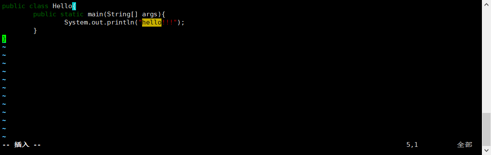
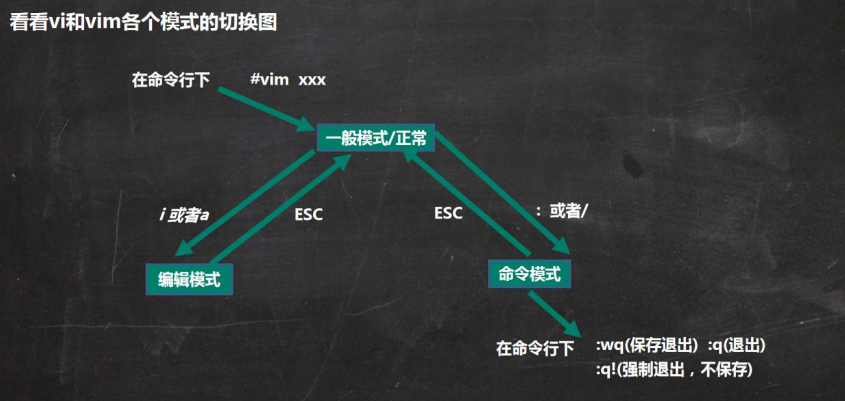

# Vi和Vim编辑器

## vi和vim的基本介绍

Linux系统会内置vi文本编辑器。

Vim具有程序编辑的能力，可以看做是Vi的增强版本，可以主动的以字体颜色辨别语法的正确性，方便程序设计。代码补完、编译及错误跳转等方便编程的功能特别丰富,在程序员中被广泛使用。

## vi和vim常用的三种模式

### 正常模式

以vim打开一个档案就直接进入一般模式了(这是**默认的模式**)。在这个模式中，你可以使用『上下左右」按键来移动光标，你可以使用【删除字符」或『删除整行」来处理档案内容，也可以使用【复制、粘贴」来处理你的文件数据。

### 插入模式

按下i,，I， o， O，a， A， r， R等任何一个字母之后才会进入编辑模式,一般来说按i即可。

### 命令行模式

先按esc键 再输入：在这个模式当中,可以提供你相关指令，完成读取、存盘、替换、离开vim、显示行号等的动作则是在此模式中达成的！

## vi 和vim基本使用

使用 vim开发一个Hello.java程序，保存、步骤说明和演示

## 各种模式的相互切换

## vi和vim快捷键

1) 拷贝当前行 yy，拷贝当前行向下的5行 5yy，并粘贴(输入p)

2) 删除当前行 dd，删除当前行向下的5行5dd

3) 在文件中查找某个单词[命令行下/关键字，回车查找，输入n就是查找下一个]

4) 设置文件的行号，取消文件的行号.[命令行下: set nu和:set nonu]

5) 编辑/etc/profile文件，在一般模式下,使用快捷键到该文档的最末行[G]和最首行[gg]

6) 在一个文件中输入"hello"，在一般模式下,然后又撤销这个动作u

7) 编辑 /etc/profile文件，在一般模式下,并将光标移动到，输入20，再按shift+g 或 【G/gg】