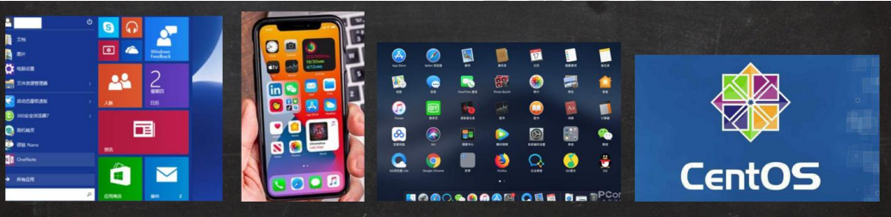

# 介绍

本人的[学习源头](https://www.bilibili.com/video/BV1Sv411r7vd?from=search&seid=2242825036427323134&spm_id_from=333.337.0.0)

1. Linux的诞生

   Linux 内核最初只是由芬兰人林纳斯·托瓦兹（Linus Torvalds）在赫尔辛基大学上学时出于个人爱好而编写的，同时，也是Git 的创造者。

2. linux是一个开源、免费的操作系统,其稳定性、安全性、处理多并发已经得到业界的认可,目前很多企业级的项目(c/c++/php/python/java/go)都会部署到Linux/unix系统上。

3. 常见的操作系统(windows、 IOS、 Android、 MacOS, Linux, Unix)。

   

4. Linux主要的发行版：

   Ubuntu(乌班图)、RedHat(红帽)、CentoS、Debain[蝶变]、Fedora、SuSE、 OpenSUSE [示意图]

5. Linux的应用领域

   1. 服务器领域

      linux在**服务器领域**的应用是最强的。
      linux**免费、稳定、高效**等特点在这里得到了很好的体现,尤其在一些高端领域尤为广泛(c/c++/php/java/python/go)。

   2. 嵌入式领域

      linux运行稳定、对网络的良好支持性、低成本,且可以根据需要进行**软件裁剪**，内核最小可以达到几百KB等特点，使其近些年来在**嵌入式领域**的应用得到非常大的提高。

      主要应用:机顶盒、数字电视、网络电话、程控交换机、手机、PDA、智能家居、智能硬件等都是其应用领域。以后在**物联网中应用会更加广泛**。

6. Linux vs Windows

   目前国内 Linux 更多的是应用于服务器上，而桌面操作系统更多使用的是 Windows。主要区别如下

   | **比较**                            | **Windows**                                                  | **Linux**                                                    |
   | ----------------------------------- | :----------------------------------------------------------- | :----------------------------------------------------------- |
   | 界面                                | 界面统一，外壳程序固定所有 Windows 程序菜单几乎一致，快捷键也几乎相同。 | 图形界面风格依发布版不同而不同，可能互不兼容。GNU/Linux 的终端机是从 UNIX 传承下来，基本命令和操作方法也几乎一致。 |
   | 驱动                           程序 | 驱动程序丰富，版本更新频繁。默认安装程序里面一般包含有该版本发布时流行的硬件驱动程序，之后所出的新硬件驱动依赖于硬件厂商提供。对于一些老硬件，如果没有了原配的驱动有时很难支持。另外，有时硬件厂商未提供所需版本的 Windows 下的驱动，也会比较头痛。 | 由志愿者开发，由 Linux 核心开发小组发布，很多硬件厂商基于版权考虑并未提供驱动程序，尽管多数无需手动安装，但是涉及安装则相对复杂，使得新用户面对驱动程序问题（是否存在和安装方法）会一筹莫展。但是在开源开发模式下，许多老硬件尽管在Windows下很难支持的也容易找到驱动。HP、Intel、AMD 等硬件厂商逐步不同程度支持开源驱动，问题正在得到缓解。 |
   | 使用                                | 使用比较简单，容易入门。图形化界面对没有计算机背景知识的用户使用十分有利。 | 图形界面使用简单，容易入门。文字界面，需要学习才能掌握。     |
   | 学习                                | 系统构造复杂、变化频繁，且知识、技能淘汰快，深入学习困难。   | 系统构造简单、稳定，且知识、技能传承性好，深入学习相对容易。 |
   | 软件                                | 每一种特定功能可能都需要商业软件的支持，需要购买相应的授权。 | 大部分软件都可以自由获取，同样功能的软件选择较少。           |

   

