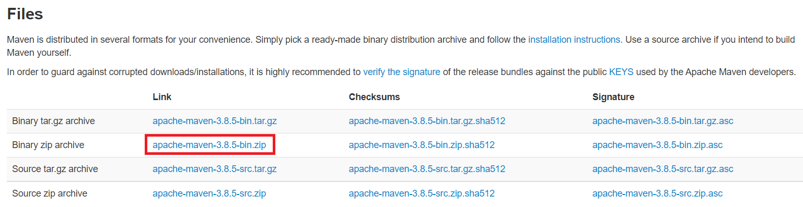

# 第02章_Maven 核心程序解压和配置

## 一、Maven核心程序解压与配置

### 1、Maven 官网地址

首页：[Maven – Welcome to Apache Maven](https://maven.apache.org/)

下载页面：[Maven – Download Apache Maven](https://maven.apache.org/download.cgi)

下载链接：

具体下载地址：https://dlcdn.apache.org/maven/maven-3/3.8.5/binaries/apache-maven-3.8.5-bin.zip

### 2、解压Maven核心程序

核心程序压缩包：apache-maven-3.8.5-bin.zip，解压到**非中文、没有空格**的目录。

在解压目录中，我们需要着重关注 Maven 的核心配置文件：**conf/settings.xml**

### 3、指定本地仓库

本地仓库默认值：用户家目录/.m2/repository。由于本地仓库的默认位置是在用户的家目录下，而家目录往往是在 C 盘，也就是系统盘。将来 Maven 仓库中 jar 包越来越多，仓库体积越来越大，可能会拖慢 C 盘运行速度，影响系统性能。所以建议将 Maven 的本地仓库放在其他盘符下。配置方式如下：

```xml
<!-- localRepository
| The path to the local repository maven will use to store artifacts.
|
| Default: ${user.home}/.m2/repository
<localRepository>/path/to/local/repo</localRepository>
-->
<localRepository>D:\maven-repository</localRepository>
```

本地仓库这个目录，我们手动创建一个空的目录即可。

**记住**：一定要把 localRepository 标签**从注释中拿出来**。

**注意**：本地仓库本身也需要使用一个**非中文、没有空格**的目录。

### 4、配置阿里云提供的镜像仓库

Maven 下载 jar 包默认访问境外的中央仓库，而国外网站速度很慢。改成阿里云提供的镜像仓库，**访问国内网站**，可以让 Maven 下载 jar 包的时候速度更快。配置的方式是：

#### ①将原有的例子配置注释掉

```xml
<!-- <mirror>
  <id>maven-default-http-blocker</id>
  <mirrorOf>external:http:*</mirrorOf>
  <name>Pseudo repository to mirror external repositories initially using HTTP.</name>
  <url>http://0.0.0.0/</url>
  <blocked>true</blocked>
</mirror> -->
```

#### ②加入我们的配置

将下面 mirror 标签整体复制到 settings.xml 文件的 mirrors 标签的内部。

```xml
<mirror>
    <id>nexus-aliyun</id>
    <mirrorOf>central</mirrorOf>
    <name>Nexus aliyun</name>
    <url>http://maven.aliyun.com/nexus/content/groups/public</url>
</mirror>
```

### 5、配置 Maven 工程的基础 JDK 版本

如果按照默认配置运行，Java 工程使用的默认 JDK 版本是 1.5，而我们熟悉和常用的是 JDK 1.8 版本。修改配置的方式是：将 profile 标签整个复制到 settings.xml 文件的 profiles 标签内。

```xml
<profile>
    <id>jdk-1.8</id>
    <activation>
        <activeByDefault>true</activeByDefault>
        <jdk>1.8</jdk>
    </activation>
    <properties>
        <maven.compiler.source>1.8</maven.compiler.source>
        <maven.compiler.target>1.8</maven.compiler.target>
        <maven.compiler.compilerVersion>1.8</maven.compiler.compilerVersion>
    </properties>
</profile>
```

