# 第03章_使用 Maven：命令行环境

## 一、实验一：根据坐标创建 Maven 工程

### 1、Maven 核心概念：坐标

#### ①数学中的坐标

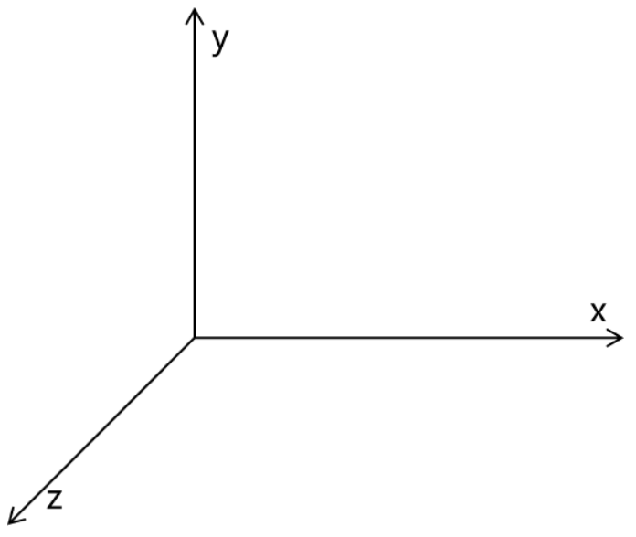

使用 x、y、z 三个**『向量』**作为空间的坐标系，可以在**『空间』**中唯一的定位到一个**『点』**。

#### ②Maven中的坐标

##### [1]向量说明

使用三个**『向量』**在**『Maven的仓库』**中**唯一**的定位到一个**『jar』**包。

- **groupId**：公司或组织的 id
- **artifactId**：一个项目或者是项目中的一个模块的 id
- **version**：版本号

##### [2]三个向量的取值方式

- groupId：公司或组织域名的倒序，通常也会加上项目名称
  - 例如：com.atguigu.maven
- artifactId：模块的名称，将来作为 Maven 工程的工程名
- version：模块的版本号，根据自己的需要设定
  - 例如：SNAPSHOT 表示快照版本，正在迭代过程中，不稳定的版本
  - 例如：RELEASE 表示正式版本

举例：

- groupId：com.atguigu.maven
- artifactId：pro01-atguigu-maven
- version：1.0-SNAPSHOT

#### ③坐标和仓库中 jar 包的存储路径之间的对应关系

坐标：

```xml
<groupId>javax.servlet</groupId>
<artifactId>servlet-api</artifactId>
<version>2.5</version>
```

上面坐标对应的 jar 包在 Maven 本地仓库中的位置：

```
Maven本地仓库根目录\javax\servlet\servlet-api\2.5\servlet-api-2.5.jar
```

一定要学会根据坐标到本地仓库中找到对应的 jar 包。

### 2、实验操作

#### ①创建目录作为后面操作的工作空间

例如：D:\maven-workspace\space201026

:::caution

此时我们已经有了三个目录，分别是：

- Maven 核心程序：中军大帐
- Maven 本地仓库：兵营
- 本地工作空间：战场

:::

#### ②在工作空间目录下打开命令行窗口

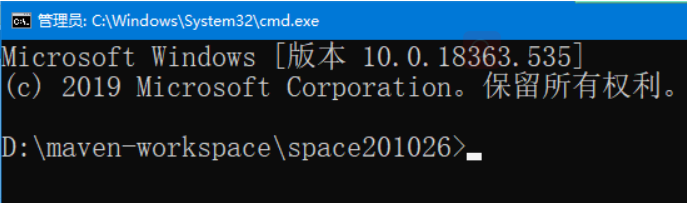

#### ③使用命令生成Maven工程

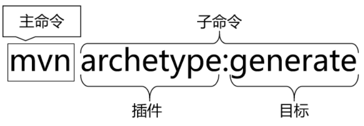

运行 **mvn archetype:generate** 命令

下面根据提示操作

:::tip

Choose a number or apply filter (format: [groupId:]artifactId, case sensitive contains): 7:【直接回车，使用默认值】

Define value for property 'groupId': com.atguigu.maven

Define value for property 'artifactId': pro01-maven-java

Define value for property 'version' 1.0-SNAPSHOT: :【直接回车，使用默认值】

Define value for property 'package' com.atguigu.maven: :【直接回车，使用默认值】

Confirm properties configuration: groupId: com.atguigu.maven artifactId: pro01-maven-java version: 1.0-SNAPSHOT package: com.atguigu.maven Y: :【直接回车，表示确认。如果前面有输入错误，想要重新输入，则输入 N 再回车。】

:::

#### ④调整

Maven 默认生成的工程，对 junit 依赖的是较低的 3.8.1 版本，我们可以改成较适合的 4.12 版本。

自动生成的 App.java 和 AppTest.java 可以删除。

```xml
<!-- 依赖信息配置 -->
<!-- dependencies复数标签：里面包含dependency单数标签 -->
<dependencies>
	<!-- dependency单数标签：配置一个具体的依赖 -->
	<dependency>
		<!-- 通过坐标来依赖其他jar包 -->
		<groupId>junit</groupId>
		<artifactId>junit</artifactId>
		<version>4.12</version>
		
		<!-- 依赖的范围 -->
		<scope>test</scope>
	</dependency>
</dependencies>
```

#### ⑤自动生成的 pom.xml 解读

```xml
<!-- project 标签：跟标签，表示对当前工程进行配置、管理 -->
<project xmlns="http://maven.apache.org/POM/4.0.0" xmlns:xsi="http://www.w3.org/2001/XMLSchema-instance"
  xsi:schemaLocation="http://maven.apache.org/POM/4.0.0 http://maven.apache.org/xsd/maven-4.0.0.xsd">
  	<!-- modelVersion 标签：从 Maven 2 开始就固定是 4.0.0 -->
  	<!-- 代表当前 pom.xml 所采用的标签结构 -->
  	<modelVersion>4.0.0</modelVersion>
    
    <!-- 当前Maven工程的坐标信息 -->
    <!-- groupId 标签：坐标向量之一；代表公司或组织开发的某一个项目 -->
    <groupId>com.atguigu.maven</groupId>
    <!-- artifactId 标签：坐标向量之一；代表项目下的某一个模块 -->
    <artifactId>pro01-maven-java</artifactId>
    <!-- version 标签：坐标向量之一；代表当前模块的版本 -->
    <version>1.0-SNAPSHOT</version>

    <!-- 当前Maven工程的打包方式，可选值有下面三种： -->
    <!-- jar：表示这个工程是一个Java工程  -->
    <!-- war：表示这个工程是一个Web工程 -->
    <!-- pom：表示这个工程是“管理其他工程”的工程 -->
    <packaging>jar</packaging>

    <name>pro01-maven-java</name>
    <url>http://maven.apache.org</url>

    <!-- properties 标签：在 Maven 中定义属性值 -->
    <properties>
        <!-- 工程构建过程中读取源码时使用的字符集 -->
        <project.build.sourceEncoding>UTF-8</project.build.sourceEncoding>
    </properties>

    <!-- dependencies 标签：配置具体依赖信息，可以包含多个 dependency 子标签 -->
    <dependencies>
        <!-- dependency 标签：配置一个具体的依赖信息 -->
        <dependency>
            <!-- 在dependency标签内使用具体的坐标依赖我们需要的一个jar包 -->
            <groupId>junit</groupId>
            <artifactId>junit</artifactId>
            <version>4.12</version>

            <!-- scope标签配置依赖的范围 -->
            <scope>test</scope>
        </dependency>
    </dependencies>
</project>
```

### 3、Maven核心概念：POM

#### ①含义

POM：**P**roject **O**bject **M**odel，项目对象模型。和 POM 类似的是：DOM（Document Object Model），文档对象模型。它们都是模型化思想的具体体现。

#### ②模型化思想

POM 表示将工程抽象为一个模型，再用程序中的对象来描述这个模型。这样我们就可以用程序来管理项目了。我们在开发过程中，最基本的做法就是将现实生活中的事物抽象为模型，然后封装模型相关的数据作为一个对象，这样就可以在程序中计算与现实事物相关的数据。

#### ③对应的配置文件

POM 理念集中体现在 Maven 工程根目录下 **pom.xml** 这个配置文件中。所以这个 pom.xml 配置文件就是 Maven 工程的核心配置文件。其实学习 Maven 就是学这个文件怎么配置，各个配置有什么用。

### 4、Maven核心概念：约定的目录结构

#### ①各个目录的作用

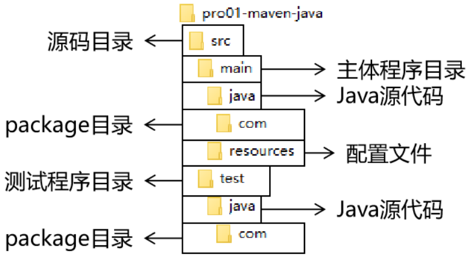

另外还有一个 target 目录专门存放构建操作输出的结果。

#### ②约定目录结构的意义

Maven 为了让构建过程能够尽可能自动化完成，所以必须约定目录结构的作用。例如：Maven 执行编译操作，必须先去 Java 源程序目录读取 Java 源代码，然后执行编译，最后把编译结果存放在 target 目录。

#### ③约定大于配置

Maven 对于目录结构这个问题，没有采用配置的方式，而是基于约定。这样会让我们在开发过程中非常方便。如果每次创建 Maven 工程后，还需要针对各个目录的位置进行详细的配置，那肯定非常麻烦。

目前开发领域的技术发展趋势就是：**约定大于配置，配置大于编码**。

## 二、实验二：在 Maven 工程中编写代码

### 1、主体程序

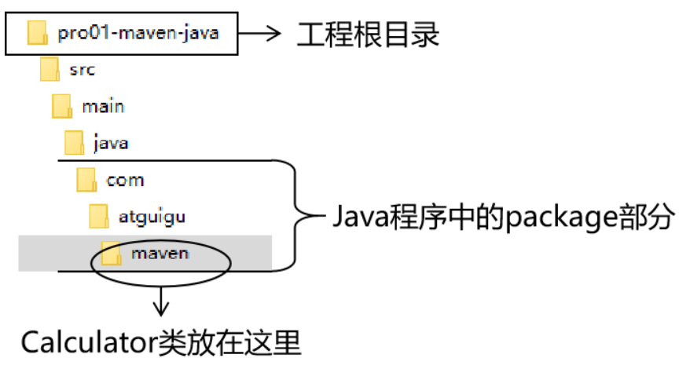

主体程序指的是被测试的程序，同时也是将来在项目中真正要使用的程序。

```java
package com.atguigu.maven;
	
public class Calculator {
	
	public int sum(int i, int j){
		return i + j;
	}
	
}
```

### 2、测试程序

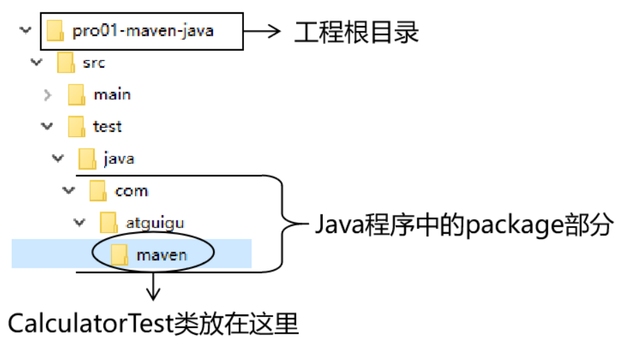

```java
package com.atguigu.maven;
	
import org.junit.Test;
import com.atguigu.maven.Calculator;
	
// 静态导入的效果是将Assert类中的静态资源导入当前类
// 这样一来，在当前类中就可以直接使用Assert类中的静态资源，不需要写类名
import static org.junit.Assert.*;
	
public class CalculatorTest{
	
	@Test
	public void testSum(){
		
		// 1.创建Calculator对象
		Calculator calculator = new Calculator();
		
		// 2.调用Calculator对象的方法，获取到程序运行实际的结果
		int actualResult = calculator.sum(5, 3);
		
		// 3.声明一个变量，表示程序运行期待的结果
		int expectedResult = 8;
		
		// 4.使用断言来判断实际结果和期待结果是否一致
		// 如果一致：测试通过，不会抛出异常
		// 如果不一致：抛出异常，测试失败
		assertEquals(expectedResult, actualResult);
		
	}
	
}
```

## 三、执行 Maven 的构建命令

### 1、要求

运行 Maven 中和构建操作相关的命令时，必须进入到 pom.xml 所在的目录。如果没有在 pom.xml 所在的目录运行 Maven 的构建命令，那么会看到下面的错误信息：

```java
The goal you specified requires a project to execute but there is no POM in this directory
```

:::tip

mvn -v 命令和构建操作无关，只要正确配置了 PATH，在任何目录下执行都可以。而构建相关的命令要在 pom.xml 所在目录下运行——操作哪个工程，就进入这个工程的 pom.xml 目录。

:::

### 2、清理操作

mvn clean

效果：删除 target 目录

### 3、编译操作

主程序编译：mvn compile

测试程序编译：mvn test-compile

主体程序编译结果存放的目录：target/classes

测试程序编译结果存放的目录：target/test-classes

### 4、测试操作

mvn test

测试的报告存放的目录：target/surefire-reports

### 5、打包操作

mvn package

打包的结果——jar 包，存放的目录：target

### 6、安装操作

mvn install

```log
[INFO] Installing D:\maven-workspace\space201026\pro01-maven-java\target\pro01-maven-java-1.0-SNAPSHOT.jar to D:\maven-rep1026\com\atguigu\maven\pro01-maven-java\1.0-SNAPSHOT\pro01-maven-java-1.0-SNAPSHOT.jar
[INFO] Installing D:\maven-workspace\space201026\pro01-maven-java\pom.xml to D:\maven-rep1026\com\atguigu\maven\pro01-maven-java\1.0-SNAPSHOT\pro01-maven-java-1.0-SNAPSHOT.pom
```

安装的效果是将本地构建过程中生成的 jar 包存入 Maven 本地仓库。这个 jar 包在 Maven 仓库中的路径是根据它的坐标生成的。

坐标信息如下：

```xml
<groupId>com.atguigu.maven</groupId>
<artifactId>pro01-maven-java</artifactId>
<version>1.0-SNAPSHOT</version>
```

在 Maven 仓库中生成的路径如下：

```log
D:\maven-rep1026\com\atguigu\maven\pro01-maven-java\1.0-SNAPSHOT\pro01-maven-java-1.0-SNAPSHOT.jar
```

另外，安装操作还会将 pom.xml 文件转换为 XXX.pom 文件一起存入本地仓库。所以我们在 Maven 的本地仓库中想看一个 jar 包原始的 pom.xml 文件时，查看对应 XXX.pom 文件即可，它们是名字发生了改变，本质上是同一个文件。

## 四、创建 Maven 版的 Web 工程

### 1、说明

使用 mvn archetype:generate 命令生成 Web 工程时，需要使用一个专门的 archetype。这个专门生成 Web 工程骨架的 archetype 可以参照官网看到它的用法：

参数 archetypeGroupId、archetypeArtifactId、archetypeVersion 用来指定现在使用的 maven-archetype-webapp 的坐标。

### 2、操作

注意：如果在上一个工程的目录下执行 mvn archetype:generate 命令，那么 Maven 会报错：不能在一个非 pom 的工程下再创建其他工程。所以不要再刚才创建的工程里再创建新的工程，**请回到工作空间根目录**来操作。

然后运行生成工程的命令：

```log
mvn archetype:generate -DarchetypeGroupId=org.apache.maven.archetypes -DarchetypeArtifactId=maven-archetype-webapp -DarchetypeVersion=1.4
```

下面的操作按照提示执行：

:::tip

Define value for property 'groupId': com.atguigu.maven Define value for property 'artifactId': pro02-maven-web Define value for property 'version' 1.0-SNAPSHOT: :【直接回车，使用默认值】

Define value for property 'package' com.atguigu.maven: :【直接回车，使用默认值】 Confirm properties configuration: groupId: com.atguigu.maven artifactId: pro02-maven-web version: 1.0-SNAPSHOT package: com.atguigu.maven Y: :【直接回车，表示确认】

:::

### 3、生成的pom.xml

确认打包的方式是war包形式

```xml
<packaging>war</packaging>
```

### 4、生成的Web工程的目录结构

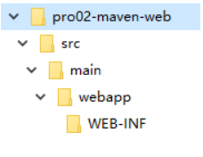

webapp 目录下有 index.jsp

WEB-INF 目录下有 web.xm

### 5、创建 Servlet

#### ①在 main 目录下创建 java 目录

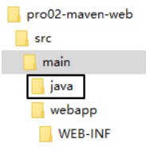

#### ②在 java 目录下创建 Servlet 类所在的包的目录

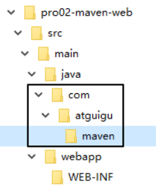

#### ③在包下创建 Servlet 类

```java
package com.atguigu.maven;
	
import javax.servlet.http.HttpServlet;
import javax.servlet.http.HttpServletRequest;
import javax.servlet.http.HttpServletResponse;
import javax.servlet.ServletException;
import java.io.IOException;
	
public class HelloServlet extends HttpServlet{
	
	protected void doGet(HttpServletRequest request, HttpServletResponse response) throws ServletException, IOException {
		
		response.getWriter().write("hello maven web");
		
	}
	
}
```

#### ④在 web.xml 中注册 Servlet

```xml
<servlet>
    <servlet-name>helloServlet</servlet-name>
    <servlet-class>com.atguigu.maven.HelloServlet</servlet-class>
</servlet>
<servlet-mapping>
    <servlet-name>helloServlet</servlet-name>
    <url-pattern>/helloServlet</url-pattern>
</servlet-mapping>
```

### 6、在 index.jsp 页面编写超链接

```html
<html>
<body>
<h2>Hello World!</h2>
<a href="helloServlet">Access Servlet</a>
</body>
</html>
```

:::tip

JSP全称是 Java Server Page，和 Thymeleaf 一样，是服务器端页面渲染技术。这里我们不必关心 JSP 语法细节，编写一个超链接标签即可。

:::

### 7、编译

此时直接执行 mvn compile 命令出错：

:::warning

程序包 javax.servlet.http 不存在

程序包 javax.servlet 不存在

找不到符号

符号: 类 HttpServlet

……

:::

上面的错误信息说明：我们的 Web 工程用到了 HttpServlet 这个类，而 HttpServlet 这个类属于 servlet-api.jar 这个 jar 包。此时我们说，Web 工程需要依赖 servlet-api.jar 包。

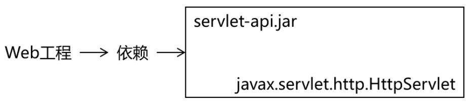

### 8、配置对 servlet-api.jar 包的依赖

对于不知道详细信息的依赖可以到https://mvnrepository.com/网站查询。使用关键词搜索，然后在搜索结果列表中选择适合的使用。

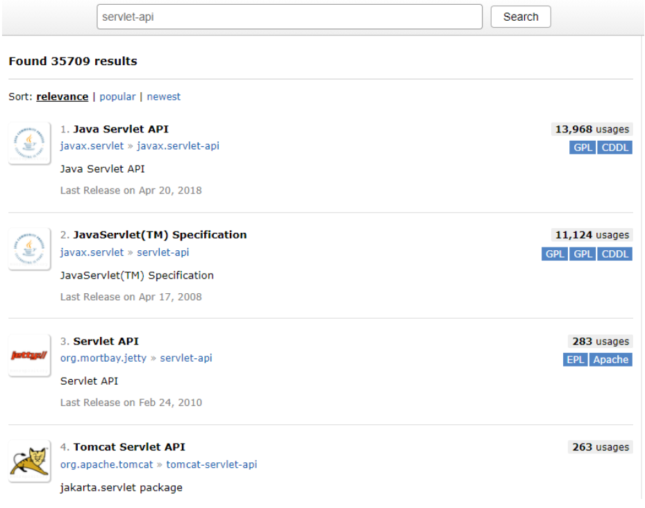

比如，我们找到的 servlet-api 的依赖信息：

```xml
<!-- https://mvnrepository.com/artifact/javax.servlet/javax.servlet-api -->
<dependency>
    <groupId>javax.servlet</groupId>
    <artifactId>javax.servlet-api</artifactId>
    <version>3.1.0</version>
    <scope>provided</scope>
</dependency>
```

这样就可以把上面的信息加入 pom.xml。重新执行 mvn compile 命令。

### 9、将 Web 工程打包为 war 包

运行 mvn package 命令，生成 war 包的位置如下图所示：

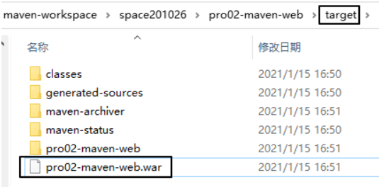

### 10、将 war 包部署到 Tomcat 上运行

将 war 包复制到 Tomcat/webapps 目录下

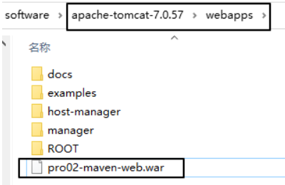

启动 Tomcat：

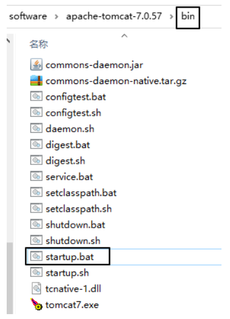

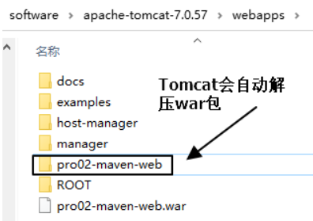

通过浏览器尝试访问：`http://localhost:8080/pro02-maven-web/index.jsp`