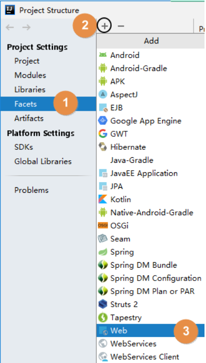

# 第04章_使用 Maven：IDEA环境

:::tip

各个 IDEA 不同版本在具体操作方面存在一定差异，这里我们以 2019.3.3 版本为例进行演示。其它版本大家灵活变通即可。


:::

## 一、创建父工程

### 1、创建 Project


### 2、开启自动导入

创建 Project 后，IDEA 会自动弹出下面提示，我们选择**『Enable Auto-Import』**，意思是启用自动导入。


这个自动导入**一定要开启**，因为 Project、Module 新创建或 pom.xml 每次修改时都应该让 IDEA 重新加载 Maven 信息。这对 Maven 目录结构认定、Java 源程序编译、依赖 jar 包的导入都有非常关键的影响。

另外也可以通过 IDEA 的 Settings 设置来开启：


## 二、配置Maven信息

每次创建 Project 后都需要设置 Maven 家目录位置，否则 IDEA 将使用内置的 Maven 核心程序（不稳定）并使用默认的本地仓库位置。这样一来，我们在命令行操作过程中已下载好的 jar 包就白下载了，默认的本地仓库通常在 C 盘，还影响系统运行。

配置之后，IDEA 会根据我们在这里指定的 Maven 家目录自动识别到我们在 settings.xml 配置文件中指定的本地仓库。


## 三、创建Java模块工程


## 四、创建Web模块工程

### 1、创建模块

按照前面的同样操作创建模块，**此时**这个模块其实还是一个**Java模块**。

### 2、修改打包方式

Web 模块将来打包当然应该是 **war** 包。

```xml
<packaging>war</packaging>
```

### 3、Web 设定

首先打开项目结构菜单：


然后到 Facets 下查看 IDEA 是否已经帮我们自动生成了 Web 设定。正常来说只要我们确实设置了打包方式为 war，那么 IDEA 2019 版就会自动生成 Web 设定。


另外，对于 IDEA 2018 诸版本没有自动生成 Web 设定，那么请参照下面两图，我们自己创建：




### 4、借助IDEA生成web.xml


### 5、设置 Web 资源的根目录

结合 Maven 的目录结构，Web 资源的根目录需要设置为 src/main/webapp 目录。


## 五、其他操作

### 1、在IDEA中执行Maven命令

#### ①直接执行


#### ②手动输入

### 2、在IDEA中查看某个模块的依赖信息

### 3、工程导入

#### ①来自版本控制系统

#### ②来自工程目录

### 4、模块导入

#### ①情景重现

#### ②导入 Java 类型模块

#### ③导入 Web 类型模块